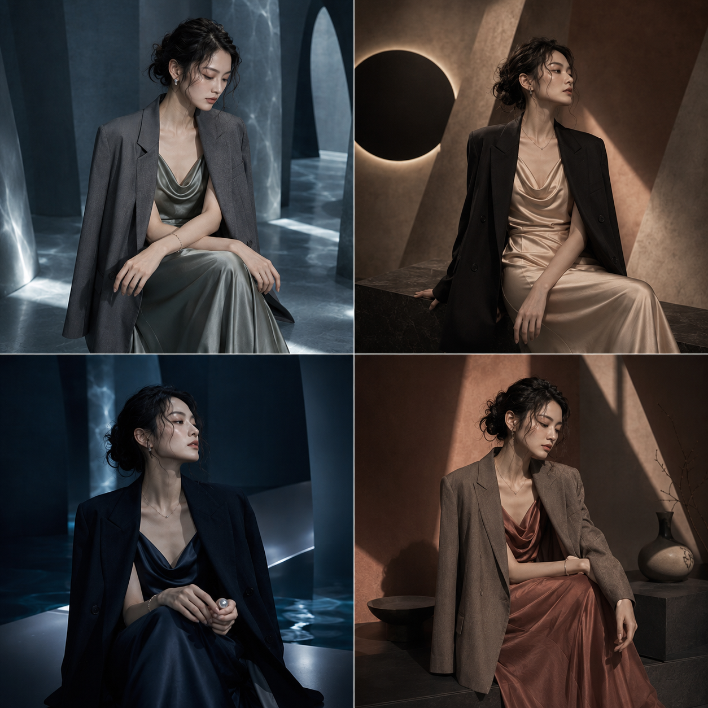
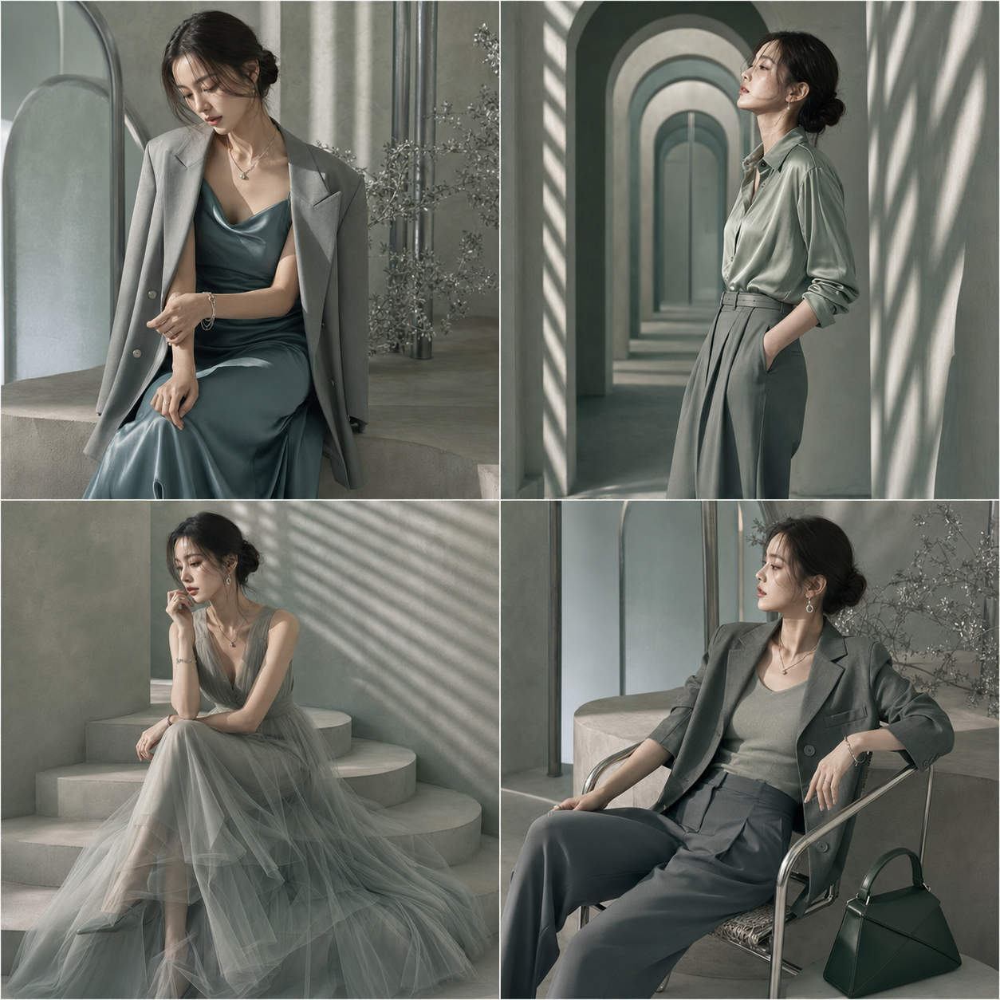
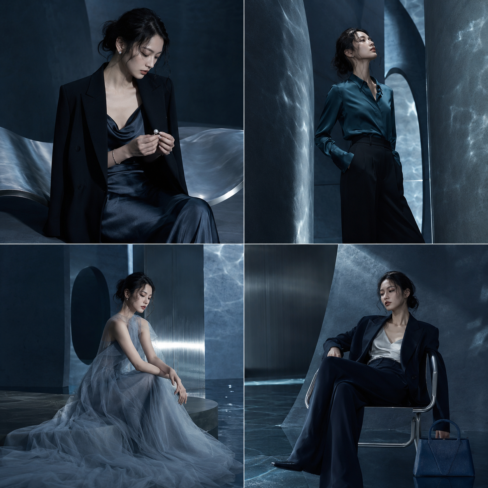
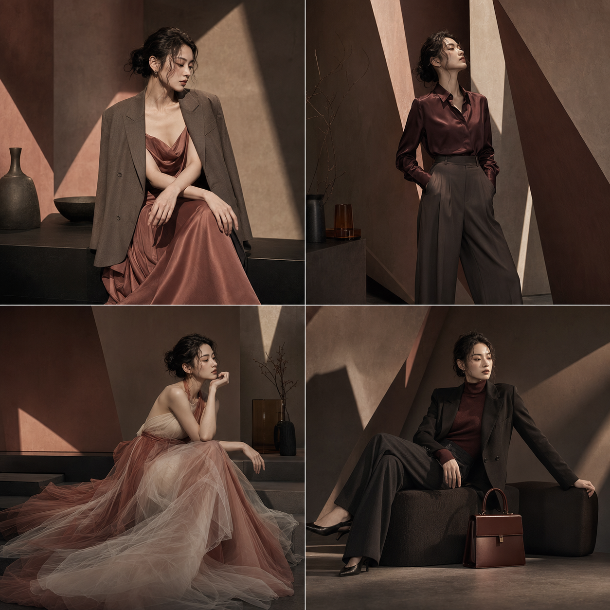
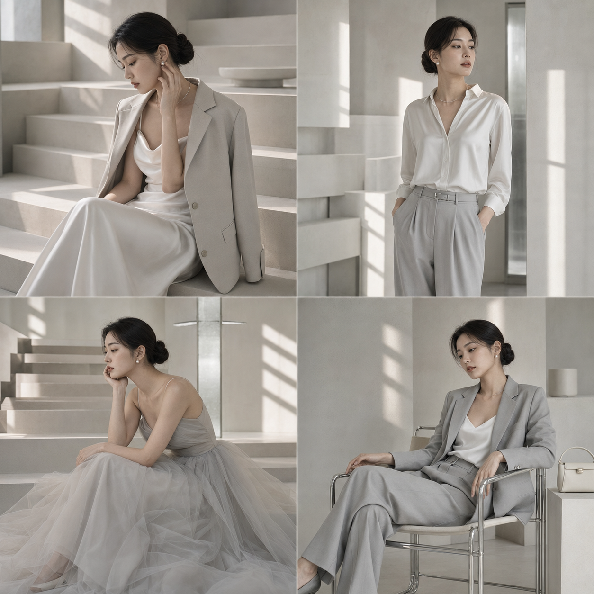
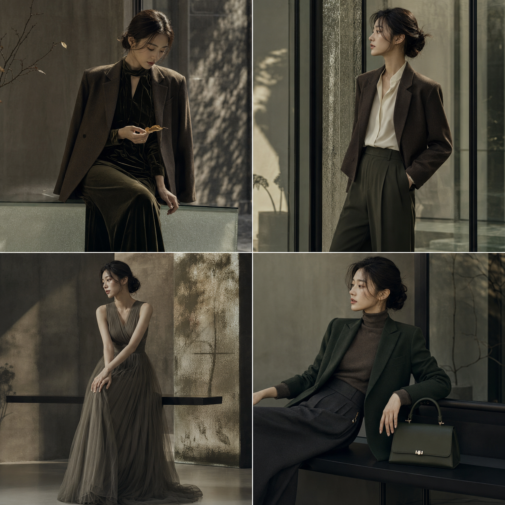

六组低饱和色域，把同一套四宫格骨架变成六个原创建筑时装世界。关键是锁定人物身份，再让色彩同时控制建筑、材质与光线。

提示词：
同一位成年亚洲女性，2×2 高端时尚杂志四宫格，低饱和色域，原创极简建筑影棚，定向电影光，真实皮肤纹理，quiet luxury，architectural fashion editorial。

#GPTImage2 #千问 #生图提示词 #Prompt #女友感自拍 #静奢六境

