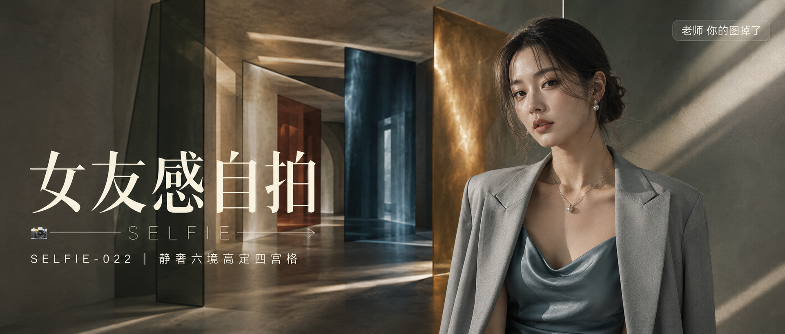

# SELFIE-022-静奢六境高定四宫格 封面

## 封面提示词

一位 25 岁漂亮亚洲女性置身原创“静奢六境”概念建筑空间，人物位于画面右侧前景，以正脸与轻微 3/4 侧脸之间的上半身姿态看向镜头，面部占画面高度三分之一以上，五官精致自然、面部立体清晰、眼神有神灵动、妆感干净清透、皮肤光泽细腻，黑棕色低发髻与轻盈碎发，穿月桂青灰斜裁缎面长裙和雾灰结构感西装；身后六层半透明几何光幕由月桂青灰、琥珀沙金、深海蓝黑、陶土酒红、珍珠象牙、墨茶棕绿依次折叠延伸，形成放射状消失点与空间纵深，窄束硬光切过玻璃和微水泥墙面，侧逆光打亮颧骨与发丝，冷暖色域在背景克制交汇，左侧保留干净文字区，电影感光影，色彩层次丰富，高清锐利，构图黄金比例，视觉冲击力强，商业海报级完成度，画面有张力，真实国际时尚杂志摄影，2.35:1 电影横构图。避免纯侧脸、纯背影、远景小人、眼睛半闭、嘴巴微张、面部阴暗、背景杂乱、低俗姿势、暴露服装、手部畸形、AI 美女脸、网红感、过度精修、塑料皮肤、暗沉肤色、明显痘印、明显皱纹、斑点、面部变形、Logo、二维码和水印。

【文字排版-必须完整保留，不得省略或简化任何一项】画面左侧垂直居中偏下叠加文字排版：超大号衬线字体米白色主文案「女友感自拍」，主文案正下方一条细横线左端带📷横线中央有透明英文水印 SELFIE，横线下方等宽白色字体副文案「SELFIE-022 ｜ 静奢六境高定四宫格」；右上角浅色半透明圆角底衬配小号文字「老师 你的图掉了」（署名文字，必须出现，不可省略）；无整体蒙层，文字直接压图。【文字排版结束】

## 封面图片

