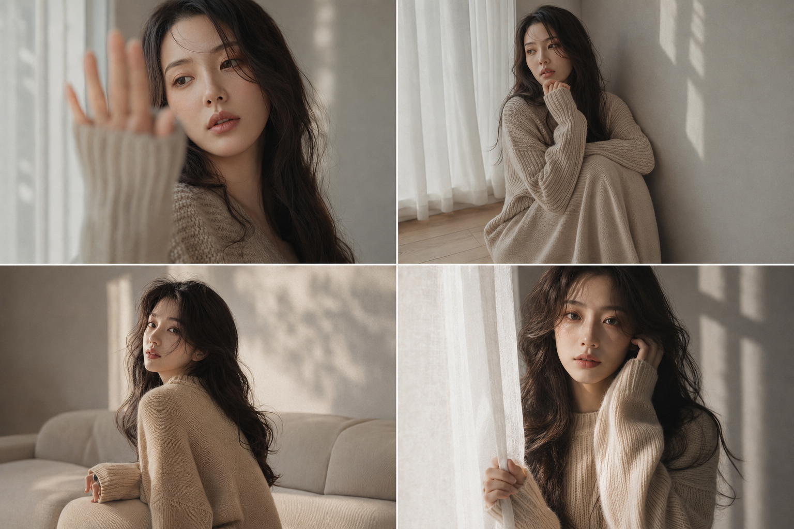
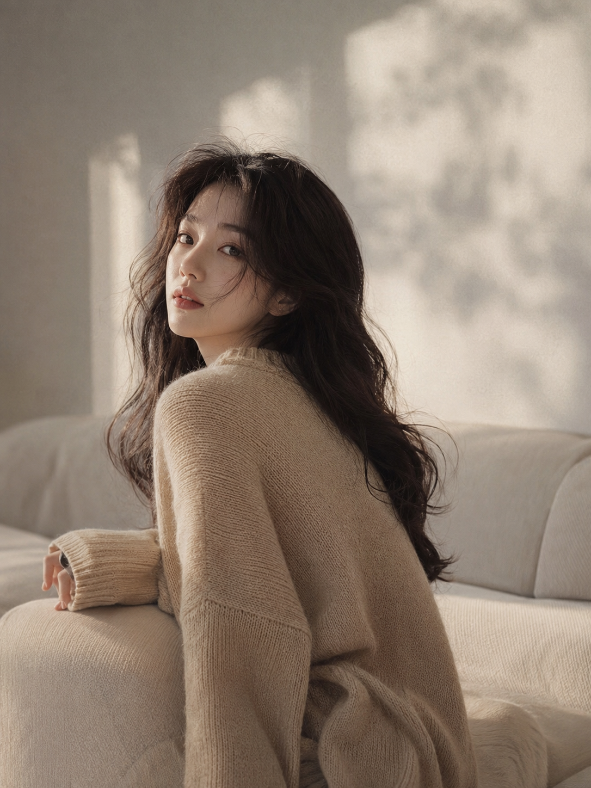
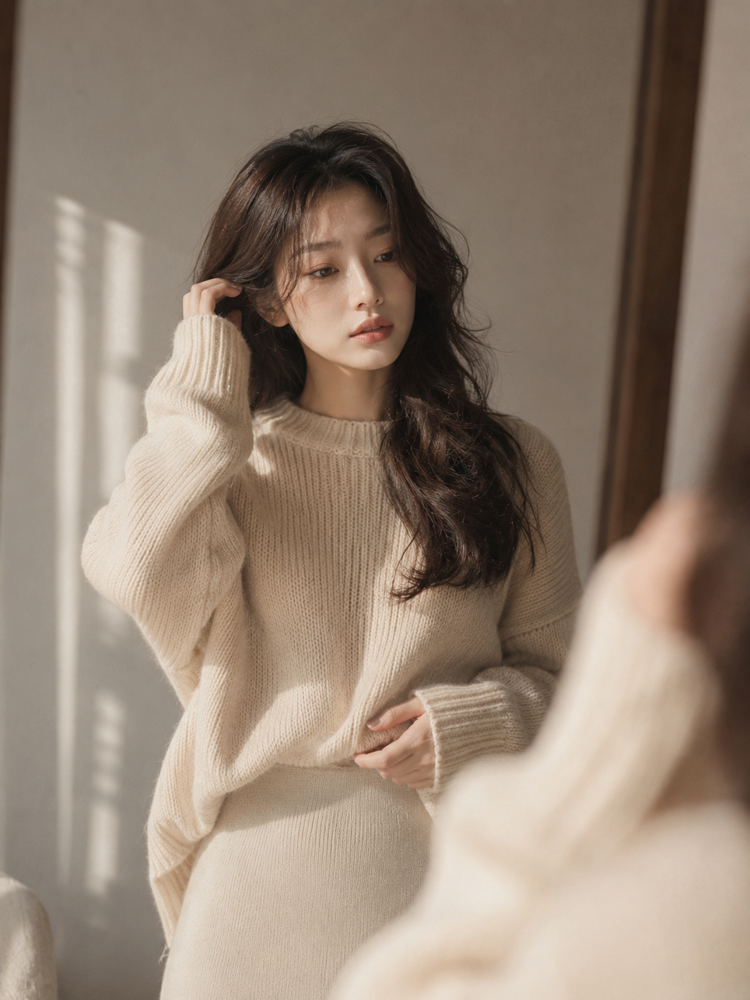
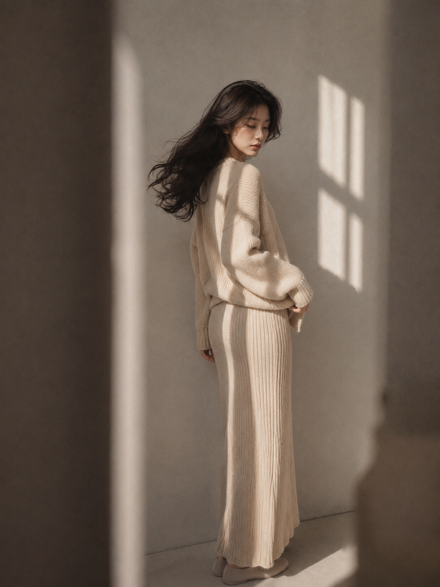

# 朋友圈都以为是真实抓拍，这组暖灰窗边女友感写真太自然了

有些照片第一眼并不张扬，却会让人停下来多看几秒：窗光很软，毛衣有触感，头发没有被整理得一丝不乱，人物也不像在完成一个标准姿势。它更像某个安静下午，被熟悉的人顺手拍下来的片段。

这一组我把它叫作「雾绒叙事」。核心不是复制某一种姿势，而是用六个居家瞬间建立同一种情绪：安静、松弛、克制，同时保留真实的亲近感。

---

## 先确定这组照片的情绪骨架

暖灰女友感最容易被误写成“灰色背景 + 米色毛衣”。但颜色只是表层，真正让六张图像同一组作品的，是稳定的视觉秩序：窗边散射光负责柔化面部，低对比胶片色负责压住商业感，针织纹理与轻微乱发负责补充生活痕迹，留白则让人物看起来没有在刻意营业。

这组可复用的画面关键词是：柔和窗光、暖灰低饱和、真实皮肤纹理、轻微乱发、浅景深、非中心构图、细颗粒、克制表情。其中最重要的不是“好看”，而是好看得像真实的人，而不是一张标准化 AI 美女图。

---

## 01｜窗边抬手遮光：用前景制造“刚好被拍到”

这一张承担整组的视觉入口。手掌靠近镜头形成大面积虚化，既遮掉一部分画面，也把视线推向眼睛。人物偏右、左侧留白，窗影和光斑只负责烘托，不抢主体。手不是为了摆造型，而像对突然靠近的光线做出的自然反应。

下面只放这一份完整原版提示词，复制即可使用：

竖版 3:4，真实写实韩系室内人像写真，暖灰低饱和电影感色调，一位24至27岁的成年亚洲女生，东亚面孔，五官清秀耐看，脸型柔和，皮肤白皙自然但保留真实细腻纹理，黑棕色中长发，松散自然大波浪卷，发丝略凌乱，有轻微空气感和毛躁感。她穿一件燕麦米色宽松粗针织毛衣，长袖遮住部分手掌，领口自然松垮但不过度暴露。人物站在浅灰米色墙面前，靠近窗边，侧前方柔和自然窗光洒在脸部和肩颈上，背景有模糊的窗影和柔和光斑。她微微抬起一只手靠近镜头，手掌形成大面积前景虚化，头轻轻侧向一边，眼神从手臂后方安静望向远处，嘴唇自然微张，神情慵懒、克制、安静。构图为近景半身，人物偏右，保留适量留白，50mm 或 85mm 人像镜头质感，f1.8 浅景深，焦点清晰落在眼睛和嘴唇，前景柔和虚化，低对比暖灰胶片调色，细腻颗粒，轻微暗角，真实摄影，时尚杂志感，无文字，无水印，无logo。

这里决定真实感的词是“手掌形成大面积前景虚化”。只写“抬手遮光”，模型常会把手端正地放在脸旁；补上与镜头的距离关系，才会产生抓拍式的空间层次。

---

## 02｜地板坐姿沉思：让视线离开镜头

第二张把人物放低，环境也随之变得更安静。抱膝、低头、目光落向左下方，三者共同形成封闭但不压抑的姿态。浅木地板带来一点温度，白纱帘则把窗光过滤得更均匀。设计时特意让一只手藏进长袖，另一只手只轻触下巴，减少复杂手势带来的失真风险。

这类画面不要同时加入太多家具。墙面、地板、纱帘已经足够构成空间，额外的床、桌、花瓶会让“沉思”变成杂乱的生活记录。

---

## 03｜沙发边回眸：把动作写成一段因果

回眸好不好看，差别往往不在“回头”二字，而在回头之前发生了什么。这里先设定人物原本侧坐，随后因为听到动静才转向镜头，于是肩膀、头发和视线会自然形成时间差。先写状态，再写触发，最后写反应，是比堆叠“自然抓拍感”更稳定的交互方式。

沙发只作为柔和的背景形状，不需要清晰展示完整轮廓。85mm 的压缩感会让人物与背景更贴近，同时保留头发和肩部边缘的清晰度，适合做带一点亲近距离的居家时尚画面。

---

## 04｜镜前整理头发：镜子只做空间线索

镜前画面很容易变成标准自拍照，所以这一张没有让人物举手机，也没有让镜面占据一半构图。立镜只露出少量失焦边缘，告诉观众空间里有镜子；人物看向镜中的自己，一只手整理耳边碎发，另一只手扶住衣摆，动作有明确分工。

镜面元素越少，注意力越容易停留在人物。让镜子提供层次，不让镜子成为主题，画面就会从“记录动作”升级成更完整的杂志叙事。

---

## 05｜靠墙转身：用发尾弧度代替夸张动作

中全景需要变化，但不需要大幅度甩头。人物只是微微转身，长发在动作结束前留下自然弧度；门框或墙角形成一层虚化遮挡，让镜头像躲在空间边缘记录这一秒。服装继续使用同色系针织，但通过纵向纹理和直筒轮廓拉长整体比例。

这张的关键是动作幅度小，视觉余韵大。如果同时加入大幅甩发、强风和夸张裙摆，安静的暖灰情绪会立刻被破坏。

---

## 06｜窗帘边直视：用眼神完成收束

前五张都在回避直接交流，最后一张才让人物正面看向镜头。她轻轻捏住纱帘边缘，另一只手触碰脸侧发丝，脸部一半明亮、一半落入浅灰阴影。双眼保持清晰，双唇自然合拢，让情绪落在“安静地看见你”，而不是刻意制造表情。

把直视镜头放在组图末尾，会形成一种轻微的叙事回环：观众先旁观她的日常，最后才被她发现。视线顺序本身就是组图节奏，不只是单张照片的动作选择。

---

## 为什么这六张会像同一次真实拍摄

六张图改变了姿势、景别和视线，却始终固定四件事：同一位成年亚洲女生、同一套燕麦米色针织造型、同一间暖灰极简室内、同一类柔和窗边散射光。变化负责提供新鲜感，固定项负责建立身份与风格一致性。

与 AI 交互时，可以先锁定“人物 + 服装 + 场景 + 光线”，再逐张替换动作和机位。一次只改变两到三个变量，比每张都重写完整世界观更容易得到像同一组拍摄的结果。实际出图还统一加入了真实肤质、手部结构与无文字水印等负面约束，用来减少塑料皮肤、手指异常和画面杂讯。

最容易破坏这组情绪的词有两个：一是“完美精致妆容”，它会把人物推向商业棚拍；二是“强烈戏剧光”，它会让阴影过硬、亲近感消失。更稳的做法是保留干净自然肤质和柔和散射窗光，让漂亮来自光线、构图和状态，而不是磨皮与浓妆。

---

如果你想继续扩展这套画面，可以把窗边换成阴天阳台、安静书房或浅色走廊，但不要同时改变服装、色调和人物气质。先收藏这组写法；你更想看“雨天冷灰版”还是“黄昏奶油版”，欢迎在评论区留下下一期主题。

---

## 往期回顾

- SELFIE-022 静奢六境高定四宫格
- SELFIE-021 澄夏六感饮品海报
- SELFIE-020 色域缪斯六色封面

#GPTImage2 #千问 #豆包 #生图提示词 #Prompt #女友感自拍 #暖灰窗边写真
