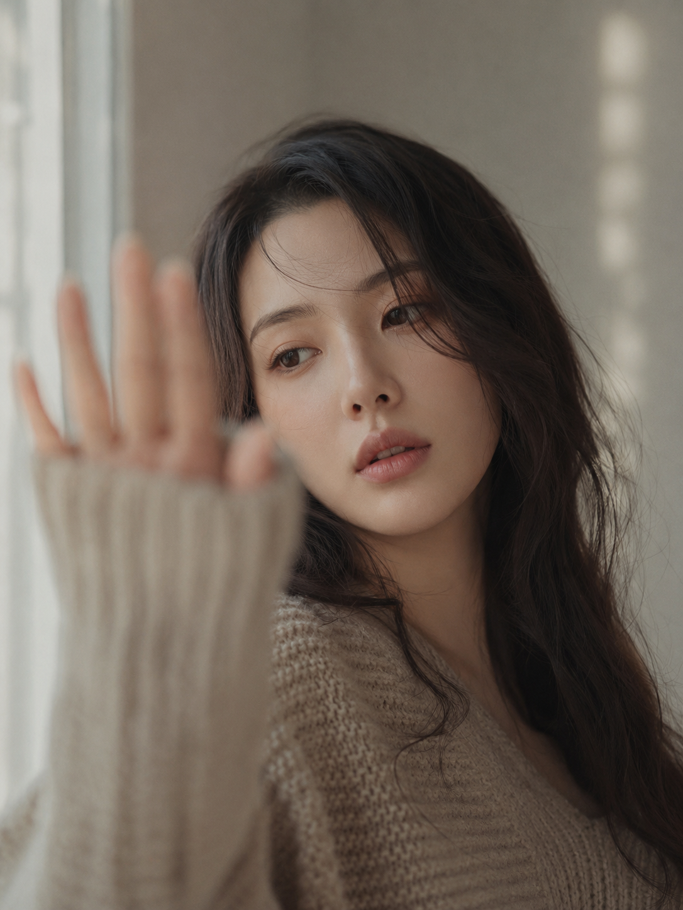
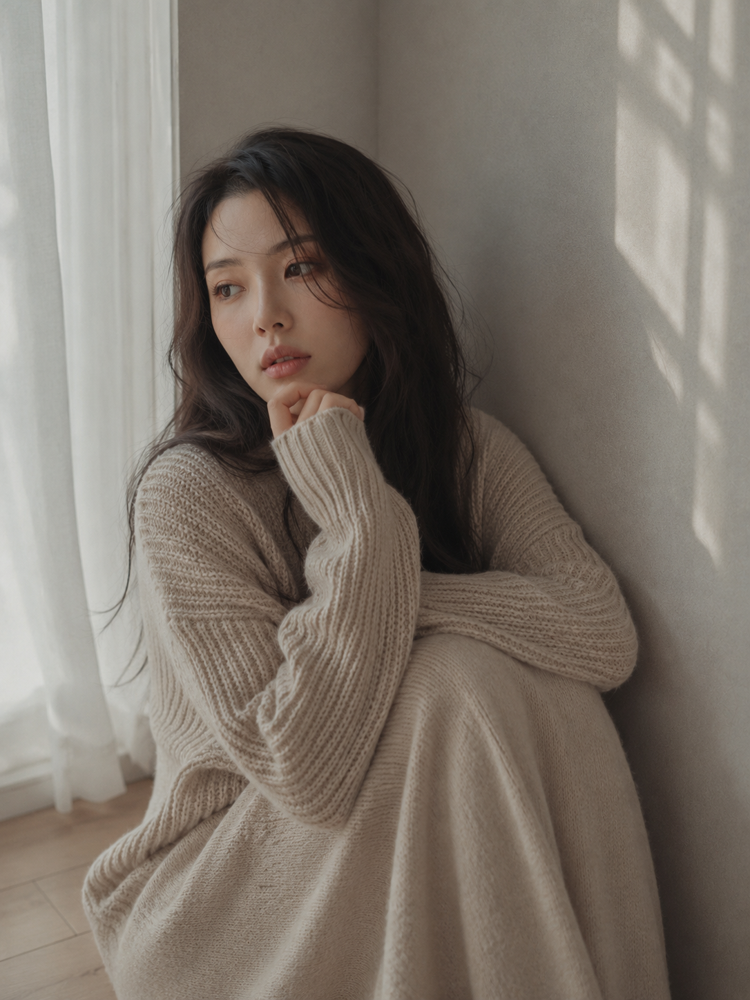
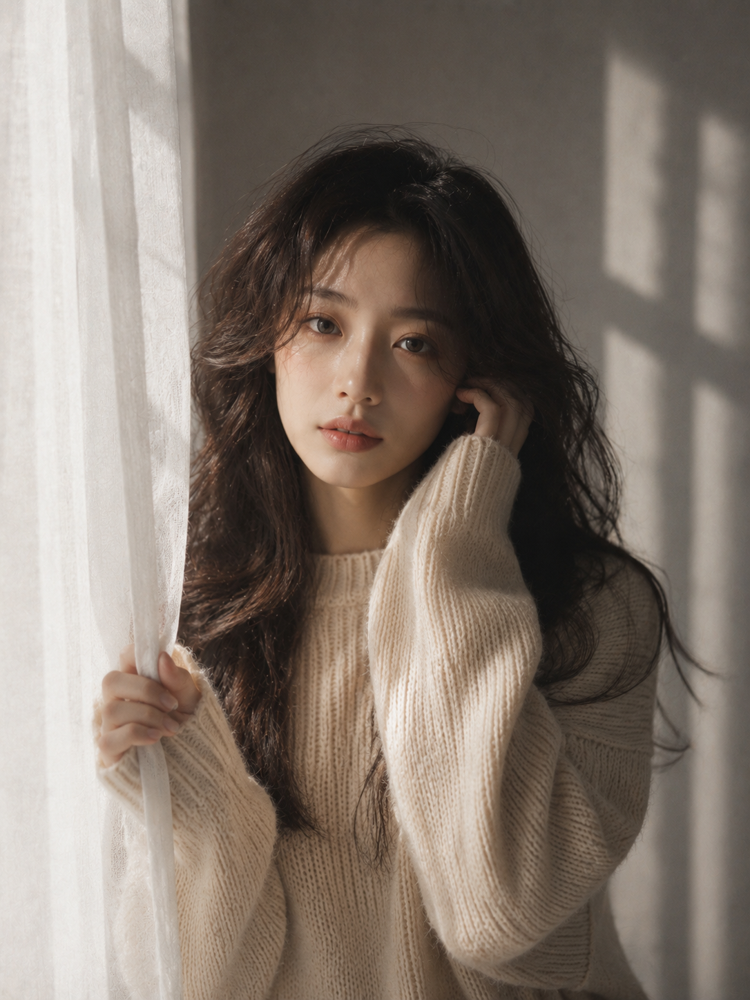

有种写真看起来很像朋友圈随手抓拍，安静、克制、不摆拍，其实靠的是一套很稳的写法框架。这一期用同一位人物、同一件针织毛衣、同一间暖灰居家场景，拍出了六个完全不同情绪的瞬间，这里整理设计思路和完整提示词。

**为什么"锁场景锁人物，只换动作"最容易出稳定的图**

六张图共用的是人物设定、服装和暖灰胶片色调这三层，只在层内更换姿势、视线方向和光源角度。场景、人物、服装都锁死之后，AI 不容易在细节上跑偏，人物一致性会明显提高；反过来如果每张都换场景换衣服，画面的"系列感"就会被打散。

**窗边抬手遮光感**

人物站在窗边柔和逆光中，抬手靠近镜头形成大面积前景虚化，这个动作让画面有天然的私密感和抓拍感，而不是正面摆拍。

提示词：
竖版3:4，真实写实韩系室内人像写真，暖灰低饱和电影感色调，一位24至27岁的成年亚洲女生，东亚面孔，五官清秀耐看，脸型柔和，皮肤白皙自然但保留真实细腻纹理，面部干净，眼神真实，黑棕色中长发，松散自然大波浪卷，发丝略凌乱，有轻微空气感和毛躁感。她穿一件燕麦米色宽松粗针织毛衣，长袖遮住部分手掌，领口自然松垮但不过度暴露。人物站在浅灰米色墙面前，靠近窗边，侧前方柔和自然窗光洒在脸部和肩颈上，背景有模糊的窗影和柔和光斑。她微微抬起一只手靠近镜头，手掌形成大面积前景虚化，头轻轻侧向一边，眼神从手臂后方安静望向远处，嘴唇自然微张，神情慵懒、克制、安静。构图为近景半身，人物偏右，保留适量留白，50mm或85mm人像镜头质感，f1.8浅景深，焦点清晰落在眼睛和嘴唇，前景柔和虚化，低对比暖灰胶片调色，细腻颗粒，轻微暗角，真实摄影，时尚杂志感。避免手指畸形、多手多指、身体比例错误、背景杂乱、AI美女脸、网红感、过度精修、塑料皮肤、暗沉肤色、明显痘印、明显皱纹、斑点、面部变形。

**地板坐姿沉思感**

坐姿代替站姿，双腿收起、一手藏在袖口抱膝、指尖轻触下巴，整体情绪从"被抓拍"变成"独自发呆"，是六张图里最松弛的一张。

**窗帘边直视镜头感**

这是六张里唯一正面直视镜头的一张，脸部一半明亮一半落入浅灰阴影，用光比制造出安静又略带清冷的表情张力。

**关键参数说明**

- "同一人物+同一服装贯穿六个动作"：这是让六张图看起来是"一个系列"而不是随机拼凑的核心方法。
- "暖灰低饱和胶片调色+细腻颗粒"：统一色彩基调，避免每张图色调跳跃。
- "前景虚化"：抬手、纱帘边缘等前景元素靠近镜头形成虚化，能天然制造出抓拍感和私密感。
- "视线方向变化"：望向远处、低头沉思、直视镜头，三种视线方向让六张图的情绪浓度各不相同。

**可替换的元素**

- 服装：燕麦米色针织毛衣可换成其他低饱和纯色毛衣或衬衫，颜色统一在奶咖色系最不容易出错。
- 场景：暖灰居家墙面可换成灰蓝调卧室、原木书房，色调逻辑同样适用。
- 光线：柔和窗光可换成清晨薄雾光或黄昏暖光，同一动作在不同光线下情绪完全不同。
- 姿势：站姿可换成坐姿或倚靠姿势，收放身体线条制造不同的松弛程度。

#生图提示词 #GPTImage2 #千问 #豆包 #女友感自拍 #暖灰窗边写真
