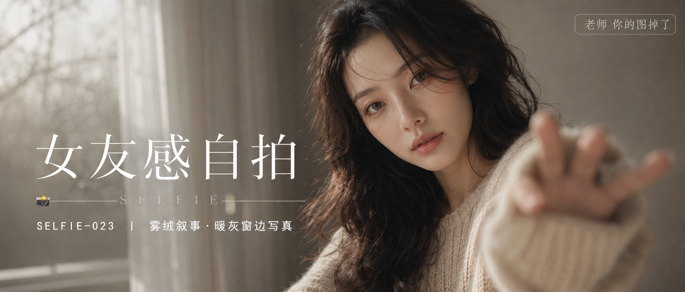

# SELFIE-023-雾绒叙事·暖灰窗边写真 封面

## 封面提示词

极简暖灰米色室内，一位24至27岁的成年亚洲女生位于画面右侧，正面与3/4侧脸之间的近景半身构图，面部占画面三分之一以上，黑棕色松散长卷发带轻盈发丝，穿燕麦米色宽松粗针织毛衣，服装得体克制；她抬手靠近镜头形成柔和前景虚化，双眼清晰明亮地直视镜头，双唇自然合拢，五官精致自然、面部立体清晰、皮肤光泽细腻、眼神有神灵动、妆感干净清透、轮廓清晰上镜。左侧留出干净排版空间，白纱窗帘与树影形成层层透视，侧逆光打亮颧骨与发丝轮廓，柔光环绕面部，暖灰与奶咖之间有细微冷暖对比，电影感光影，高清锐利，色彩层次丰富，构图黄金比例，前景虚化背景，视觉冲击力强，商业杂志封面级完成度，画面有张力，真实摄影，无整体蒙层，避免侧脸比例过大、眼睛半闭、嘴巴微张、人物过小、五官模糊、手指畸形、多手多指、过度暴露、透明服装、色情暗示、文字乱码、水印、logo、二维码，避免 AI 美女脸、网红感、过度精修、塑料皮肤、暗沉肤色、明显痘印、明显皱纹、斑点、面部变形，2.35:1 电影横构图。

【文字排版-必须完整保留，不得省略或简化任何一项】画面左侧垂直居中偏下叠加文字排版：超大号衬线字体米白色主文案「女友感自拍」，主文案正下方一条细横线左端带📷横线中央有透明英文水印 SELFIE，横线下方等宽白色字体副文案「SELFIE-023 ｜ 雾绒叙事·暖灰窗边写真」；右上角浅色半透明圆角底衬配小号文字「老师 你的图掉了」（署名文字，必须出现，不可省略）；无整体蒙层，文字直接压图。【文字排版结束】

## 封面图片

