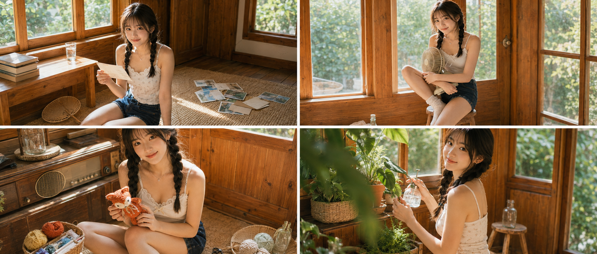
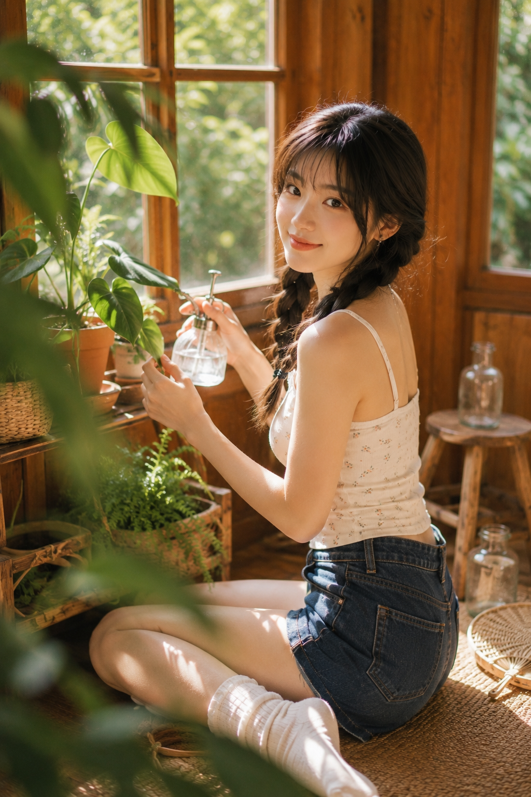

蜂蜜色木窗、双麻花辫和夏日上午光，把六个普通居家动作串成同一组清透生活写真。构图只需轮流改变机位、视线和视觉锚点，就能统一又不重复。

提示词：
竖版2:3，24岁亚洲女生，低位双麻花辫，奶油白蕾丝边背心与深蓝牛仔短裤，内衬完整不透，夏日老式木屋，蜂蜜橙木窗，藤席与绿植，柔和窗边逆光，真实日系生活摄影，轻复古胶片质感，五官自然清秀，面部干净，眼神真实，表情松弛。

#GPTImage2 #千问 #生图提示词 #Prompt #女友感自拍 #夏日木屋写真

