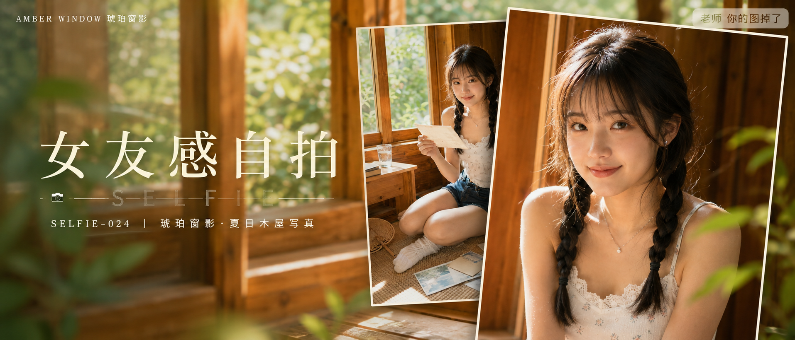

# SELFIE-024-琥珀窗影·夏日木屋写真 封面

## 封面提示词

夏日木屋人像杂志封面，同一位24岁亚洲女生，低位双麻花辫、轻薄空气刘海、奶油白蕾丝边背心与深蓝牛仔短裤，内衬完整不透；主体使用两张摄影卡片错落堆叠形成视觉层次：右侧前景大卡片为人物正脸3/4侧脸半身近景，面部占卡片三分之一以上，她回眸自然微笑，眼神有神灵动，五官精致自然，面部立体清晰，皮肤光泽细腻，妆感干净清透，黄金时段暖光照脸；后方稍微旋转的第二张卡片呈现她在木窗藤席上读信的生活瞬间。卡片有精致米白细边和自然投影，蜂蜜橙木窗、奶油白、植物绿、深牛仔蓝形成鲜明而克制的色彩记忆点，前景虚化的绿叶与窗格光影增加空间纵深，电影感光影，高清锐利，色彩层次丰富，视觉冲击力强，构图黄金比例，色调统一精致，商业杂志封面级完成度，真实摄影质感，2.35:1 电影横构图。避免未成年感、软色情、过度暴露、透视服装、纯背影、纯远景、眼睛半闭、嘴巴微张、面部太小、手部畸形，避免 AI 美女脸、网红感、过度精修、塑料皮肤、暗沉肤色、明显痘印、明显皱纹、斑点、面部变形。

【文字排版-必须完整保留，不得省略或简化任何一项】画面左侧垂直居中偏下叠加文字排版：超大号衬线字体米白色主文案「女友感自拍」，主文案正下方一条细横线左端带📷横线中央有透明英文水印 SELFIE，横线下方等宽白色字体副文案「SELFIE-024 ｜ 琥珀窗影·夏日木屋写真」；左上角可加入小号高级视觉名「AMBER WINDOW 琥珀窗影」；右上角浅色半透明圆角底衬配小号文字「老师 你的图掉了」（署名文字，必须出现，不可省略）；无整体蒙层，文字直接压图。【文字排版结束】

## 封面图片

