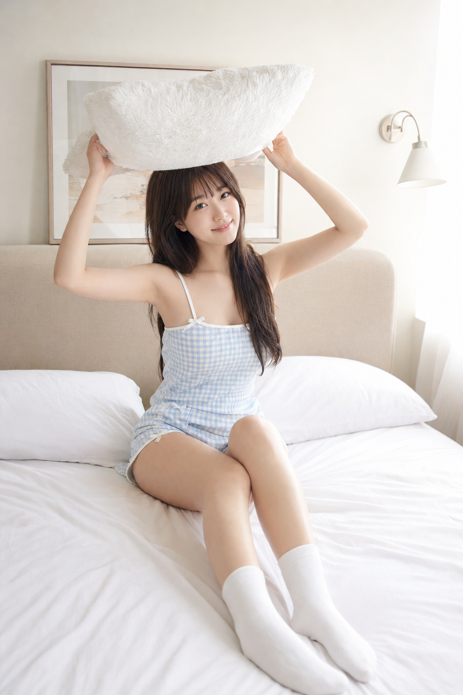
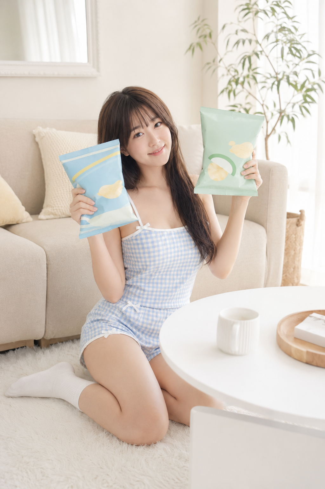
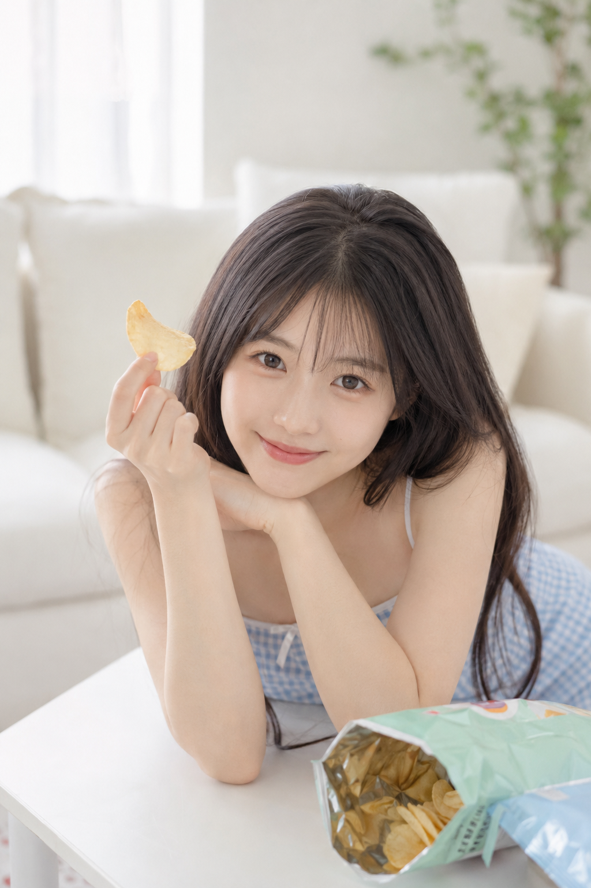
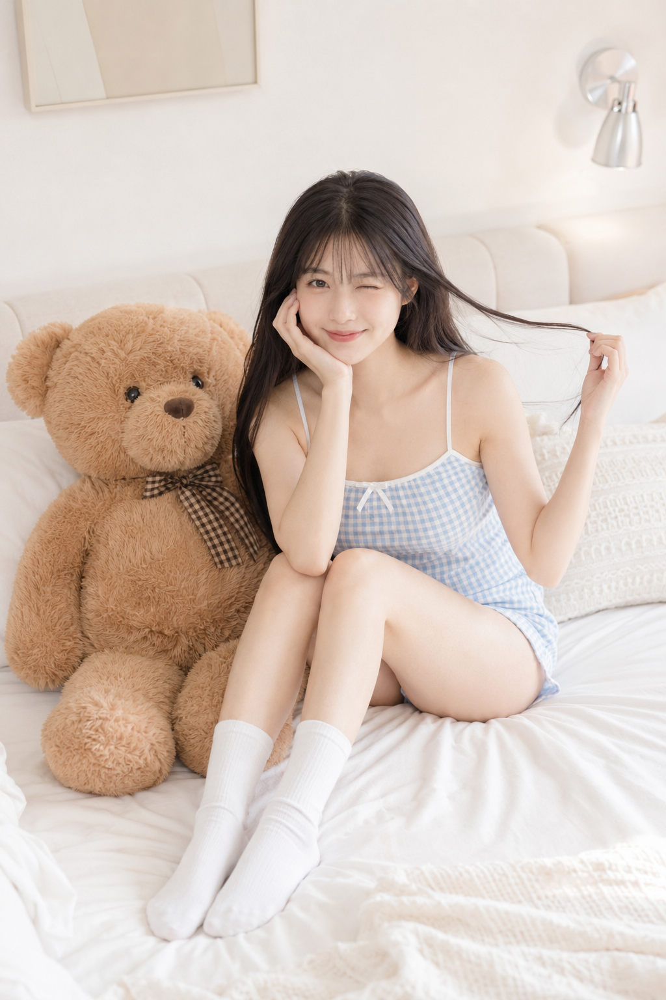
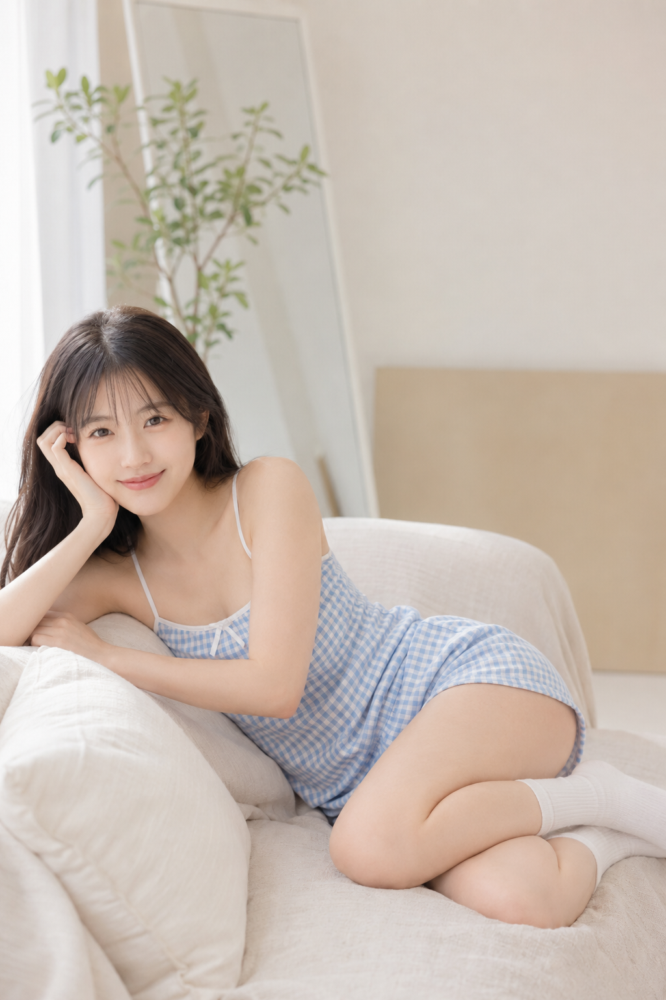
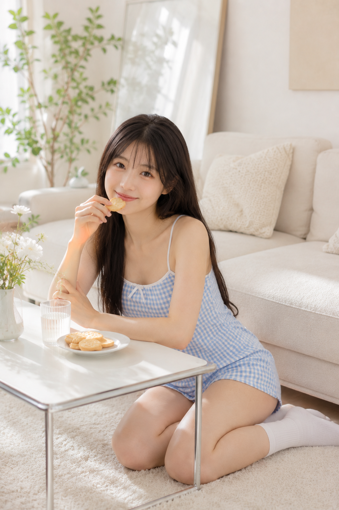

奶油白居家写真经常会生成得像样板间，问题通常不在光线，而在人物、动作和镜头距离没有形成连续的生活叙事。这组图把人物、浅蓝白格纹穿搭、奶油白空间和柔和日光锁住，再用六个动作和不同焦段组织节奏。

**为什么这类场景容易出图**

- 奶油白和浅蓝是低饱和的稳定组合，窗光能保留皮肤质感，避免画面显得厚重。
- 抱枕、零食、泰迪熊和轻食不是摆件，而是人物抬手、托脸、侧卧的合理原因。
- 35mm、45mm、50mm 与 85mm 轮换，能在环境、人物和情绪特写之间建立观看节奏。

**抱枕晨间瞬间**

用轻微俯拍保留床品与床头，让双手举起的抱枕成为动作重心。

提示词：
竖版2:3，明亮高调的日系甜美居家写真，一位22岁成年亚洲女生，真实自然的东亚面孔，五官清秀耐看，黑棕色长直发自然披肩，轻薄齐刘海，皮肤白皙通透但保留自然纹理，清透淡妆，面部干净，眼神真实，气质清爽亲和，神情温柔可爱。她穿浅蓝白小格纹吊带居家连体短裤，白色细肩带与白色蝴蝶结装饰，搭配纯白中筒袜，坐在奶油白床上，双腿自然并拢微微前伸，双手把一只蓬松白色枕头举过头顶，像晨间打闹的瞬间，脸微微歪向镜头，露出淡淡笑意。场景是干净柔软的奶油白卧室，白色床品、米白软包床头、极简装饰画、银色壁灯，整体简洁通透。大面积柔和窗光，高调布光，低对比，低饱和，奶油白与浅蓝色主调，真实摄影质感，35mm环境人像，轻微俯拍，人物清晰、背景柔和，画面清新、可爱、治愈。不要品牌logo，不要水印，不要文字。避免 AI 美女脸、网红感、过度精修、过度磨皮、幼态感、塑料皮肤、暗沉肤色、明显痘印、明显皱纹、斑点、面部变形、手部畸形、结构错误。

**零食桌前互动**

白色小桌放在前景，人物跪坐在地毯上，能避免双手展示零食变成广告画面。

提示词：
竖版2:3，日系清甜风高调居家人像，同一位22岁成年亚洲女生，黑棕色长发，轻薄刘海，五官自然清秀，眼神明亮真实，面部干净，自然皮肤纹理，气质清爽亲和，清透自然妆容。她穿同一套浅蓝白格纹吊带居家连体短裤，搭配白色中筒袜，跪坐在米白色布艺沙发前的白色地毯上，身前是一张白色极简小桌，双手分别举起两包无品牌彩色零食包装，一包偏湖蓝色，一包偏薄荷绿色，表情俏皮甜美，正面看向镜头。奶油白客厅角落，米白沙发、浅色抱枕、白框墙镜、绿色室内植物、奶油色墙面与白色地毯，空间明亮柔和。大窗自然光配合柔光箱，高调、浅阴影、空气感强，50mm镜头，中景正面构图，桌面作为前景形成层次，低饱和奶油白色调，真实商业写真质感。不要品牌文字、广告水印、二维码。避免 AI 美女脸、网红感、过度精修、塑料皮肤、暗沉肤色、明显痘印、明显皱纹、斑点、面部变形、过曝、肢体变形、手指错误、杂乱背景。

**趴桌托脸近景**

85mm 近景只保留眼神、手势和薯片的距离关系，背景虚化后仍保留客厅的生活信息。

提示词：
竖版2:3，清新柔光的日系居家生活写真，同一位22岁成年亚洲女生，真实自然的东亚面孔，黑色顺直长发，轻薄刘海，五官自然清秀，面部干净，干净自然肤质，眼神真实灵动，唇色淡粉。她穿同一套浅蓝白格纹吊带居家连体短裤，俯身趴在白色桌边，双臂自然交叠，下巴轻轻靠在手背上，一只手举着一片浅金色薯片靠近脸侧，看向镜头，像被记录到的零食间隙，表情俏皮自然。背景是奶油白客厅，米白沙发、白纱窗帘、白墙、浅色靠垫和一株模糊绿植，环境极简通透。使用85mm镜头拍摄近景特写，浅景深，对焦在眼睛，背景虚化细腻。整体高调布光，柔和自然窗光，奶油白、浅米色、浅蓝色主调，真实摄影质感，像精致生活写真。不要文字、logo、水印。避免 AI 美女脸、网红感、过度精修、过度磨皮、塑料皮肤、暗沉肤色、明显痘印、明显皱纹、斑点、面部变形、幼态感、手部畸形、低清晰度。

**泰迪熊色彩锚点**

在浅色空间里保留一个焦糖棕色道具，就能给奶油蓝画面增加稳定的视觉重心。

提示词：
竖版2:3，明亮奶油白卧室写真，同一位22岁成年亚洲女生，黑棕色长直发，轻薄齐刘海，五官自然清秀，面部干净，皮肤光泽自然，轮廓清晰，气质清爽亲和。她穿同一套浅蓝白格纹吊带居家连体短裤和白色中筒袜，坐在白色床上，身旁放着一只大型焦糖棕色泰迪熊，一只手轻轻拈起一缕发丝，另一只手托在脸侧，对镜头自然眨一只眼睛，双腿自然弯曲收在身前。场景包含白色床品、奶油色靠垫、浅色墙面、极简壁灯和柔软白色抱枕，空间整洁温柔。高调柔光布光，阴影很浅，奶油白、浅米色、浅蓝色主调，焦糖棕点缀，真实摄影棚拍感，35mm镜头，全身偏中景，人物位于画面中间略偏右，构图舒展，氛围甜美治愈。不要任何品牌信息和水印。避免 AI 美女脸、网红感、过度精修、塑料皮肤、暗沉肤色、明显痘印、明显皱纹、斑点、面部变形、幼态感、手脚畸形、家具穿模、过度锐化。

**沙发侧卧留白**

人物偏左、右侧留出镜子和绿植，能让横向姿势不显得像家具展示。

提示词：
竖版2:3，柔和高级的奶油白居家人像写真，同一位22岁成年亚洲女生，真实自然的东亚脸，黑棕色长发柔顺披肩，轻薄刘海，五官自然清秀，面部干净，眼神柔和真实，嘴角带自然笑意，干净自然肤质，轮廓清晰。她穿同一套浅蓝白小格纹吊带居家连体短裤和白色袜子，侧卧在米白色沙发上，上半身微微撑起，手肘支在沙发扶手处，一只手轻扶耳侧，另一只手自然叠放，面对镜头露出温柔清爽的微笑。场景为干净通透的奶油白客厅，米白沙发覆盖浅色棉麻罩布，旁边有白色靠枕、白框镜子、奶油色背景板和高挑绿植，整体有杂志感留白。大面积窗边柔光，高调低对比，浅景深，色调克制清新，奶油白、暖灰白、浅蓝色主调。50mm镜头，半身到三分之二身构图，人物偏左，右侧保留环境留白，真实摄影，精致柔和。不要品牌、水印、文字。避免 AI 美女脸、网红感、过度精修、塑料皮肤、暗沉肤色、明显痘印、明显皱纹、斑点、面部变形、肢体结构错误、凌乱背景。

**轻食下午茶收尾**

最后用小桌、饼干和45mm中景补全场景，让前面的互动像发生在同一段居家时光。

提示词：
竖版2:3，清甜生活化的日系高调居家写真，同一位22岁成年亚洲女生，真实自然的东亚面孔，长直黑发，轻薄齐刘海，五官自然清秀，面部干净，自然皮肤纹理，表情松弛，眼神真实，妆容清透。她穿同一套浅蓝白格纹吊带居家连体短裤，搭配白色中筒袜，跪坐在奶油白沙发前的白色地毯上，身前是一张白色金属边小桌，桌上放着一只白色小盘和几块浅色饼干，她一只手拿着一块饼干靠近唇边，另一只手自然搭在桌沿，微笑看向镜头，像悠闲下午茶的瞬间。背景为米白沙发、浅色靠垫、白墙、极简镜子、绿植和白色花瓶，空间明亮整洁，布景生活感强但不复杂。柔和自然窗光，高调布光，阴影轻浅，奶油白和浅蓝色主导，点缀少量绿色植物，真实摄影质感，45mm镜头，中景三分构图，桌面形成前景层次，氛围轻松温柔。不要logo、品牌文字、水印。避免 AI 美女脸、网红感、过度精修、塑料皮肤、暗沉肤色、明显痘印、明显皱纹、斑点、面部变形、过曝、手指畸形、桌椅结构错误、低清画质。

**关键参数说明**

- 先固定人物、服装、主色和光线，系列中的人物身份和视觉基调才稳定。
- 35mm 适合交代卧室与客厅，50mm 适合自然的人际距离，85mm 适合把注意力收回眼神。
- 高调低对比和大面积柔和窗光能让奶油白保持轻盈，同时保留自然皮肤纹理。
- 每张都给道具一个动作功能，比单纯堆叠装饰物更容易得到生活感。

**可替换的元素**

- 把抱枕换成书本、毛毯或耳机，动作仍然保持抬手或环抱。
- 把泰迪熊换成一束浅色花或一只无品牌帆布袋，只保留一个暖色强调物。
- 把奶油白卧室换成民宿窗边、日系咖啡馆或酒店房间，继续保留浅蓝服装与日光。

#生图提示词 #GPTImage2 #千问 #豆包 #女友感自拍 #奶油蓝居家写真
