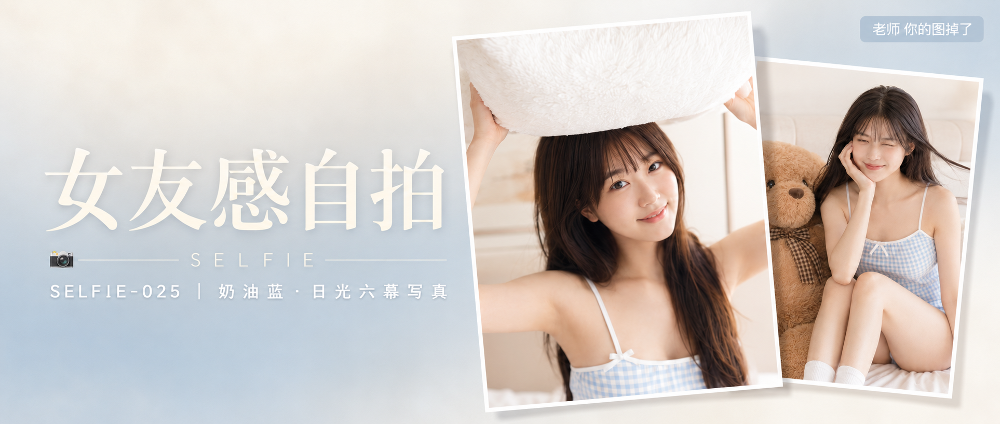

# SELFIE-025-奶油蓝·日光六幕写真 封面

## 封面提示词

奶油蓝日光叙事概念人像封面，同一位22岁成年亚洲女生，真实自然东亚面孔，黑棕色长直发和轻薄齐刘海，穿浅蓝白小格纹得体居家连体短裤，画面右侧以两张精致写真图片卡片错落堆叠：前景大卡片是女生抱着白色枕头的正脸半身近景，面部占卡片画面三分之一以上，眼神有神灵动，微笑自然；后方小卡片是她与焦糖色泰迪熊同框的四分之三侧脸瞬间，两张卡片带细白边、轻微旋转角度和柔和投影，形成高级杂志拼贴层次。背景是克制的奶油白至雾蓝色渐变，右侧柔光环绕面部，少量焦糖棕作色彩锚点，左侧保留干净文字空间。五官精致自然，面部立体清晰，皮肤光泽细腻但保留真实纹理，妆感干净清透，轮廓清晰上镜。电影感光影，高清锐利，色彩层次丰富，视觉冲击力强，构图黄金比例，色调统一精致，商业杂志封面级完成度，2.35:1 电影横构图。不要品牌logo，避免人物过小、纯背影、纯侧脸、眼睛半闭、嘴巴微张、杂乱背景、AI 美女脸、网红感、过度精修、塑料皮肤、暗沉肤色、明显痘印、明显皱纹、斑点、面部变形。

【文字排版-必须完整保留，不得省略或简化任何一项】画面左侧垂直居中偏下叠加文字排版：超大号衬线字体米白色主文案「女友感自拍」，主文案正下方一条细横线左端带📷横线中央有透明英文水印 SELFIE，横线下方等宽白色字体副文案「SELFIE-025 ｜ 奶油蓝·日光六幕写真」；右上角浅色半透明圆角底衬配小号文字「老师 你的图掉了」（署名文字，必须出现，不可省略）；无整体蒙层，文字直接压图。【文字排版结束】

## 封面图片

