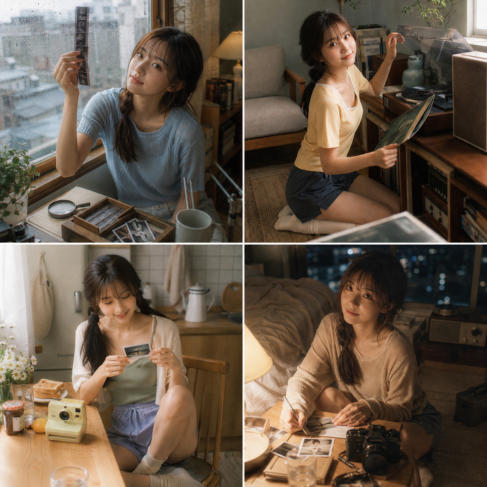
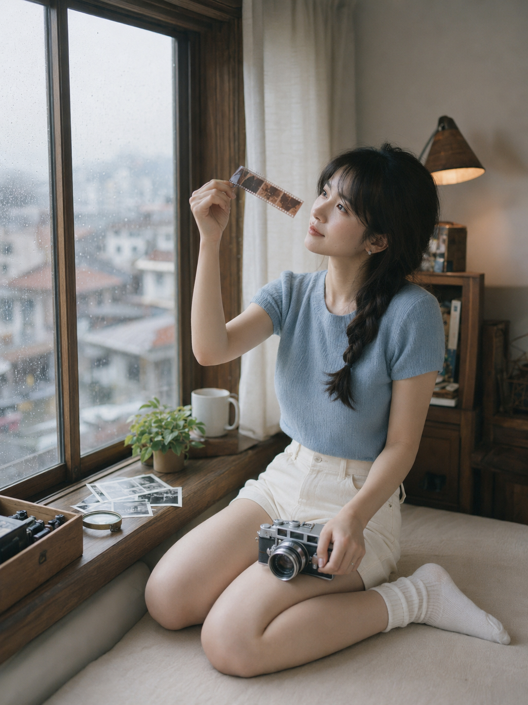
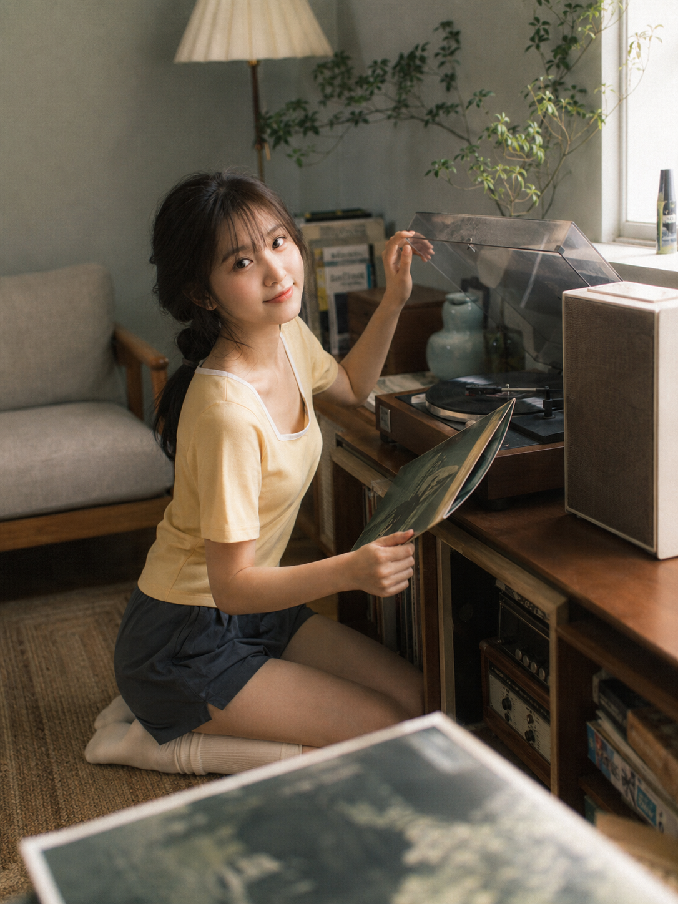
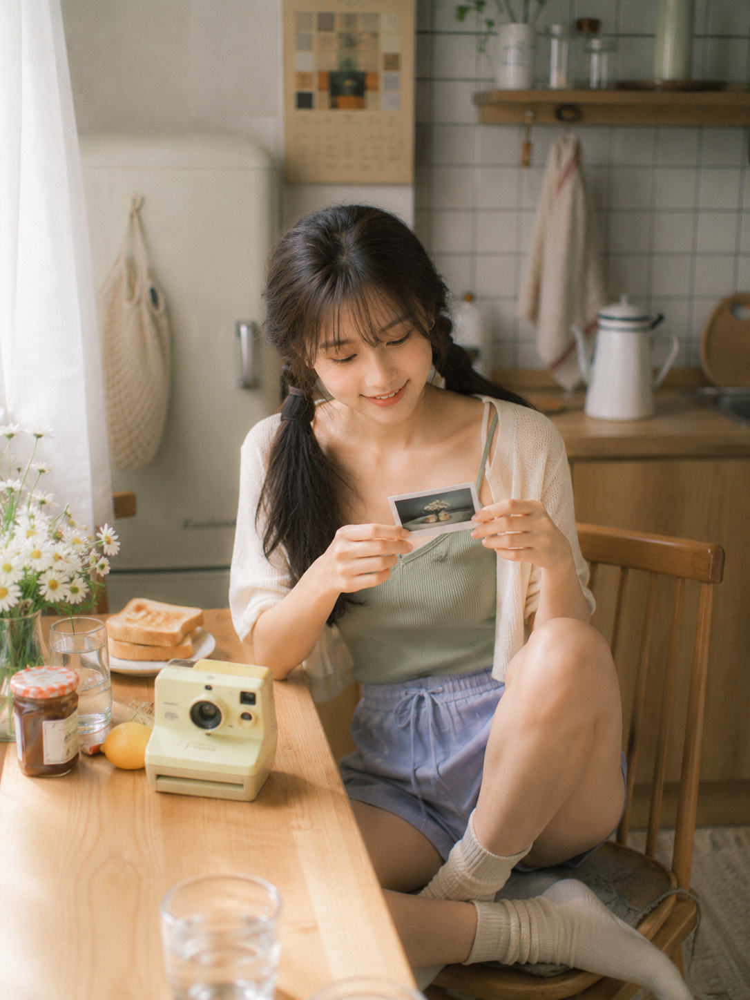
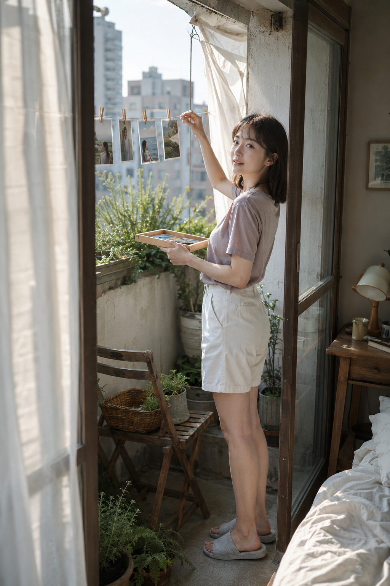
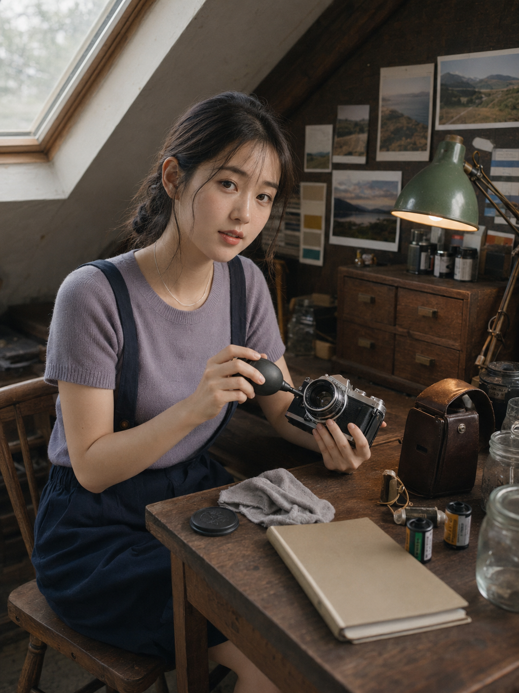
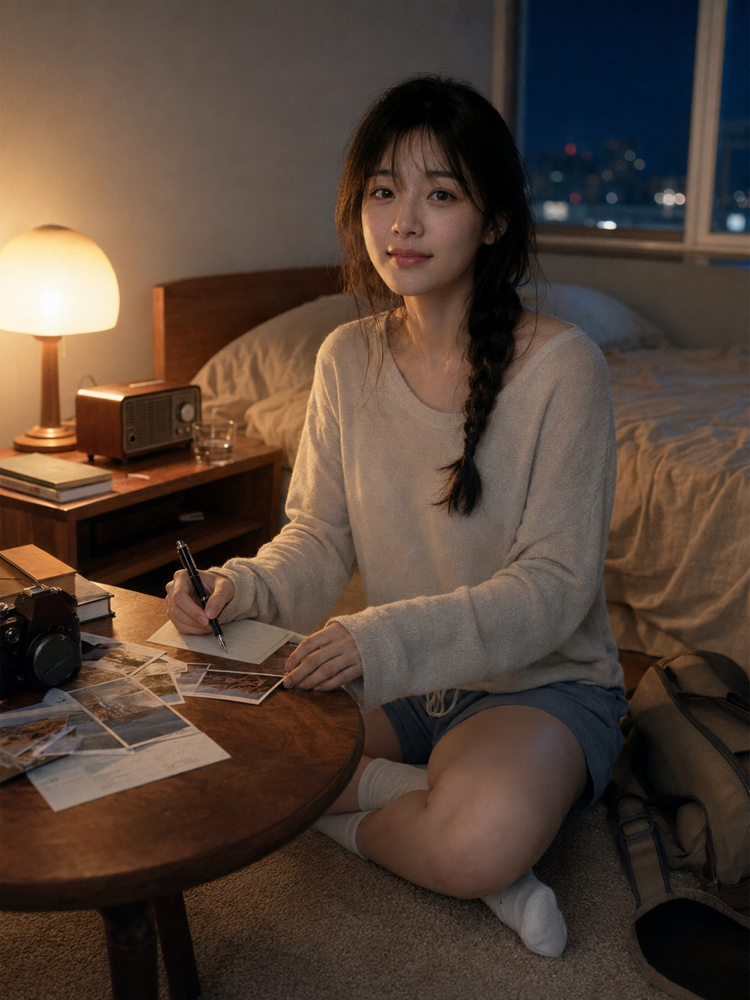

# 试了六个复古生活场景，最像真实女友抓拍的是这一幕

**Q：为什么很多“女友感”照片明明人物好看，却还是一眼像 AI？**

问题往往不在脸，而在画面没有“正在发生的事”。人物只是坐着微笑，道具只是摆设，空间再精致也像样板间。真正自然的关键，是让人物和胶片、唱片、相机、照片发生明确互动，再用朋友视角代替商业棚拍视角。

先写动作，再写光线，最后补审美风格，比一上来堆“高级、唯美、氛围感”稳定得多。

---

### ✅ #01 雨后窗边：让胶片成为光的中心

这一幕最完整：人物举起半透明底片，雨珠玻璃负责制造前后层次，冷灰窗光与暖色台灯把脸从背景里托出来。人物没有直勾勾看镜头，而是在做一件具体的事，所以更像被朋友偶然记录。

**可直接复制的原版提示词：**

竖版3:4，日系复古居家胶片写真，一位23岁成年亚洲女生坐在老公寓的木质飘窗旁整理刚冲洗出来的胶片底片，真实自然的东亚面孔，柔和鹅蛋脸，五官清秀耐看，眼神安静灵动，皮肤白皙通透但保留细腻真实纹理，不惨白、不塑料。黑棕色中长发编成松弛的单侧低麻花辫，轻薄弧形刘海，脸侧散落几缕自然碎发，佩戴小巧银色耳钉。她穿浅雾蓝色短袖针织上衣，搭配奶油白高腰棉质短裤和白色薄棉堆堆袜，服装柔软宽松、内衬完整、自然得体。女生屈膝侧坐在铺有米白色坐垫的飘窗上，一只手举起半透明胶片迎着窗光观察，另一只手扶着放在膝盖上的银色复古旁轴相机，微微侧头，嘴角带若有若无的笑意，动作自然专注。窗外是刚下过雨的模糊城市屋顶，玻璃上残留细小雨珠，窗台摆放木质底片盒、放大镜、几张没有文字的黑白照片、白瓷马克杯和小型绿植。室内背景为浅灰墙面、胡桃木矮柜、旧书、亚麻窗帘和暖棕色台灯，空间带有真实生活痕迹，但整洁克制。采用平视中近景构图，人物位于画面右侧三分之一，左侧窗户保留大面积柔和留白，胶片位于前景光线最明亮的位置。50mm定焦镜头，f/1.8浅景深，人物眼睛、手指与胶片边缘清晰，窗外和室内家具柔和虚化。雨天冷灰自然光从左侧进入，暖色台灯作为轻微补光，形成低饱和蓝灰、奶油白、胡桃木棕和自然肤色之间的冷暖平衡。真实摄影，日系生活写真，细腻彩色负片质感，柔和高光，轻微胶片颗粒，低对比，安静、清透、文艺、自然，不添加文字、水印、边框和品牌标识。避免未成年人，避免幼态儿童脸，避免软色情、暴露、透视衣物、刻意性感姿势，避免AI网红脸、过度磨皮、塑料皮肤、夸张大眼、尖下巴、浓妆，避免手指畸形、多余肢体、胶片结构错误、相机变形，避免过度橙黄、HDR、强闪光、死黑阴影、动漫感、3D渲染感、乱码、文字、水印。

---

### ✅ #02 唱片机旁：用“邀请感”替代摆拍感

抽唱片的手和扶唱片机的手形成动作链，回头浅笑则把镜头变成一起听歌的朋友。35mm 略低机位保留客厅环境，前景虚化的唱片封套还能制造真实观看距离。

---

### ✅ #03 午后厨房：把等待变成故事

即时照片尚未显影，本身就带悬念。桌面高度的机位像两个人隔桌聊天，鼠尾草绿、奶油黄与浅木色提高明度，却不会滑向商业影棚的“假干净”。

---

### ✅ #04 清晨阳台：让风进入静态画面

照片绳、白床单、薄纱帘都能被晨风带动，人物只需要夹照片和回头，画面就有连续动作。这里最重要的是用门框做天然画框，让全身环境照仍然保持视觉聚焦。

---

### ✅ #05 阁楼书桌：道具必须“能被正确使用”

机械相机、气吹、镜头盖如果只散落在桌上，会像布景；让双手分别固定机身和清理镜头，故事才成立。45 度观察视角还能同时看清脸、手与金属高光。

---

### ✅ #06 夜晚台灯：冷暖关系决定电影感

琥珀台灯照亮一侧脸，窗外深蓝只做微弱轮廓光，暗部保留层次。写明信片时突然抬头的瞬间，比正襟危坐更亲近；被打断的动作，就是夜间女友感最自然的表情来源。

---

这组六幕可以换道具，但不要丢掉同一条逻辑：人物在做事、镜头像朋友、光线有方向。想继续看哪一种复古日常？可以先收藏这套结构，关注后续更新，也欢迎在评论区留下你想生成的场景。

---

## 往期回顾

- SELFIE-025 奶油蓝·日光六幕写真
- SELFIE-024 琥珀窗影·夏日木屋写真
- SELFIE-023 雾绒叙事·暖灰窗边写真

#GPTImage2 #千问 #豆包 #生图提示词 #Prompt #女友感自拍 #日系胶片写真
