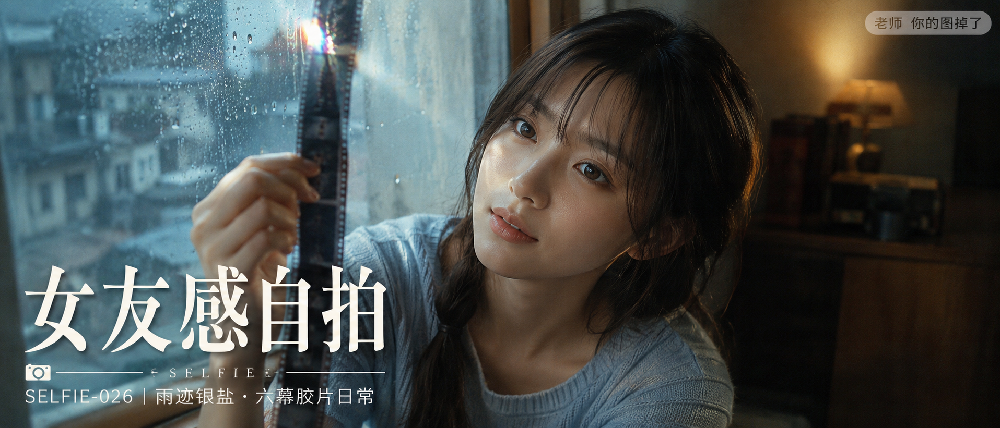

# SELFIE-026-雨迹银盐·六幕胶片日常 封面

## 封面提示词

雨后老公寓的木质飘窗边，一位23岁成年亚洲女生以正脸偏3/4侧脸靠近窗玻璃观察半透明胶片，面部占画面三分之一以上，真实自然的东亚面孔，五官精致自然，面部立体清晰，皮肤光泽细腻，眼神有神灵动，妆感干净清透；黑棕色松弛侧辫与轻薄刘海，浅雾蓝针织上衣，冷灰雨光从左侧穿过雨珠玻璃，暖棕台灯柔光环绕面部，胶片边缘在前景形成明亮高光与轻微虹彩，窗外城市屋顶虚化，冷暖色彩强对比但低饱和，画面有雨后安静故事感与即将发现旧影像的悬念，日系彩色负片、细腻颗粒、柔和高光晕染、电影感光影、高清锐利、色彩层次丰富、视觉冲击力强、构图黄金比例、前景虚化背景、色调统一精致、画面有张力、商业海报级完成度，人物清晰上镜，避免纯侧脸、远景小人、眼睛半闭、嘴巴微张，避免未成年人、软色情、暴露、透视衣物、AI美女脸、网红感、过度精修、塑料皮肤、暗沉肤色、明显痘印、明显皱纹、斑点、面部变形、手指畸形、相机和胶片结构错误，2.35:1电影横构图。

【文字排版-必须完整保留，不得省略或简化任何一项】画面左侧垂直居中偏下叠加文字排版：超大号衬线字体米白色主文案「女友感自拍」，主文案正下方一条细横线左端带📷横线中央有透明英文水印 SELFIE，横线下方等宽白色字体副文案「SELFIE-026 ｜ 雨迹银盐·六幕胶片日常」；右上角浅色半透明圆角底衬配小号文字「老师 你的图掉了」（署名文字，必须出现，不可省略）；无整体蒙层，文字直接压图。【文字排版结束】

## 封面图片

