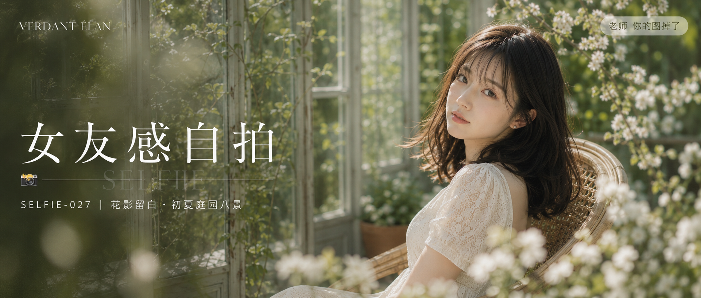

# SELFIE-027-花影留白·初夏庭园八景 封面

## 封面提示词

复古玻璃花房与初夏白花交织的电影静帧，一位24岁成年亚洲女生穿象牙白蕾丝连衣裙坐在浅藤色扶手椅上，3/4侧脸回望镜头，面部占画面三分之一以上，五官精致自然、面部立体清晰、皮肤光泽细腻、眼神有神灵动、妆感干净清透、轮廓清晰上镜；左侧玻璃窗与藤叶留出文字空间，前景白花和绿叶虚化，侧逆光打亮颧骨与发丝，奶油高光与灰绿色阴影形成克制冷暖对比，画面加入小号艺术刊名 VERDANT ÉLAN 作为层次点缀，电影感光影，色彩层次丰富，构图黄金比例，视觉冲击力强，商业杂志封面级完成度，真实摄影，2.35:1电影横构图。避免纯侧脸、闭眼、嘴巴微张、人物过小、面部模糊、AI美女脸、网红感、过度精修、塑料皮肤、暗沉肤色、明显痘印、明显皱纹、斑点、面部变形、手部畸形、文字乱码、logo、水印。【文字排版-必须完整保留，不得省略或简化任何一项】画面左侧垂直居中偏下叠加文字排版：超大号衬线字体米白色主文案「女友感自拍」，主文案正下方一条细横线左端带📷横线中央有透明英文水印 SELFIE，横线下方等宽白色字体副文案「SELFIE-027 ｜ 花影留白·初夏庭园八景」；右上角浅色半透明圆角底衬配小号文字「老师 你的图掉了」（署名文字，必须出现，不可省略）；无整体蒙层，文字直接压图。【文字排版结束】

## 封面图片

