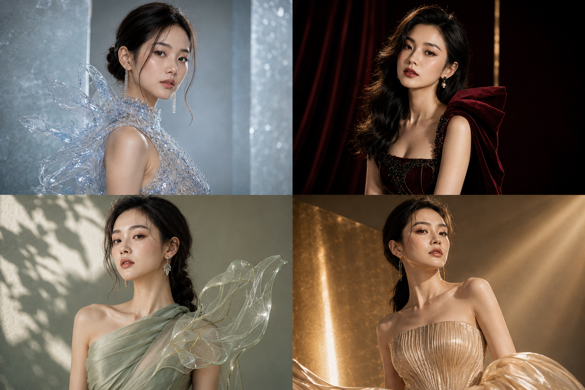
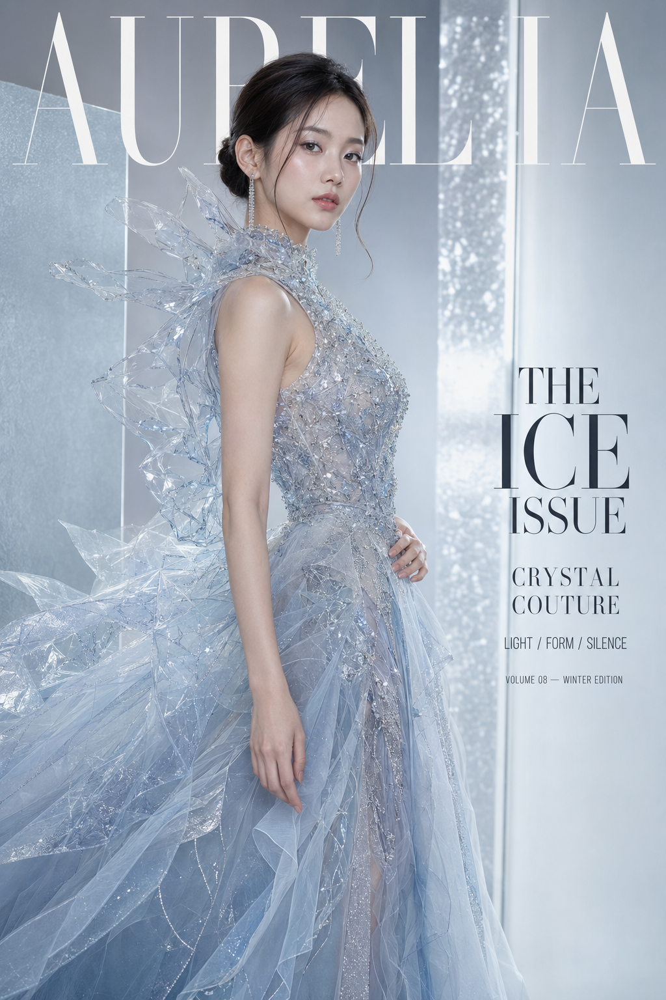
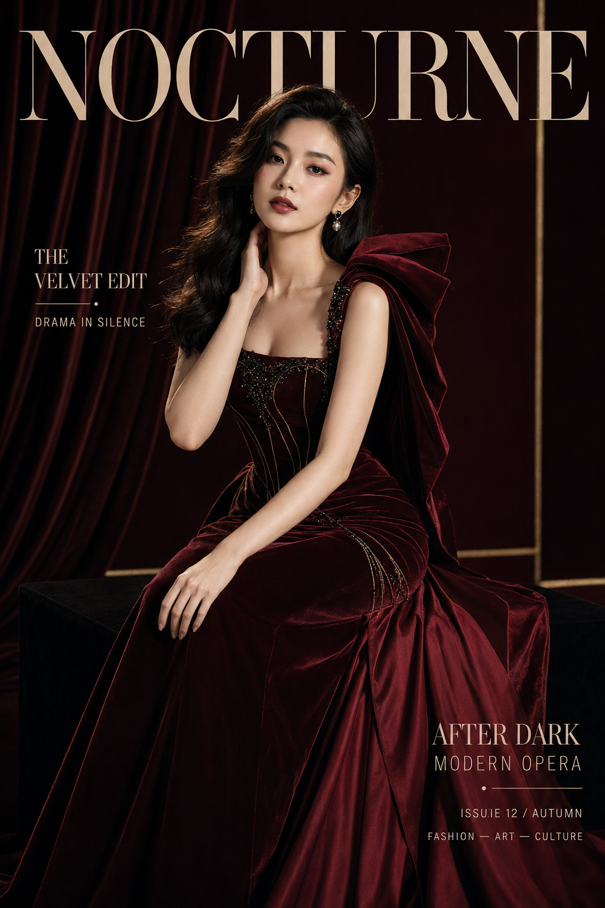
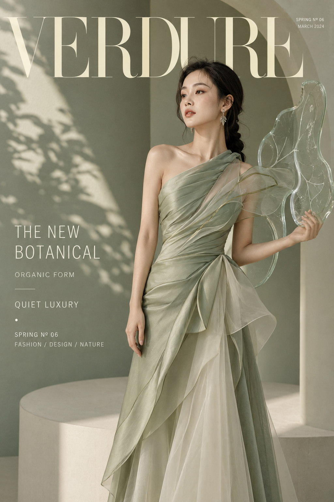
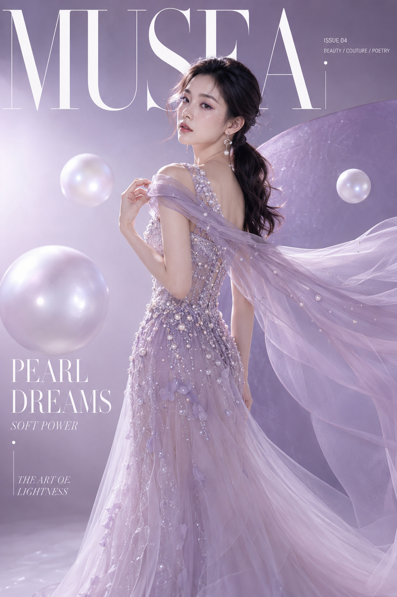
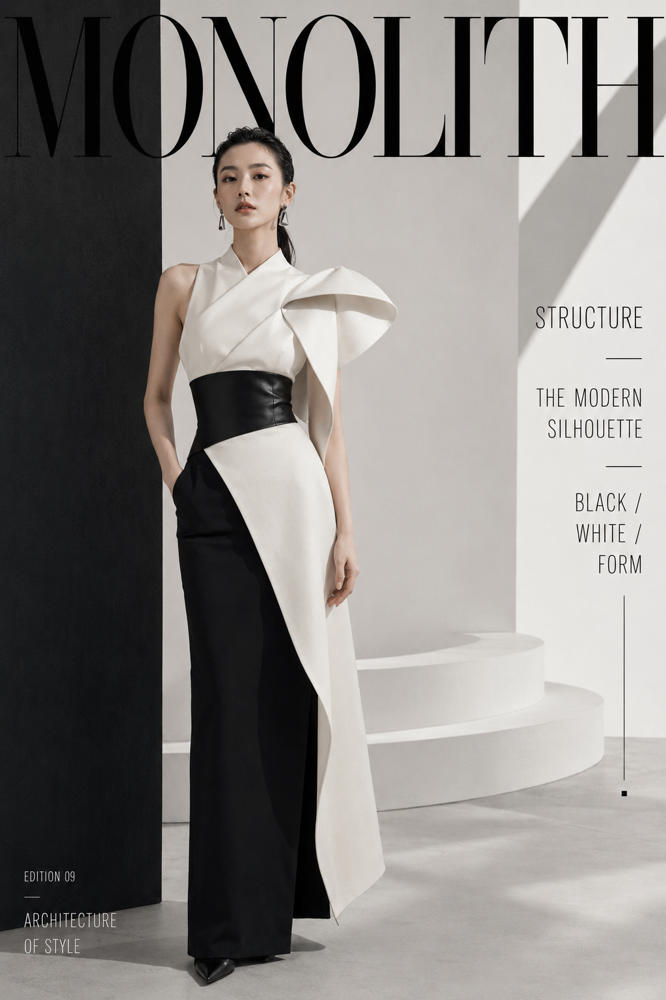
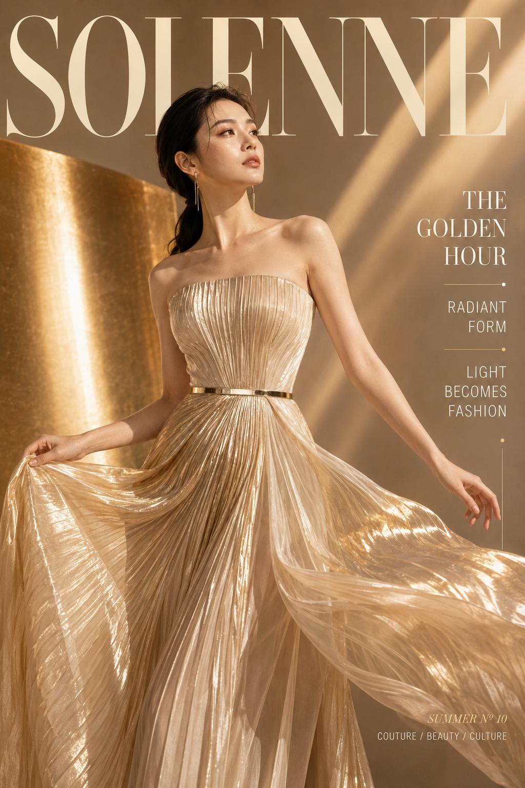

# 六种高级色如何撑起杂志封面？这套视觉层次直接照着用

六张图不靠换滤镜制造差异，而是分别重做颜色、材质、姿态、布景和字版。真正决定高级感的，不是礼服有多复杂，而是每张封面都只有一个明确的视觉主角。

---

## 01｜冰川蓝：让“冷”变得通透

冰川蓝这一张先锁定水晶、银线、透明硬纱三种材质，再用冷白轮廓光把边缘点亮。裙摆向左下方展开，右侧主动留给文字，人物和版式因此不会互相抢位置。

跟 AI 交互时，先说清楚“裙摆往哪里走、文字放在哪里”，比只写“高级杂志感”稳定得多。

提示词原版：

竖版2:3，高端国际时尚杂志封面，冰川蓝水晶高级定制主题，真实写实影棚摄影。画面主体是一位24岁漂亮亚洲女性，真实自然的东亚面孔，柔和鹅蛋脸，五官精致清秀，眼神冷静自信，皮肤白皙透亮，呈自然柔和的冷白肤色，保留细腻皮肤纹理和自然光泽。黑棕色长发梳成低位光滑盘发，耳侧留有两缕柔软弧形碎发，佩戴细长银色水晶耳坠。清透冷调妆容，灰蓝眼影、银白眼角高光、淡粉腮红、水润裸粉唇。她穿一件冰川蓝、雾白与透明银色组合的雕塑感高定礼服，上身为高领无袖结构，胸衣覆盖细密透明水晶、银线刺绣和冰裂纹珠片；左肩延伸出一片不规则透明硬纱，像冰层与玻璃薄片形成的抽象雕塑。腰部收束，下方裙摆由浅冰蓝欧根纱、银灰薄纱和半透明网纱组成，形成不对称斜向展开的巨大廓形，裙摆主要延伸至画面左下方，右侧保留排版空间，服装内衬与剪裁端庄完整。人物采用站立三分之二侧身姿态，身体面向画面左侧，脸部转向镜头，右手轻扶腰部，左手自然垂落，姿态冷静、克制、像雕塑。背景为极简浅冰灰到雾蓝色渐变影棚，后方设置两块半透明磨砂亚克力板和一道狭长银色反光面，形成现代冰川建筑感，没有家具和花卉。顶部刊头使用虚构品牌名“AURELIA”，超大号白色Didot风格高对比衬线字体，横跨顶部，字母部分被人物头部与透明肩部造型遮挡。右侧排版准确清晰的英文文案：“THE ICE ISSUE”“CRYSTAL COUTURE”“LIGHT / FORM / SILENCE”，下方加入小字号窄体无衬线字体：“VOLUME 08 — WINTER EDITION”。排版采用衬线标题与极细无衬线小字混排，留白充足，文字不遮挡人物面部。大型柔光箱从左前上方照射，右后方加入冷白轮廓光，水晶、银线和透明薄纱出现细小锐利高光。全画幅相机，85mm镜头，f/4，眼平机位，人物和礼服主要结构清晰，背景平滑柔化。整体色彩为冰川蓝、雾白、银灰和少量深黑，高级时尚编辑摄影、奢侈品牌广告、冷静、清透、未来感、8K真实摄影质感。避免复刻香槟色蓬松公主裙，避免相同侧身双手交叠姿势，避免真实杂志品牌名称，避免文字乱码、错误拼写、字母重叠，避免手指畸形、多余肢体、腰部过细、廉价塑料质感、背景杂乱、婚礼现场、花墙、动漫感、3D渲染感、水印、二维码、Logo错误，避免 AI 美女脸、网红感、过度精修、塑料皮肤、暗沉肤色、明显痘印、明显皱纹、斑点、面部变形

---

## 02｜酒红：用克制写戏剧感

酒红封面最容易变成舞台照，所以布景只保留一层帷幕、一条暗金线和一只低凳。天鹅绒负责吸光，塔夫绸负责反光，明暗材质的对撞比堆道具更有歌剧感。

设计思想：让人物坐下，并把一只手放在膝上，能打破六张图都是站姿的重复感。

---

## 03｜鼠尾草绿：自然感不等于堆植物

这张只用抽象叶脉、柔和植物投影和一件亚克力雕塑。真实花墙会把画面推向婚礼布景，而“像叶片，但不是真叶片”，能让自然主题保留艺术馆气质。

跟 AI 的交互重点是：“减少真实植物，把叶片改成透明雕塑，并给左侧标题留白。”

---

## 04｜淡紫：梦幻必须有结构

淡紫、珍珠和薄纱很容易甜腻，所以画面加入弧形板与三个悬浮圆球，用几何结构压住轻盈材质。回望动作与向右上方飘起的披纱形成一条对角线，梦幻感因此有方向，而不是一团柔雾。

---

## 05｜黑白：把人物当作建筑的一部分

黑白封面的核心不是去色，而是直线、弧面与负空间。服装的硬质裙片呼应墙体，人物正面站立、一手入袋，视觉力量来自稳定轴线，不需要夸张动作。

跟 AI 交互时可以直接要求：“保留自然肤色，其余压到黑白灰；墙面阴影必须清晰，服装白色结构面不要过曝。”

---

## 06｜香槟金：金色要像光，不要像滤镜

最后一张把金色放在反光板、褶裥边缘与轮廓光里，而不是给整张图套黄滤镜。人物看向右上方光源，裙摆顺着光线扬起，形成“光推动服装”的叙事。

高级金色的关键，是保住自然暖白肤色，同时让金色只出现在高光区域。

---

六种方向可以继续替换材质：冰川蓝换成磨砂玻璃，酒红换成黑樱桃漆面，鼠尾草绿换成纸艺结构，淡紫换成虹彩薄膜，黑白换成金属网格，香槟金换成缎面折光。方法始终不变：先确定一个主色记忆点，再让服装、光线、姿态和版式共同服务它。

喜欢哪一张可以先收藏；关注后续系列，也欢迎在评论区告诉我下一期想看哪一种高定色系。

---

## 往期回顾

- SELFIE-025 奶油蓝·日光六幕写真
- SELFIE-026 雨迹银盐·六幕胶片日常
- SELFIE-027 花影留白·初夏庭园八景

#GPTImage2 #千问 #豆包 #生图提示词 #Prompt #女友感自拍 #高定杂志封面
