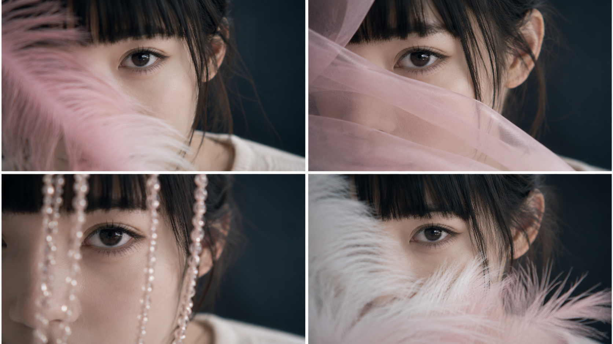
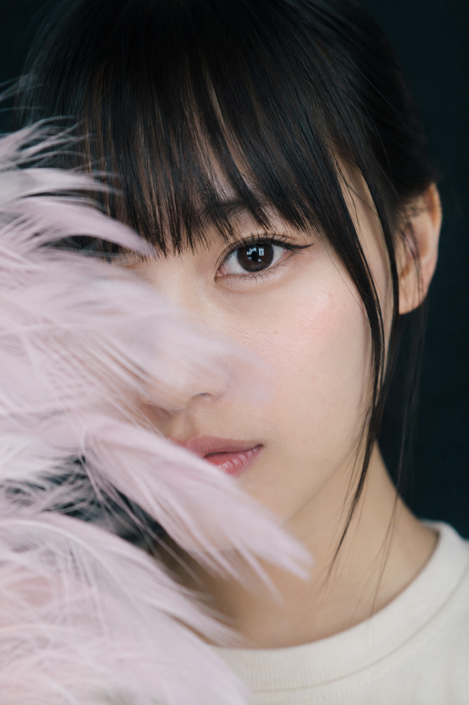
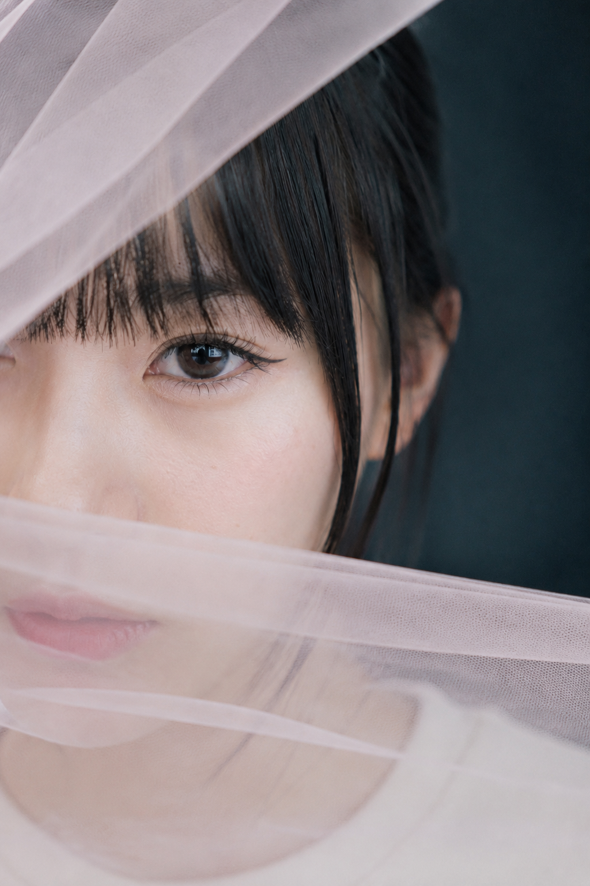
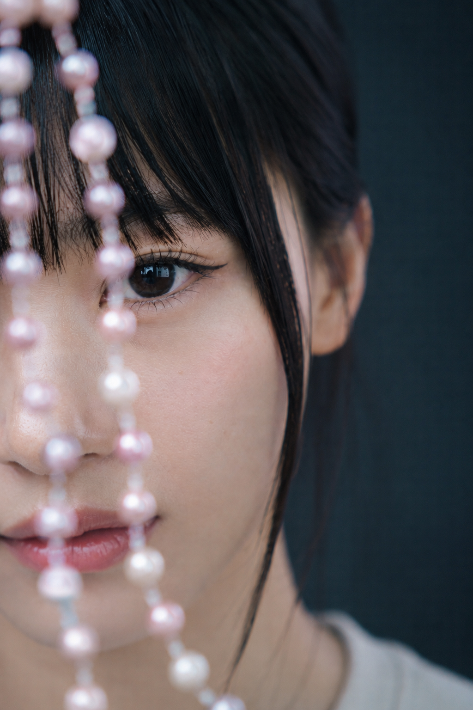
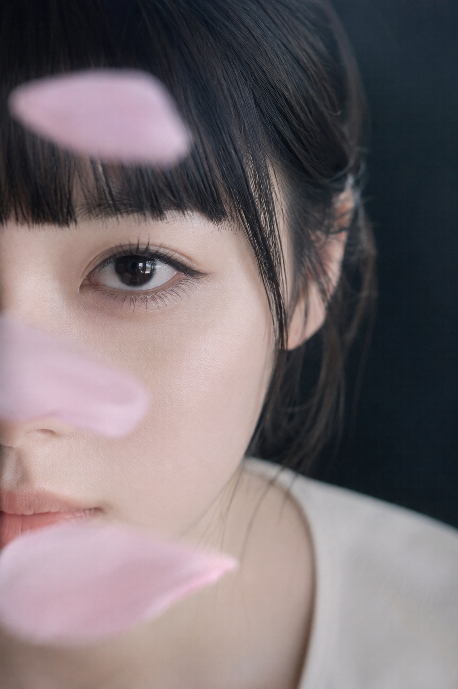
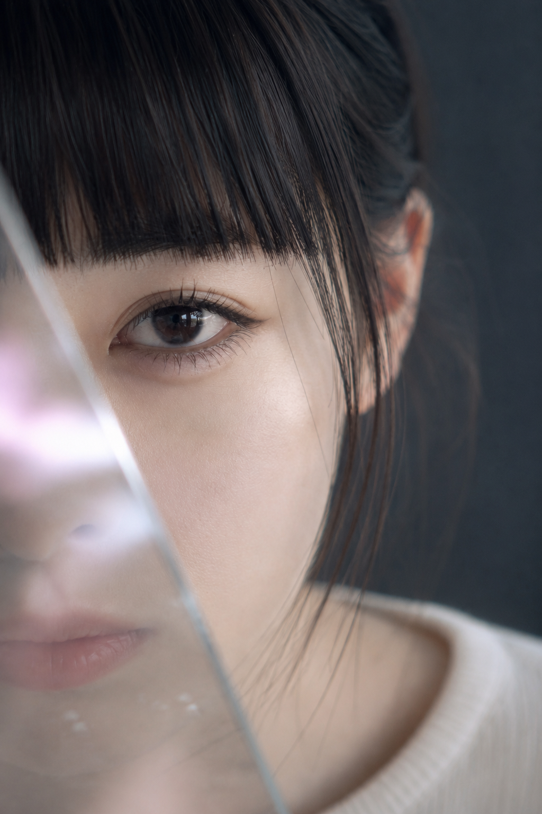
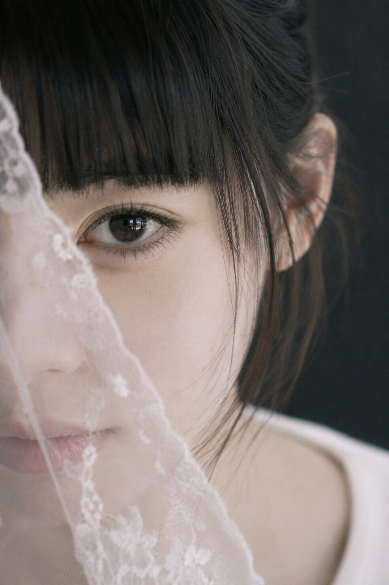
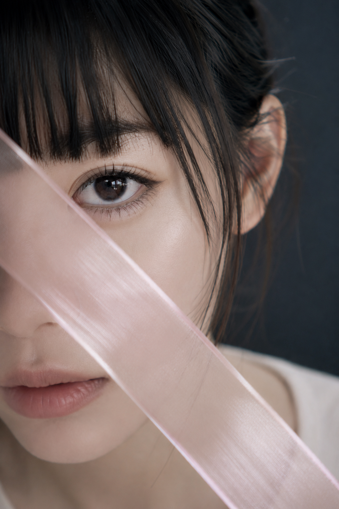
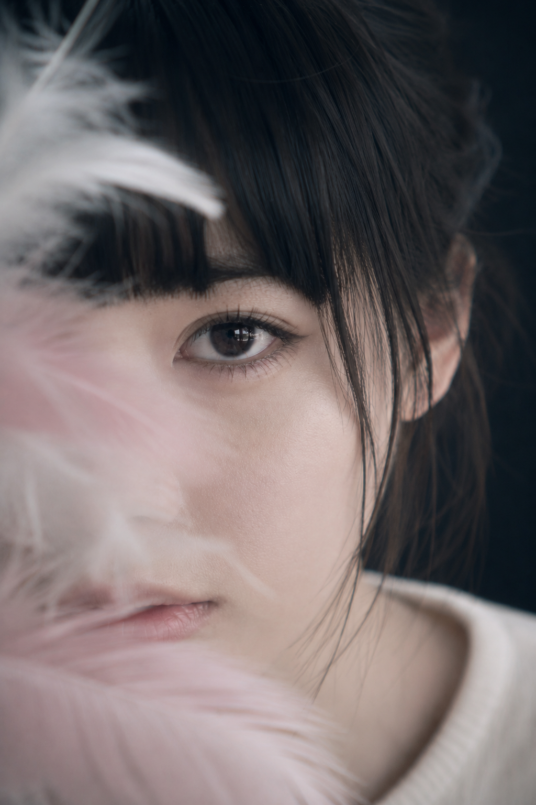

# 只露一只眼也能拍出故事感，八种前景遮挡让女友照真实又高级

这组图的核心不是“把脸挡住”，而是用一层靠近镜头的材质，为单眼凝视建立空间。眼睛是清晰的情绪锦点，羽毛、薄纱、珍珠、花瓣则是失焦的气氛。真正决定高级感的，是“清晰焦点与模糊前景”的秩序。

**Q：粉色羽毛怎么挡，才不会变成廉价影楼感？**

第一张把羽毛放在左前景，用斜线穿过画面，只让一只眼睛完整露出。粉色不需要更艳，反而要用深青黑背景压住，再把对焦点锁在睫毛和瞳孔上。前景越轻，眼神越重，画面才会有情绪。

竖版 2:3，2000 年代亚洲个人写真风格，日系轻复古数码人像，一位 24 岁成年亚洲女生，真实自然的东亚面孔，黑色长发向后束起，厚重整齐的黑色齐刘海，耳侧留细长碎发，清透淡妆，细黑上眼线，根根分明的睫毛，裸粉色嘴唇，健康自然的冷白肤色，保留轻微真实皮肤纹理，五官自然清秀，面部干净，眼神真实，轮廓清晰。人物以超近距离面部特写入镜，脸部占画面大部分，仅露出一只清晰眼睛直视镜头，另一侧被一束浅樱花粉色羽毛轻柔遮挡，羽毛从左前景斜向穿过画面，局部柔焦和轻微动态模糊，形成朦胧梦境感。人物穿无明显图案的浅米白圆领上衣，领口得体，服装尽量弱化。背景为深青黑色极简摄影棚背景，画面干净无杂物。柔和大面积正面偏侧光，眼睛有干净矩形高光，85mm 人像镜头，f/2.0，大光圈浅景深，对焦在单眼，整体低饱和、细腻、安静、神秘，真实摄影质感，无文字，无水印，无 logo，避免 AI 美女脸、网红感、过度精修、塑料皮肤、暗沉肤色、明显痘印、明显皱纹、斑点、面部变形、双眼错位、额外五官、低清晰度、失焦、背景杂乱、强烈彩色灯光、过曝和高噪点

---

**Q：薄纱为什么要分成两层？**

一层靠近额角，一层横过下半张脸，会自然形成远近不同的透明度。如果只写“粉色薄纱遮住脸”，AI 容易把它做成一整块平面蒙版。和 AI 交互时，要说清“一层在哪里，另一层在哪里”，位置关系比“朦胧”更有效。

---

**Q：珍珠怎么拍才不会抢走人的注意力？**

珍珠的作用是建立轻奢层次，不是当主角。因此它要贴近镜头、略微失焦，只在边缘留下小面积高光；右侧再留一块深色空间，让注意力最后回到眼睛。不对称留白会让画面更像编辑写真，而不是饰品广告。

---

**Q：花瓣飘过时，怎么保留真实的空气感？**

这一幕用的是不同速度的花瓣：靠近眼睛的一片较清晰，靠近镜头的几片有轻微运动模糊。这种差异会让观者相信“花瓣刚好掠过”，而不是后期贴上去的装饰。动态模糊要局部出现，人物眼睛必须绝对清晰。

---

**Q：玻璃反射最容易失败在哪里？**

最常见的失败是反光太强，整张脸像被彩色特效切碎。这一版只保留玻璃边缘的雾面反射和浅粉偏光，不做大面积棱镜。告诉 AI：“局部遮挡、不夸张、眼睛高光清晰”，能比单独写“高级反射”稳定得多。

---

**Q：蕾丝很女性化，怎么避免画面过甜？**

蕾丝本身已经有很高的信息密度，其他元素就要做减法：深青灰纯背景、浅白简洁上衣、低饱和冷光。蕾丝只在前景轻微失焦，不需要把花纹都拍清楚。材质越复杂，色彩和布景越要克制，这是让它从甜美走向高级的关键。

---

**Q：想更像杂志封面，应该改哪个变量？**

把自然飘动的前景改成有明确方向的斜线。半透明丝带从左上切到右下，会给超近景人像一个视觉节奏；轻微反光则会增加美妆广告的材质感。和 AI 说“从左上到右下斜切”，不要只说“放一条丝带”。

---

**Q：终章怎么做出更轻的空灵感？**

最后一幕把粉色的存在感再降一级，用白羽作为主体，淡粉只做边缘过渡。多层羽毛需要有通透边缘、远近差异和轻微模糊，才会像真的空气在镜头前流动。它也是八张里最克制的一张：道具更多，但颜色更少，情绪反而更集中。

---

## 这套构图最值得复用的三个判断

1. 先确定唯一视觉中心：只有一只眼睛需要完整、清晰、有高光。
2. 再描述前景的路径：从哪里进入、遮挡哪些部位、是失焦还是运动模糊。
3. 最后限制整体色彩：深青黑、冷白和浅粉已经足够，不再叠加彩色灯光和复杂布景。

最有效的交互方式不是不断增加“高级、梦幻、氛围感”，而是把物体、位置、焦平面和遮挡关系说清楚。这套方法同样可以换成树叶、玻璃水珠、毛线或透明纸，只要守住单一焦点和材质层次，就能维持真实、好看、有故事的人像质感。

---

八种前景里，你最想把哪一种换进自己的照片？也可以留下你想实验的材质，下一期继续拆解。

---

## 往期回顾

- SELFIE-028 霜镜华章·六境高定封面
- SELFIE-027 花影留白·初夏庭园八景
- SELFIE-026 雨迹银盐·六幕胶片日常

#GPTImage2 #千问 #豆包 #生图提示词 #Prompt #女友感自拍 #前景遮挡人像
