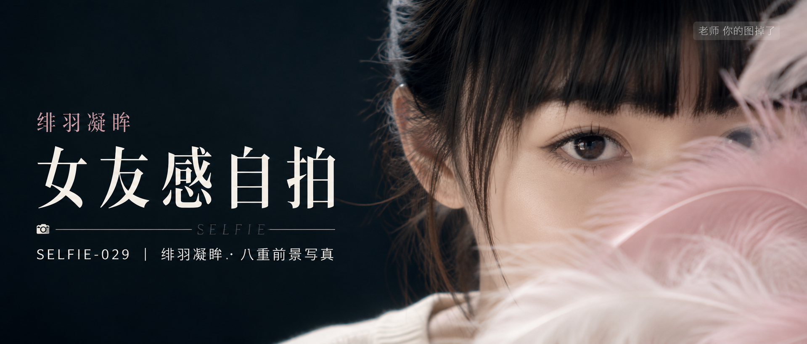

# SELFIE-029-绯羽凝眸·八重前景写真 封面

## 封面提示词

视觉概念「绯羽凝眸」：一位 24 岁成年亚洲女生的正脸偏四分之三超近景美妆人像，真实自然东亚面孔，黑色长发束起，黑色厚齐刘海，清透淡妆，五官精致自然，面部立体清晰，皮肤光泽细腻，眼神有神灵动，轮廓清晰上镜，人物位于画面右半区域，脸部占画面三分之一以上，一只清晰眼睛直视镜头，浅粉与白色羽毛从右下前景斜向掠过面部，羽毛柔焦与眼睛锐利高光形成虚实反差，深青黑背景与樱粉前景形成鲜明冷暖层次，左侧留出干净排版空间，日系轻复古数码人像与高定美妆广告融合，电影感光影，高清锐利，色彩层次丰富，视觉冲击力强，构图黄金比例，前景虚化背景，色调统一精致，画面有张力，2.35:1 电影横构图，穿浅米白圆领上衣，领口得体，避免侧脸比例过大、眼睛半闭、嘴巴微张、面部遮挡过度、文字遮挡五官、AI 美女脸、网红感、过度精修、塑料皮肤、暗沉肤色、明显痘印、明显皱纹、斑点、面部变形。【文字排版-必须完整保留，不得省略或简化任何一项】画面左侧垂直居中偏下叠加文字排版：超大号衬线字体米白色主文案「女友感自拍」，主文案正下方一条细横线左端带📷图标，横线中央有透明英文水印 SELFIE，横线下方等宽白色字体副文案「SELFIE-029 ｜ 绯羽凝眸·八重前景写真」；右上角浅色半透明圆角底衬配小号文字「老师 你的图掉了」（署名文字，必须出现，不可省略）；在主标题上方以更小的淡粉衬线字点缀视觉概念名「绯羽凝眸」，不挤压人物面部与留白，无整体蒙层，文字直接压图。【文字排版结束】

## 封面图片

