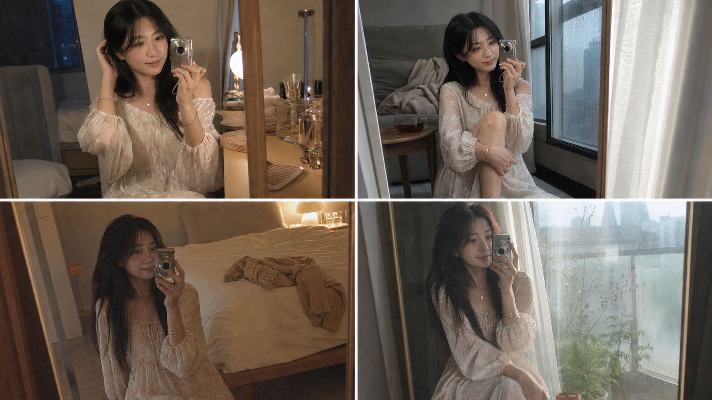
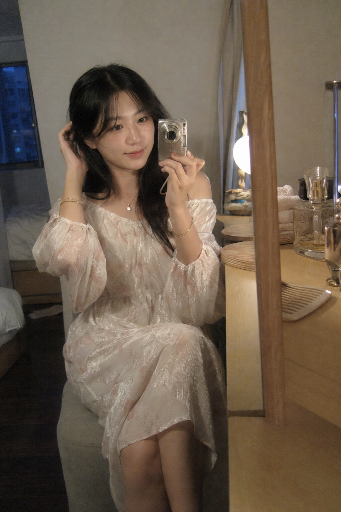
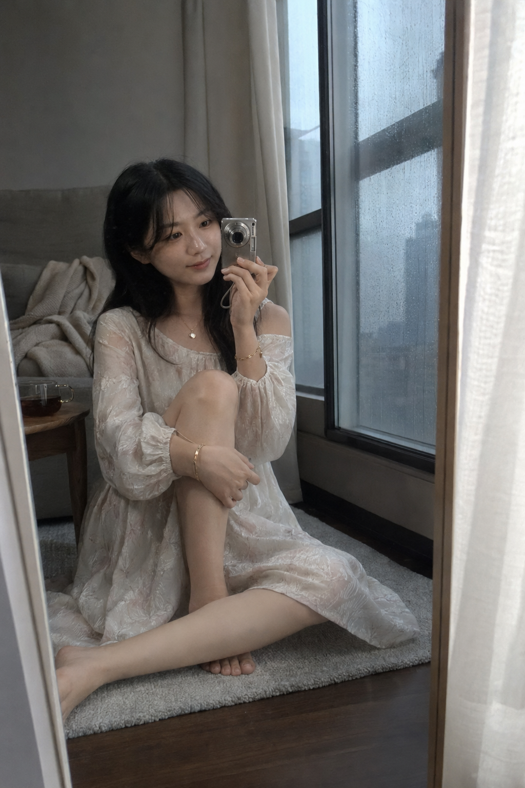
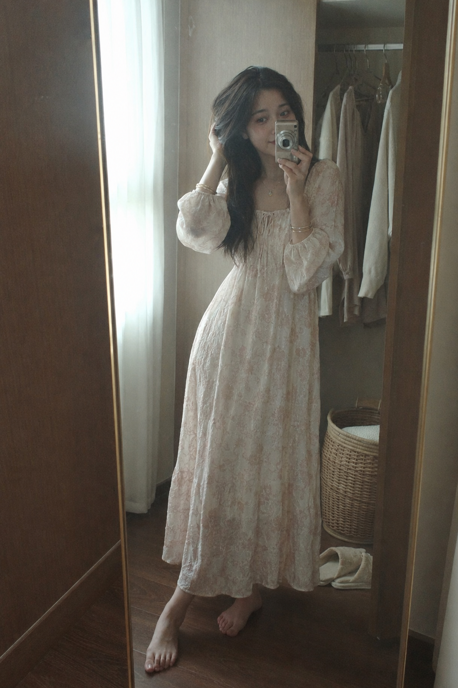
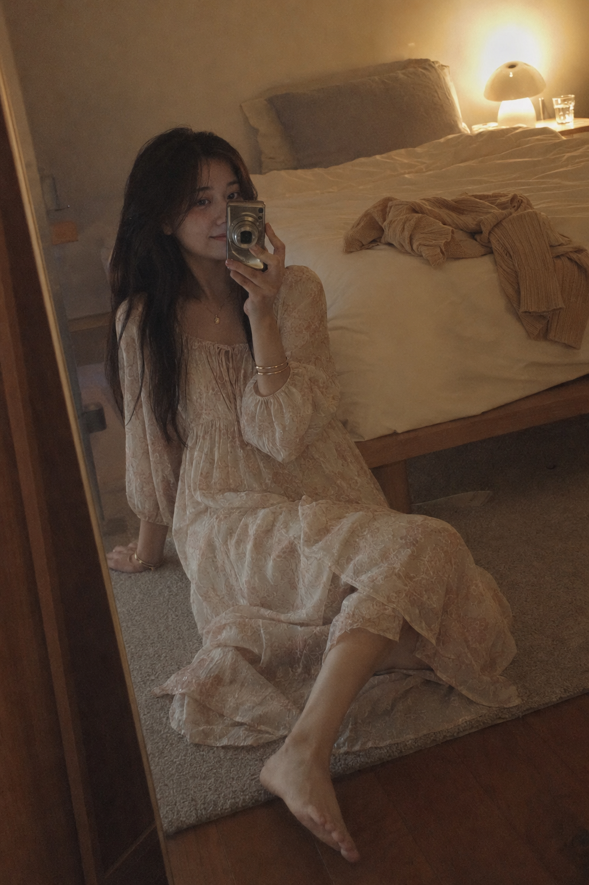
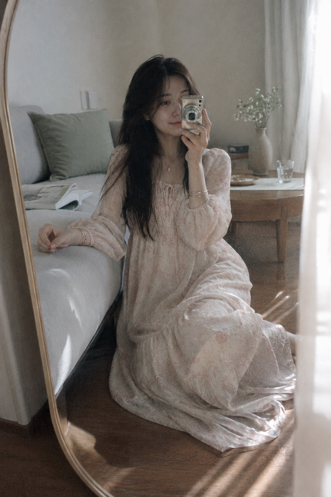
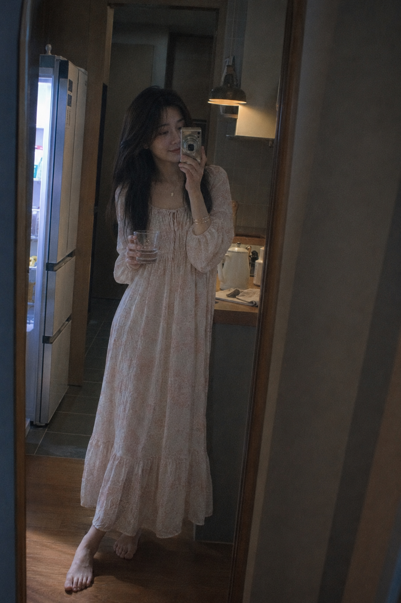
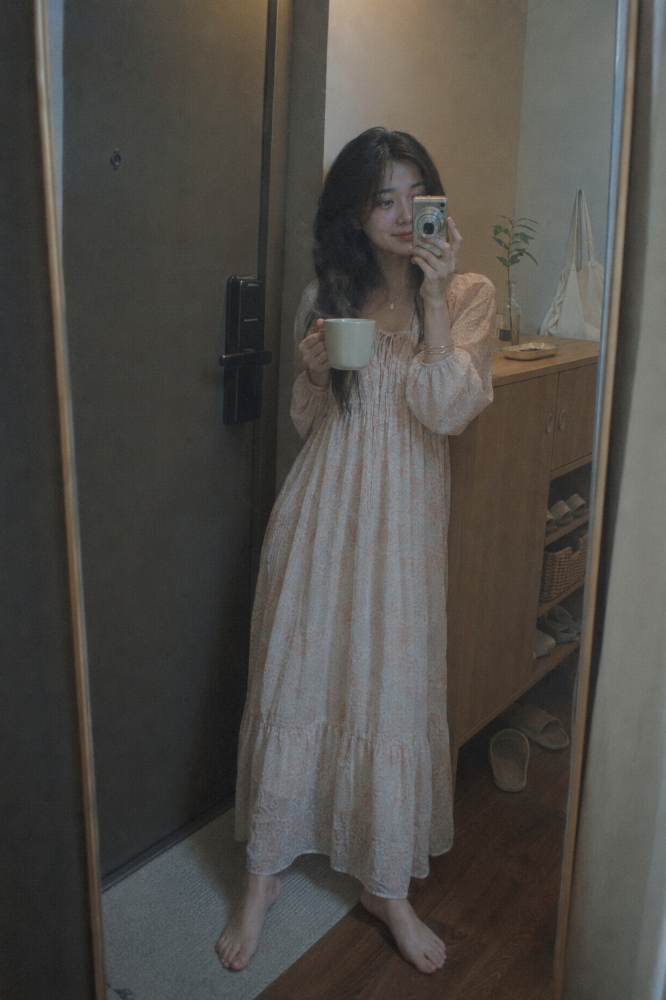
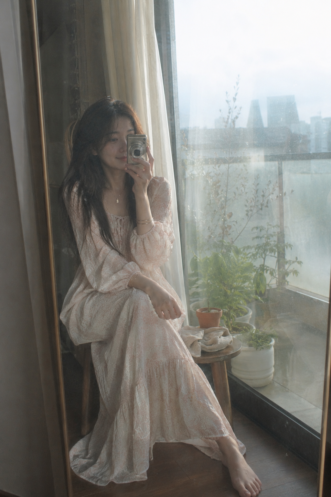

# 这组居家CCD女友照写法存一下，八个场景也能保持同一张脸

真正像私人相册的女友感自拍，关键不是把人物做得更“完美”，而是让每一处光线、动作和生活痕迹都有来由。这组图用同一张脸、同一套居家长裙和同一台复古 CCD 贯穿八个空间，只改变时间、机位与身体状态。人物锚点越稳定，场景变化才越像同一天里真实发生的八个瞬间。

梳妆台这一幕先建立整组基调：人坐在矮凳边缘，镜框切开画面，台面又挡住一小部分前景。琥珀台灯与窗外冷蓝暮色同时出现，比单纯的暖光更有空间层次；相机只遮少量脸颊，双眼仍然清晰，人物才会好看又真实。

竖版 2:3，真实居家镜前自拍摄影。同一位 24 岁成年亚洲女性坐在卧室梳妆台旁的浅灰色软垫矮凳边缘，对着靠墙窄边全身镜，用小型银棕色复古 CCD 数码相机自拍。她保持真实自然的东亚面孔：柔和鹅蛋脸、五官自然清秀、面部干净、眼神安静真实、嘴角轻微浅笑、健康自然的冷白肤色、自然皮肤纹理。黑棕色及胸中长发自然披散，中分八字刘海，发尾有柔软层次，脸侧留自然碎发。她穿浅奶白与雾粉色相间的轻薄居家长裙，细密花卉提花、柔软褶皱和微弱珠光，宽松长袖，领口自然落在肩侧，内衬完整，衣装优雅得体；佩戴小巧金色吊坠项链和两只纤细金色手镯。双腿自然交叠偏向一侧，一手轻扶耳侧头发，另一手将相机举在脸侧，身体微转向镜面，视线看向镜中的自己；镜中面部清晰，相机只遮少量脸颊，不遮双眼。背景是正在使用的奶油灰卧室：浅木梳妆台、圆形台灯、无品牌香水瓶、梳子与折叠毛巾、低饱和暖灰墙面、深棕木地板。台灯发出柔和琥珀暖光，窗外冷蓝暮色从侧后方进入，形成自然冷暖混合照明。构图略偏斜，人物位于中左，镜框竖向切割，梳妆台边缘形成近景遮挡，保留不完美生活记录感。模拟 2000 年代消费级 CCD 卡片机，40mm 等效焦段，平视近距离自拍，轻微失焦、柔焦、低解析度、细小数码噪点、压缩颗粒、高光泛白、暗部灰雾、低饱和、低对比。真实摄影，私人相册感，安静温柔，无文字、logo、水印。避免 AI 美女脸、网红感、过度精修、塑料皮肤、暗沉肤色、明显痘印、明显皱纹、斑点、面部变形，避免镜面反射错误、身份不一致、手指畸形、相机结构错误、衣装结构异常和杂乱背景。

雨天窗边不靠夸张表情，而靠抱膝姿态收住情绪。人物被放到画面偏下位置，雨痕、窗帘与镜边形成三层竖线，冷灰散射光把皮肤照得柔和，也让背景自然沉下去。这里真正决定氛围的是“雨窗近景 + 偏下构图”，不是简单加一层蓝色滤镜。

清晨衣柜前改成站姿，但没有让人物直挺挺摆拍：轻微屈膝、单腿承重、顺手整理头发，才像刚醒后的短暂停顿。半开的柜门提供一块低饱和暗面，与纱帘晨光形成明暗秩序。

到了夜间床尾，画面故意保留更多暗部。暖灯只负责塑造气氛，镜前微弱冷光负责托住面部；裙摆铺成扇形，让坐姿稳定，也避免肢体在暗部黏连。夜景不要一味提亮，先保证眼睛、手和相机结构能看清。

客厅这一幕用侧跪姿势把身体重心压低，再让人物轻扶沙发边缘，动作就有了合理支点。窗帘作为虚化前景，茶几与白花只提供生活信息，不抢人物，让画面自然但不杂乱。

深夜厨房走廊是全组冷暖反差最明显的一张：冰箱冷光勾发丝，吊灯暖光留在脸与手臂，门框和镜框把人物层层框住。透明水杯很容易与手指融合，因此要同时写清握持关系、杯子位置与手指完整。

玄关的马克杯不是装饰，而是“刚从卧室走出来”的时间证据。人物一脚在地毯、一脚在木地板，重心不完全对称；左侧深色房门留白，让小空间也有呼吸感。

最后用阳台晨雾收束：逆光勾出发丝和裙装边缘，墙面反光补亮面部，玻璃与镜面只保留轻微双重反射。反射可以制造朦胧感，但必须明确“只有一个人物”，否则最容易生成第二张脸。

和 AI 交互时，不要每次都整段重写。若第二张开始换脸，可以直接追加：“保持上一张人物的脸型、五官比例、发型、服装和相机完全不变，只替换场景与动作。”若画面太像样板间，则补一句：“保留人物不变，让梳子、毛巾、冷茶或拖鞋呈现轻微使用痕迹，背景整洁但不刻意。”这种局部修正比不断堆叠“真实感”更有效。

整组的设计逻辑可以浓缩成三层：人物锚点负责统一，冷暖混光负责情绪，镜框、窗帘与门框负责构图。CCD 噪点只是最后一层质感，先把动作与空间关系写对，再谈滤镜，照片才不会只剩复古色偏。

---

你最喜欢雨窗、夜灯还是晨雾这一幕？也可以留言说说下一组想看的居家角落。

---

## 往期回顾

- SELFIE-029 绯羽凝眸·八重前景写真
- SELFIE-028 霜镜华章·六境高定封面
- SELFIE-027 花影留白·初夏庭园八景

#GPTImage2 #千问 #豆包 #生图提示词 #Prompt #女友感自拍 #居家镜面自拍 #CCD氛围
