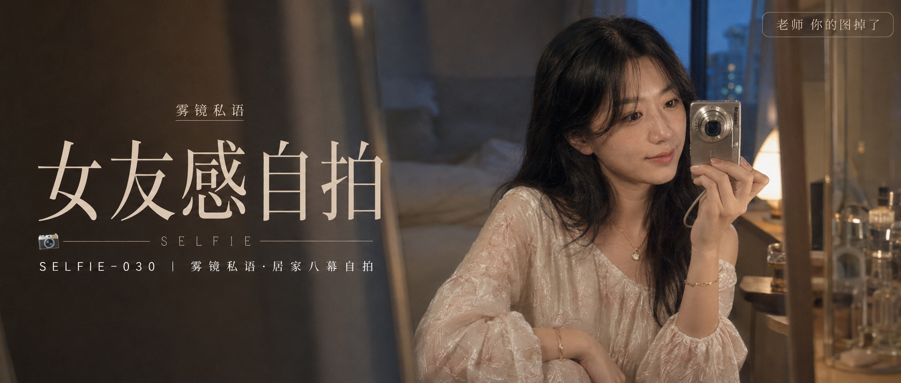

# SELFIE-030-雾镜私语·居家八幕自拍 封面

## 封面提示词

视觉概念「雾镜私语」：夜幕初临的奶油灰卧室镜前，一位 24 岁成年亚洲女性以 3/4 侧脸靠近镜面自拍，面部占画面高度三分之一以上，银棕色复古 CCD 相机停在脸颊旁且不遮双眼；五官精致自然、面部立体清晰、眼神有神灵动、妆感干净清透、健康自然肤色、皮肤光泽细腻。黑棕色及胸中长发、中分八字刘海，穿浅奶白与雾粉色花卉提花长裙，衣装结构完整优雅。前景用一小片虚化镜缘制造景深，中景是清晰人物，背景有琥珀台灯光晕与冷蓝窗光，两块镜面形成克制的重复倒影但只有一个人物，冷暖色彩对比鲜明，画面有未说完的私人日记故事感；视觉冲击力强，电影感光影，色彩层次丰富，构图黄金比例，前景虚化背景，色调统一精致，商业海报级完成度，同时保留 2000 年代 CCD 轻微噪点与柔焦记忆感。画面左侧预留干净深色排版区，人物在右侧，文字不遮挡五官。避免 AI 美女脸、网红感、过度精修、塑料皮肤、暗沉肤色、明显痘印、明显皱纹、斑点、面部变形，避免手指畸形、相机结构错误、镜像多人物、乱码、错别字、文字裁切。2.35:1 电影横构图。

【文字排版-必须完整保留，不得省略或简化任何一项】画面左侧垂直居中偏下叠加文字排版：超大号衬线字体米白色主文案「女友感自拍」，主文案正下方一条细横线左端带📷横线中央有透明英文水印 SELFIE，横线下方等宽白色字体副文案「SELFIE-030 ｜ 雾镜私语·居家八幕自拍」；排版区上方以极小号细衬线字加入视觉概念名「雾镜私语」作为次级装饰，不得替代主标题；右上角浅色半透明圆角底衬配小号文字「老师 你的图掉了」（署名文字，必须出现，不可省略）；无整体蒙层，文字直接压图。【文字排版结束】

## 封面图片

