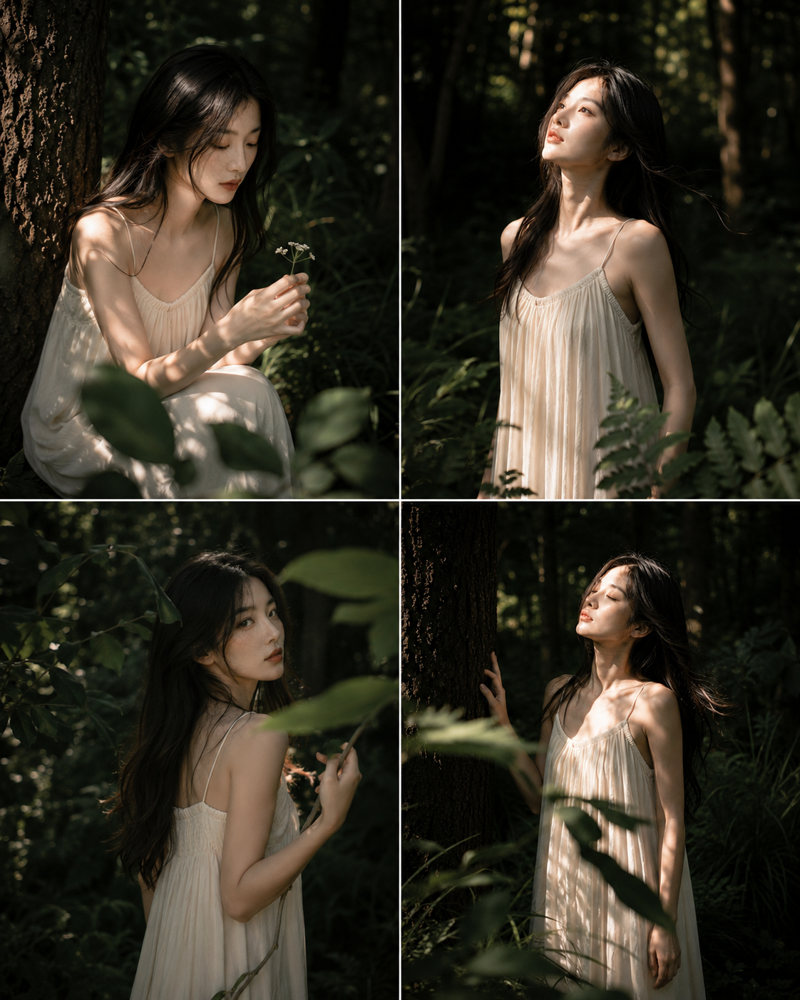
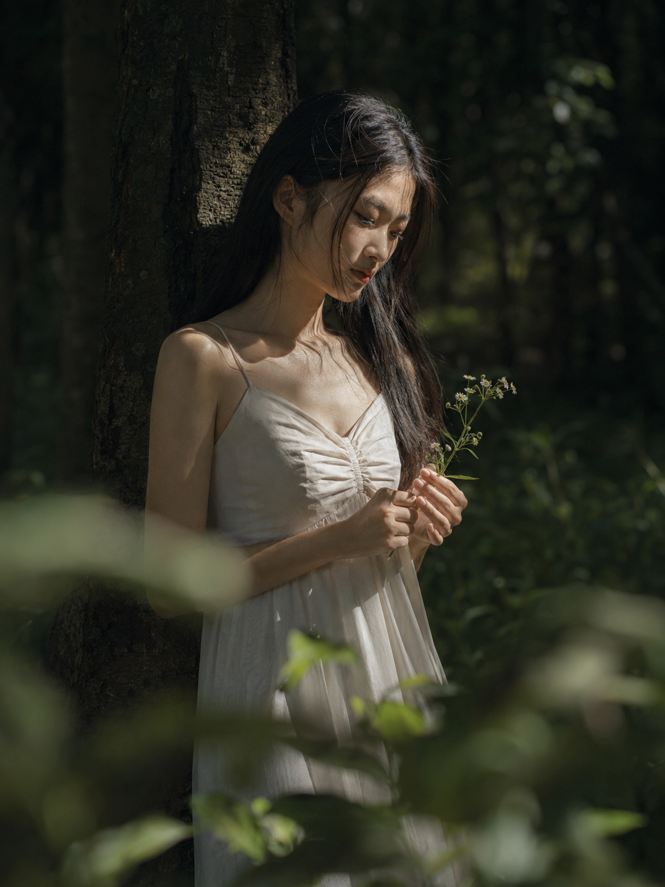
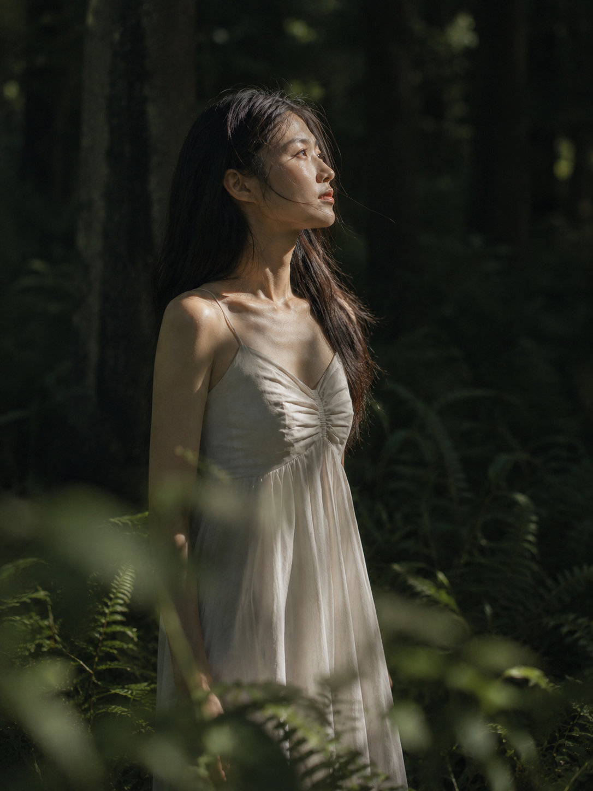
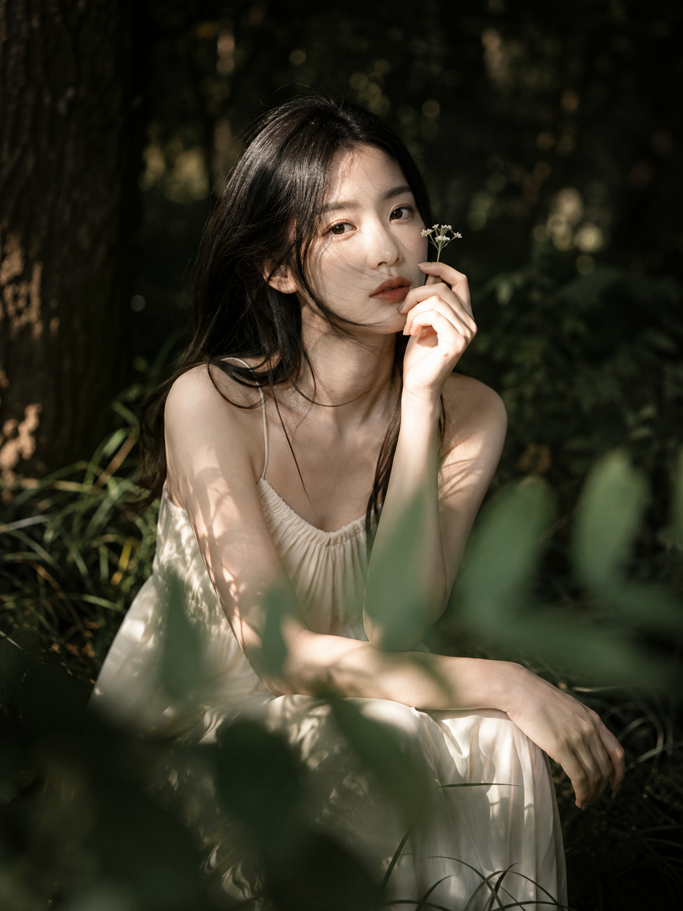
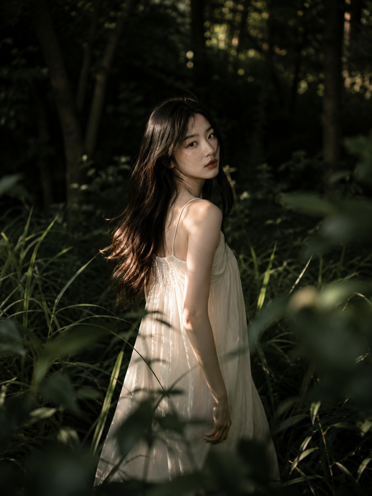
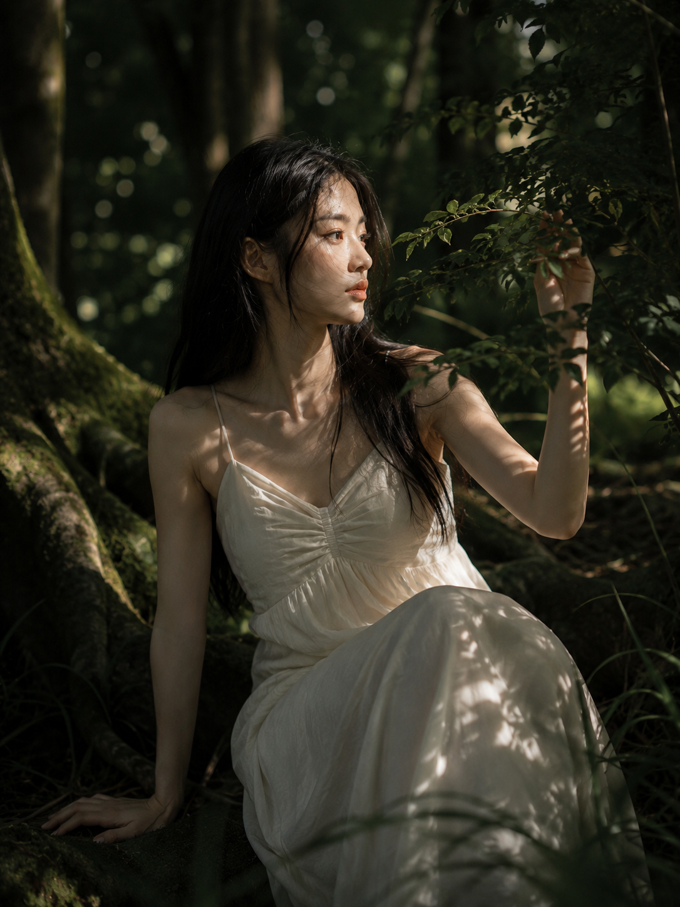
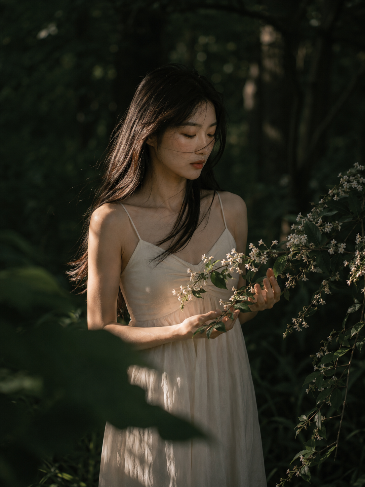
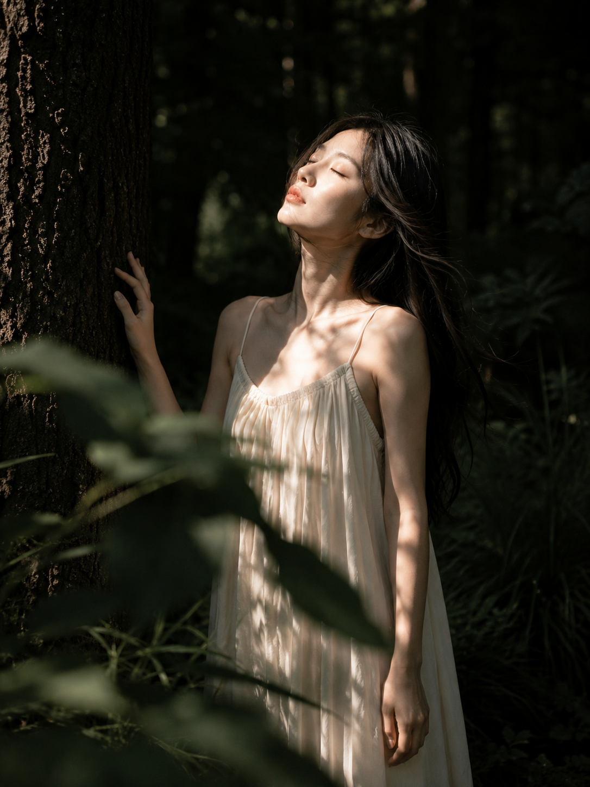
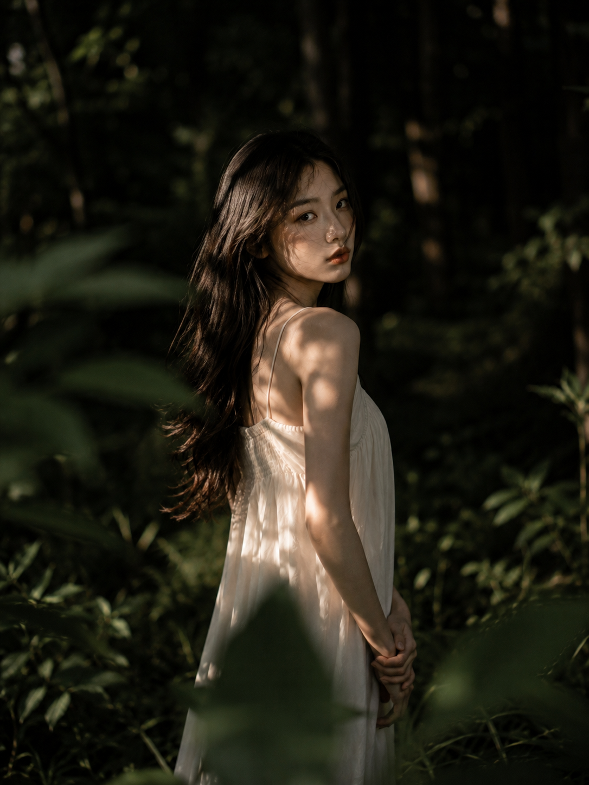

# 测了8个深林瞬间，真正让女友感像电影的是斑驳光

**今天的实验：** 人物与色盘固定，用 8 个动作测试深林自然光。决定电影感的是亮部落在哪里。

---

**#01 ｜ 树旁拾花**

85mm 压暗环境，让脸、白花和裙摆形成三点亮部。原版提示词如下：

竖版 3:4，幽暗森林中的自然光电影感人像写真，一位 24 岁成年亚洲女生，真实自然的东亚面孔，五官清秀耐看，面部干净，眼神安静克制，健康自然暖白肤色，保留细腻皮肤纹理，不过度磨皮。黑棕色长直发自然披散，发丝被微风吹起，额前与脸侧有少量凌乱碎发。穿同一条象牙白细肩带长裙，轻薄柔软面料，胸前自然抽褶，宽松垂坠，完整得体，不暴露。场景在浓密树林深处，背景是深色树干、墨绿色灌木与虚化树影，前景有几片靠近镜头的模糊叶子形成遮挡。女生轻靠在粗壮树干旁，身体微微侧向左侧，低头看向手中一小枝白色野花，神情安静若有所思。午后低角度阳光穿过树冠照亮她的脸、锁骨与裙摆局部，形成明显但柔和的斑驳树影，背景压暗，人物从深绿暗部中浮现。低饱和深绿、黑绿、深褐、象牙白与暖金色调，清冷、静谧、文艺、电影感，85mm 人像镜头，f/2 浅景深，焦点落在眼睛和面部，前景叶片虚化，背景细腻散景，轻微胶片颗粒，高清写实，无文字，无水印，无 logo，无边框。避免 AI 美女脸、网红感、过度精修、塑料皮肤、过饱和、手部畸形、结构错误。

---

**#02 ｜ 仰望林光**

抬头望向画外，侧前光擦亮面部，画面更有呼吸感。

---

**#03 ｜ 花枝近眸**

蹲坐降低重心，叶片横穿前景。跟 AI 沟通时分别写清两只手，能减少粘指。

---

**#04 ｜ 草间回眸**

走动中回头更像抓拍，脸侧高光负责锁定视线。

---

**#05 ｜ 苔根拨叶**

坐到植被层并拨开枝叶；强调裙装完整、双腿收拢，避免结构错乱。

---

**#06 ｜ 拢枝垂眸**

双手与花枝形成三角构图，半边脸留暗更显安静。

---

**#07 ｜ 闭眼沐光**

闭眼不是为了“梦幻”，重点是让窄光束准确落在面部。

---

**#08 ｜ 暗部回眸**

只亮半边脸，以前景虚、人物实、背景暗建立三层空间。

---

**测试结论：** 压暗环境、限制受光面积、明确前景。与 AI 交互时一次只改动作或光位，人物与色盘不动。

---

喜欢哪一个瞬间？欢迎收藏、关注，也可以在评论区留下想看的光线主题。

---

## 往期回顾

- SELFIE-030 雾镜私语·居家八幕自拍
- SELFIE-029 绯羽凝眸·八重前景写真
- SELFIE-028 霜镜华章·六境高定封面

#GPTImage2 #千问 #豆包 #生图提示词 #Prompt #女友感自拍 #深林电影感
