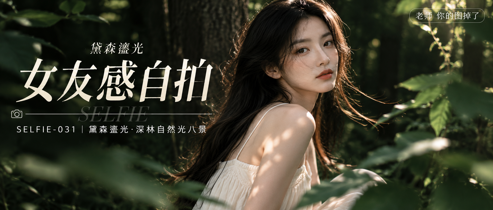

# SELFIE-031-黛森鎏光·深林自然光八景 封面

## 封面提示词

视觉概念「黛森鎏光」：幽暗深林里一束暖金斑驳光穿透墨绿树冠，24 岁成年亚洲女生穿完整得体的象牙白长裙，3/4 正脸中近景，面部占画面三分之一以上，眼神有神灵动地望向镜头，五官精致自然、面部立体清晰、皮肤光泽细腻、妆感干净清透、轮廓清晰上镜；前景深绿叶片柔焦，人物与背景形成象牙白、墨绿、暖金三层冷暖反差，侧逆光打亮颧骨与发丝，柔光环绕面部，电影感光影，高清锐利，色彩层次丰富，视觉冲击力强，构图黄金比例，画面有张力，真实商业摄影海报质感。避免纯侧脸、闭眼、嘴巴微张、人物远小、文字遮挡五官、AI 美女脸、网红感、过度精修、塑料皮肤、暗沉肤色、明显痘印、明显皱纹、斑点、面部变形、手部畸形，2.35:1 电影横构图。

【文字排版-必须完整保留，不得省略或简化任何一项】画面左侧垂直居中偏下叠加文字排版：超大号衬线字体米白色主文案「女友感自拍」，主文案上方以小号窄体字加入次级视觉概念名「黛森鎏光」，主文案正下方一条细横线左端带📷，横线中央有透明英文水印 SELFIE，横线下方等宽白色字体副文案「SELFIE-031 ｜ 黛森鎏光·深林自然光八景」；右上角浅色半透明圆角底衬配小号文字「老师 你的图掉了」（署名文字，必须出现，不可省略）；无整体蒙层，文字直接压图。【文字排版结束】

## 封面图片

