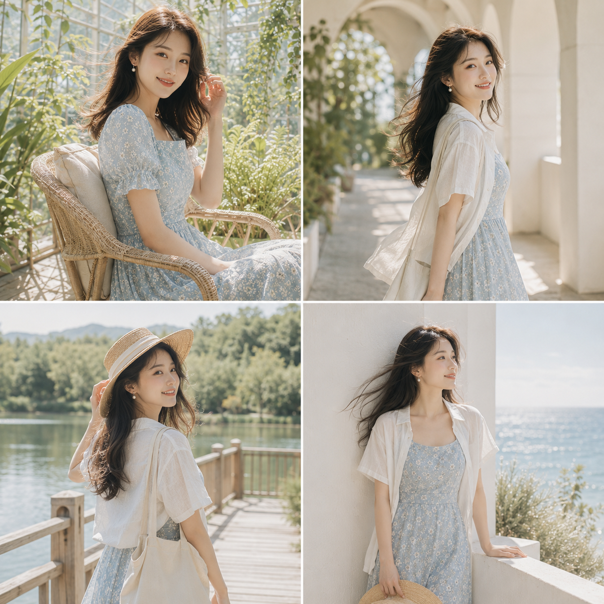
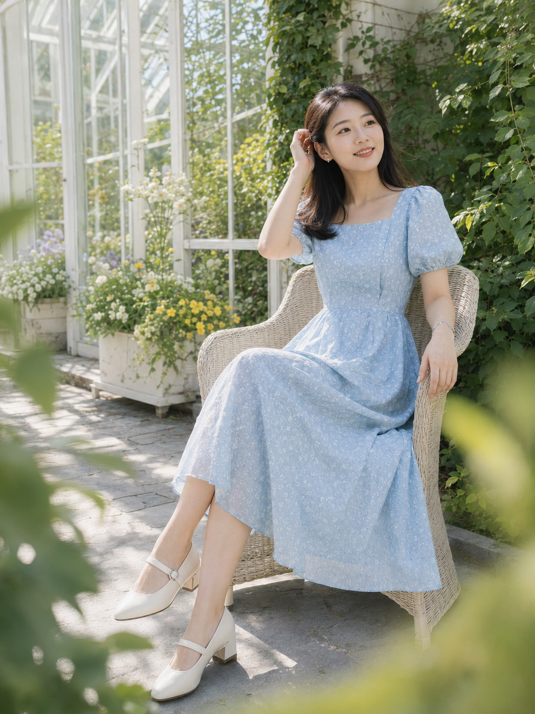
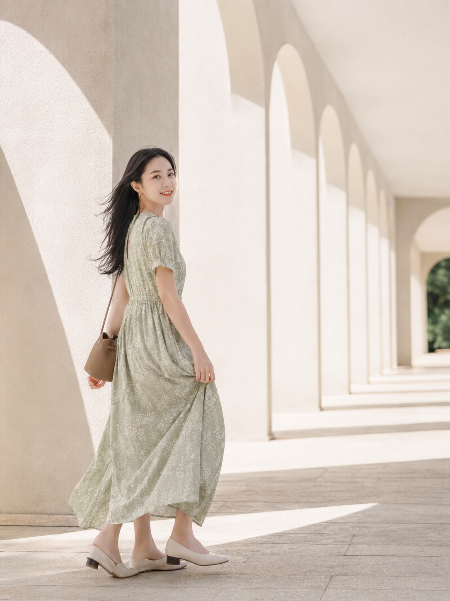
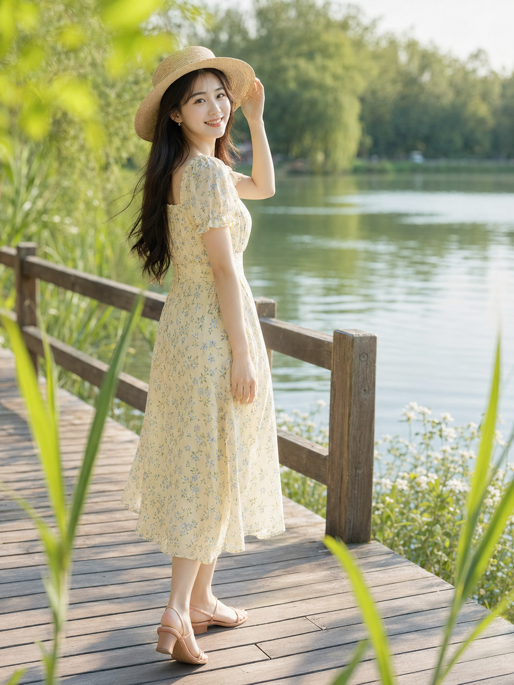
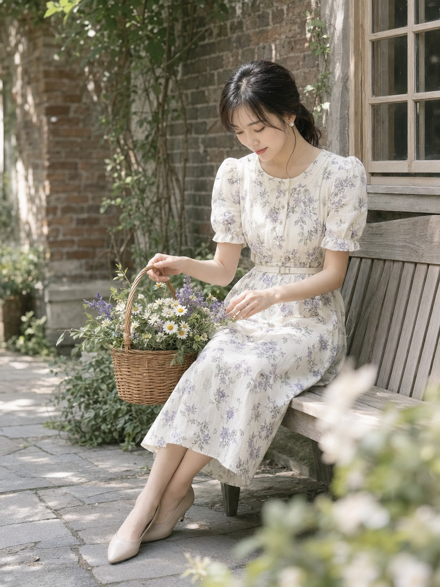
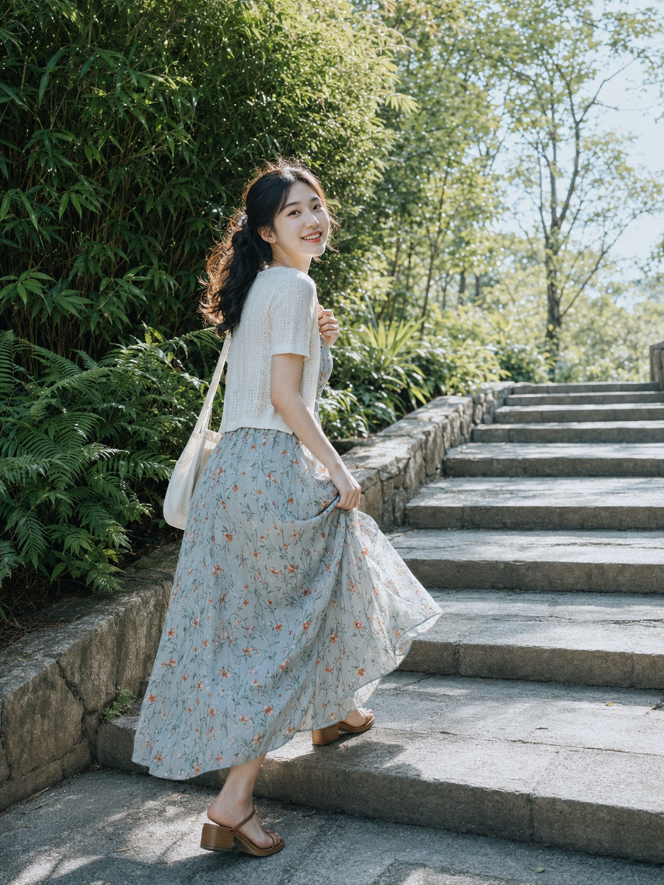
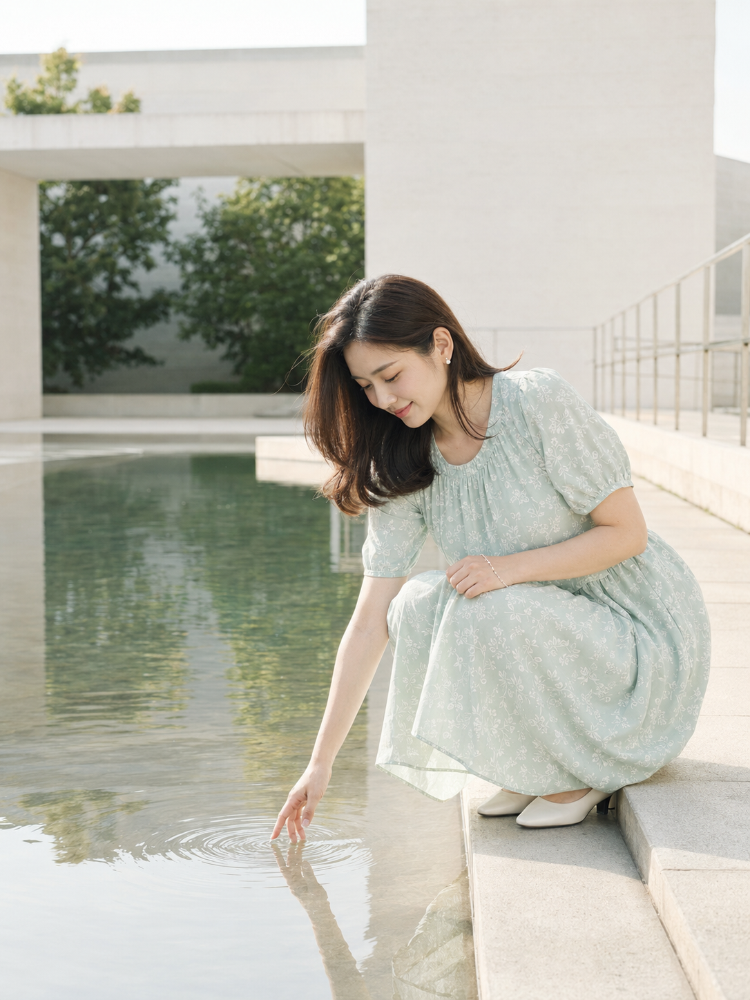

八个完全不同的夏天场景，玻璃花房、白色拱廊、湖边栈道、旧砖庭院、林荫露台、植物园石阶、海边白墙、艺术馆水庭，用的其实是同一套光线逻辑：先锁定侧逆光在肩部和发丝形成的轮廓光，再逐场景替换补光方式——水面反光、白墙反射、桌面漫反射，都是同一个原理的变体。人物基准句也全程复用，这是八张图气质统一的关键。

#GPTImage2 #千问 #生图提示词 #Prompt #女友感自拍 #夏日自然光人像

