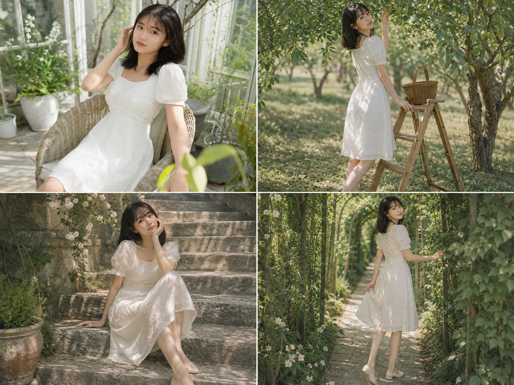

玻璃花房、果园木梯、旧石阶、木窗帘、藤蔓长廊、浅溪、庭院圆桌、白花树下，八个花园角落，同一套人物设定贯穿始终。诀窍在于把发型、服装、面部特征写得足够具体，再让每张图只变化姿态、机位和光线中的一两个变量，人设就不会跑偏。侧逆光、斑驳叶影和胶片颗粒感是贯穿全组的统一底色，让八张图看起来像同一天拍下的连续记忆。

#GPTImage2 #千问 #生图提示词 #Prompt #女友感自拍 #复古花园写真

