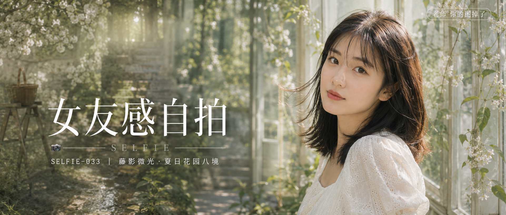

# SELFIE-033-藤影微光·夏日花园八境 封面

## 封面提示词

概念级大片质感封面，标题概念「藤镜八境」：画面主体是一位24岁东亚女生的3/4侧脸近景，五官自然清秀，面部干净，健康自然肤色，眼神真实明亮，黑棕色齐肩中长发被微风吹起几缕碎发，皮肤有细腻自然光泽和真实纹理，穿象牙白色蕾丝连衣裙，方领短泡泡袖，站在复古玻璃花房中，身侧藤蔓与白色小花自然垂落，背景以柔焦方式叠影出果园木梯、石阶、藤蔓长廊、浅溪、白花树等花园场景的朦胧色块，形成多层次空间纵深，仿佛八个花园片段在同一画面中呼吸。2.35:1 电影横构图，主体人物占据画面右侧三分之一，面部占比清晰可辨，左侧以柔和景深留白呈现叠影花园色彩，构图前中后景分明，冷暖光影对比鲜明（暖金侧逆光打在人物脸颊与发丝，背景带一层清透灰绿冷调），电影感光影，高清锐利，色彩层次丰富，视觉冲击力强，构图黄金比例，前景虚化背景，色调统一精致，画面有张力。整体色调为象牙白、奶油白、浅藤木色、鼠尾草绿与柔和蜜桃肤色，低饱和高级质感。【文字排版-必须完整保留，不得省略或简化任何一项】画面左侧垂直居中偏下叠加文字排版：超大号衬线字体米白色主文案「女友感自拍」，主文案正下方一条细横线左端带📷图标横线中央有透明英文水印 SELFIE，横线下方等宽白色字体副文案「SELFIE-033 ｜ 藤影微光·夏日花园八境」；右上角浅色半透明圆角底衬配小号文字「老师 你的图掉了」（署名文字，必须出现，不可省略）；无整体蒙层，文字直接压图。【文字排版结束】避免AI美女脸、网红感、过度精修、塑料皮肤、暗沉肤色、明显痘印、明显皱纹、斑点、面部变形、肢体畸形、手指错误、背景杂乱、过度曝光、HDR、锐化过强、文字乱码、多余水印、边框。

## 封面图片

