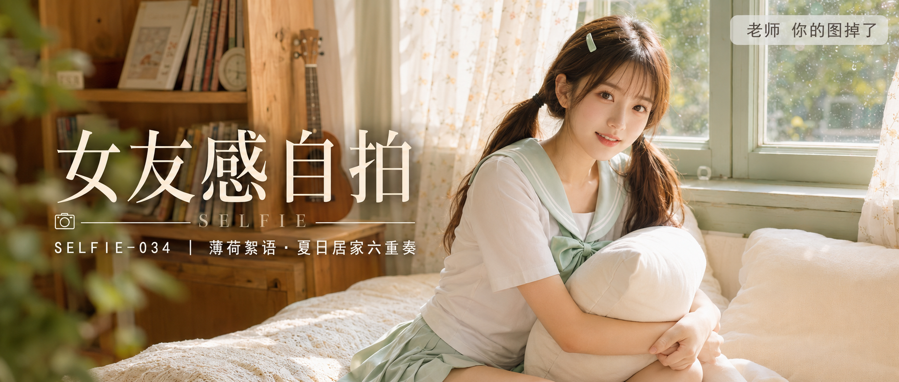
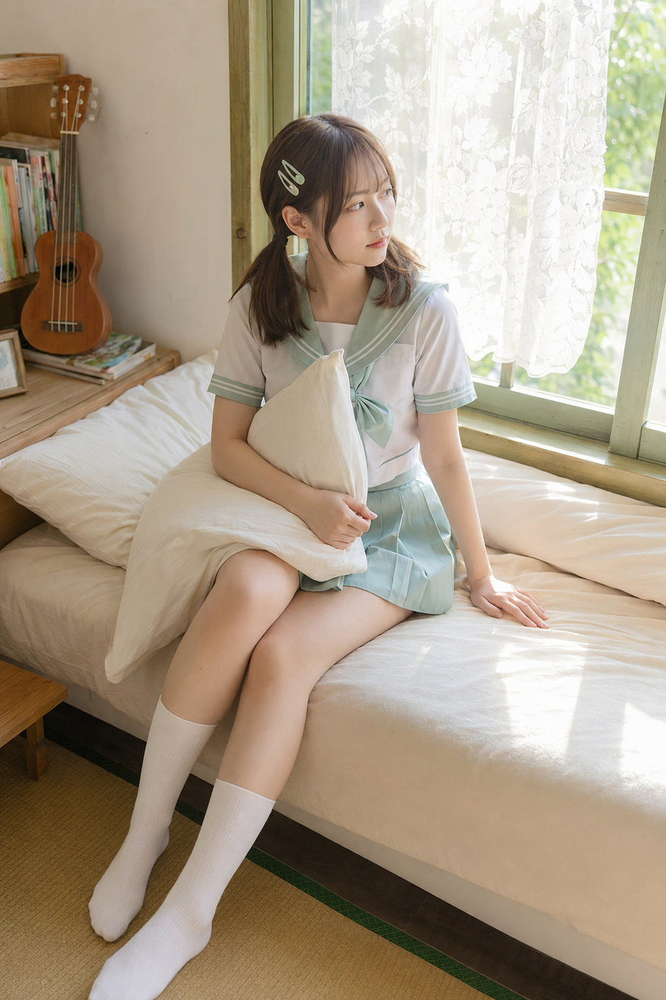
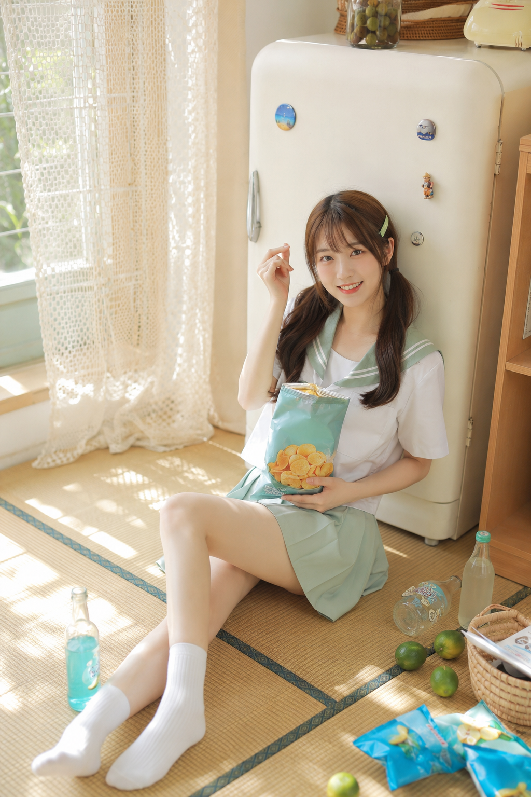
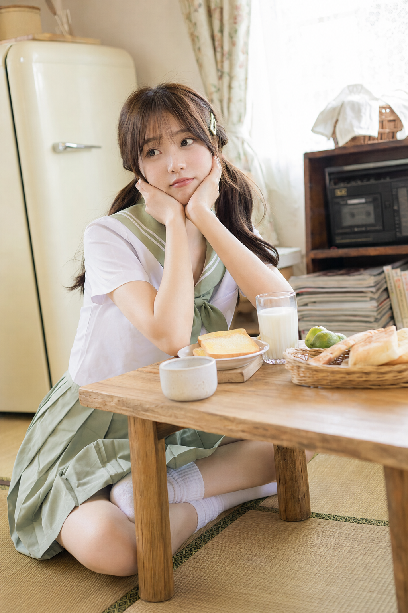
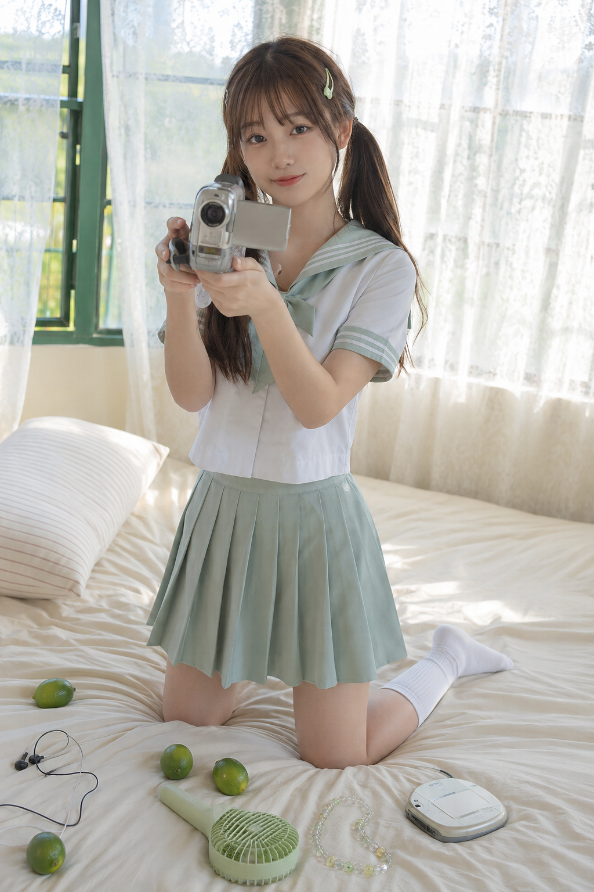
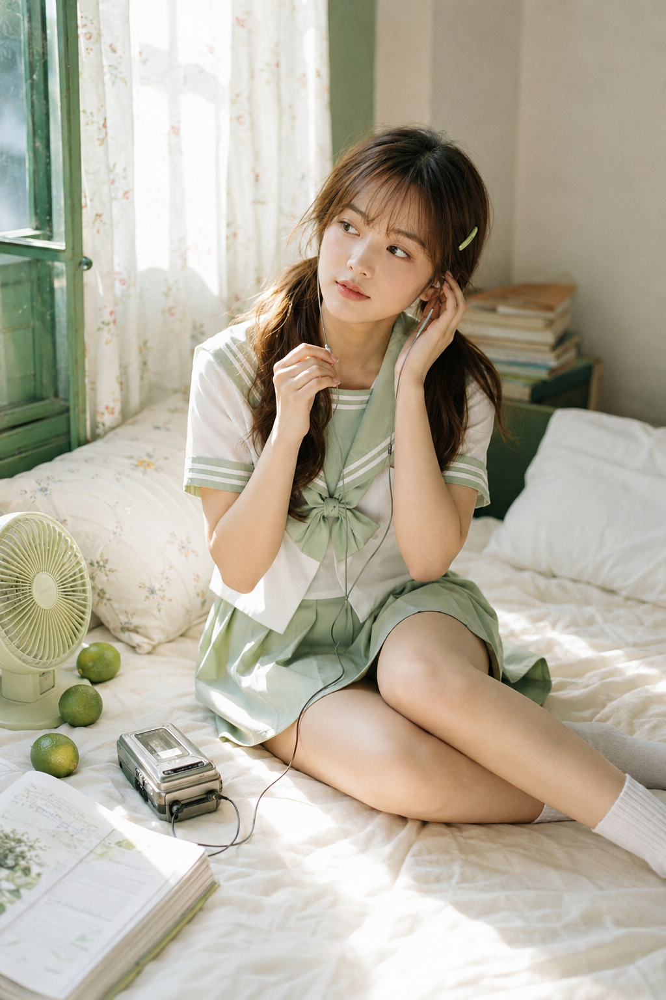
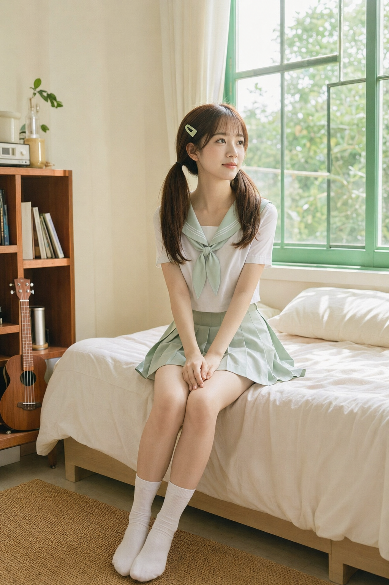

# 同一间卧室拍出6种生活感，靠的是这套构图逻辑

同一间薄荷绿卧室，同一套水手服造型，换六个动作和机位，就能拍出六种不同的生活切片。核心是"手部有具体动作+视线不直视镜头+环境留白"这套逻辑。窗边床铺这张最完整，直接放原版提示词：

竖版2:3，日系清新复古居家少女写真，夏日下午自然光，明亮高调、柔和通透、轻甜生活感、平成复古气息。画面主体是一位20-23岁成年东亚女生，脸型柔和小巧，五官自然清秀，眼睛明亮自然，白皙通透的健康肤色，干净自然肤质，带淡淡粉色腮红，裸粉色嘴唇，栗棕色中长发，轻薄齐刘海，双低马尾，发尾自然微卷，一侧别两枚浅绿色小发夹，表情松弛，眼神真实。她穿白色短袖日系水手领上衣，浅薄荷绿色翻领与袖口细条纹，胸前系薄荷绿色领巾结，搭配同色百褶短裙和白色中筒袜。女生坐在奶油白床铺上，身体微微侧坐，双腿自然交叠伸向床边，一只手抱着白色靠枕，另一只手轻扶床单，神情安静、带一点发呆感，目光望向窗外。场景为带绿色木窗框的小卧室，窗外挂着白色碎花薄纱帘，阳光透进室内，床上有奶油白床单、浅条纹靠枕，床边有浅木书架、叠放的书、木质尤克里里，地面为浅色藤编垫或榻榻米质感。整体色彩以奶油白、象牙白、薄荷绿、浅原木色、栗棕色为主，画面有轻微日系柔焦和细腻颗粒，35mm环境人像镜头，真实写实摄影质感，人物清晰，背景柔和可辨。无文字，无水印，无logo。避免AI美女脸、网红感、过度精修、塑料皮肤、暗沉肤色、明显痘印、明显皱纹、斑点、面部变形，避免手部畸形、多余手指、双腿融合、比例错误、超广角畸变、背景杂乱。

关键是"抱靠枕+侧坐"：双手有事可做，视线不看镜头，摆拍感就没了。窗外碎花纱帘把阳光揉碎，避免顺光拍平皮肤。

零食汽水这张把人物挪到地面，靠冰箱坐，手里给具体道具（薯片），表情用"眨一只眼"代替标准微笑。低机位+具体道具比单纯"笑"更容易出真实俏皮感。

早餐桌这张，牛奶杯、吐司、青苹果故意摆得不整齐，托腮让肩膀自然放松，50mm浅景深把冰箱和收录机虚化成色块，不抢镜。

DV记录是这组里唯一"手持道具正对镜头"的构图，风险最高——摄像机结构最容易被 AI 画错，解决方法是把道具写具体（银灰色复古、双手举持），表情落在"专注"而非"看镜头笑"。

听歌这张纯侧脸，目光完全避开镜头，手部动作只是"扶耳机线"。不需要观众和人物对视，代入感反而更强。

最后一张坐床沿，刻意留出书架和尤克里里的完整轮廓，人物只占画面一半。留白不是浪费，环境本身在讲故事。

六张图共用一套服装、一套发型、一间卧室，靠动作和机位撑起差异。换成沙发、飘窗、书桌都能套用，只要保留这三条核心逻辑，出片率会明显更稳。

---

这组卧室写真你最想先试哪个场景？评论区聊聊，也欢迎把你拍出来的效果发出来对比。

---

## 往期回顾

- SELFIE-031 黛森鎏光·深林自然光八景
- SELFIE-032 清透织光·夏日八境自拍
- SELFIE-033 藤影微光·夏日花园八境

#GPTImage2 #千问 #豆包 #生图提示词 #Prompt #女友感自拍 #日系复古居家写真
