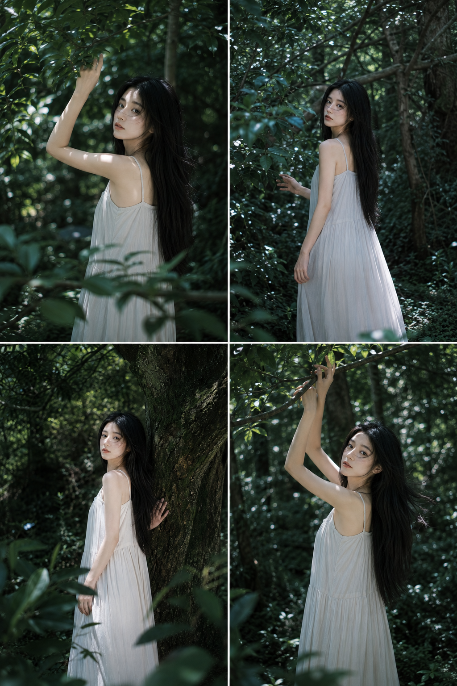
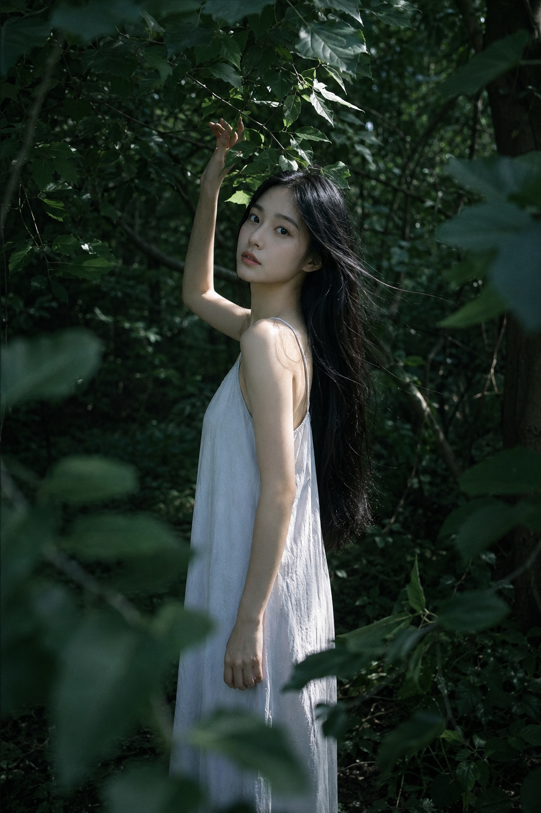
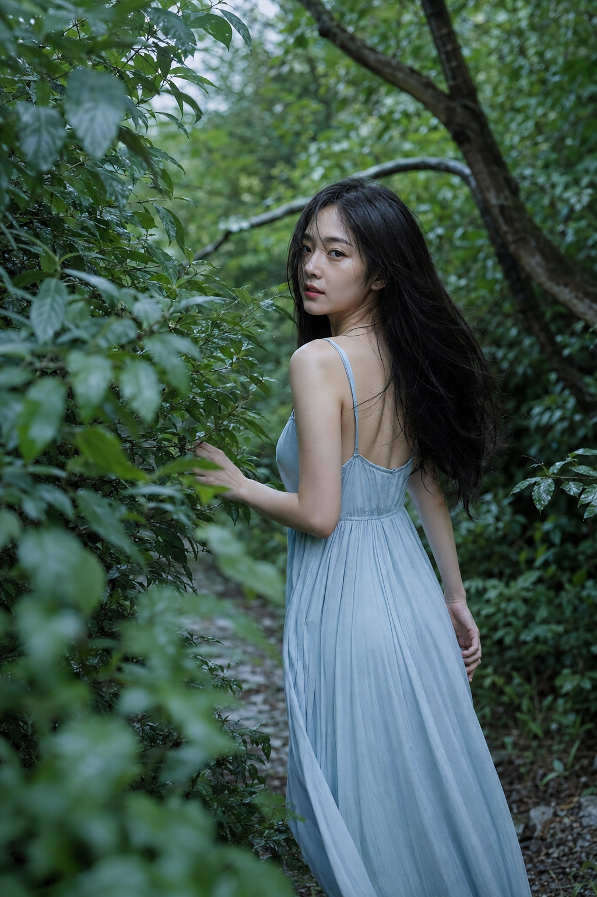
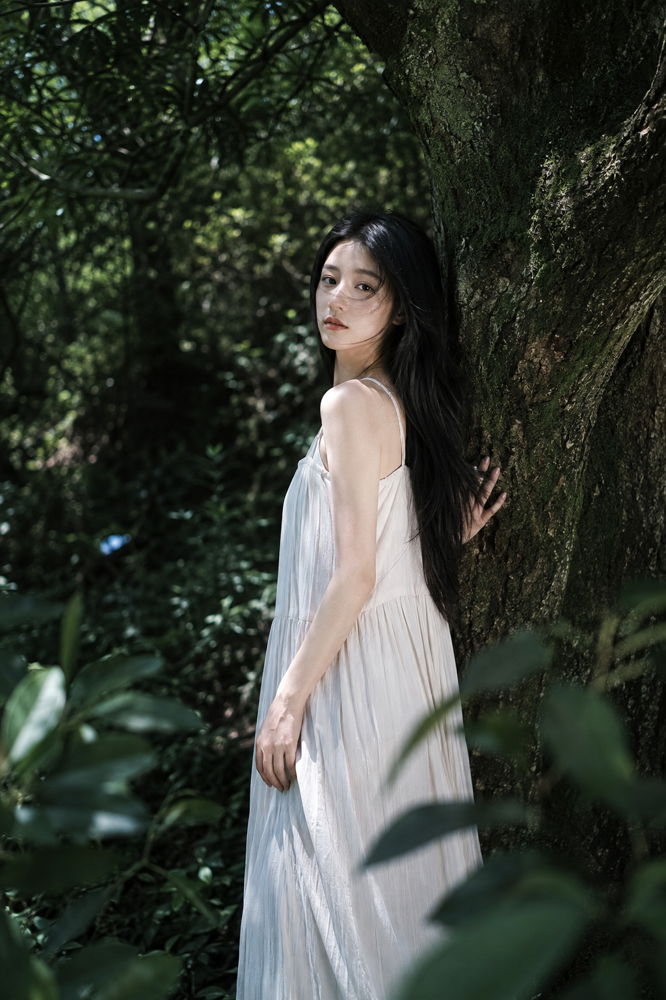
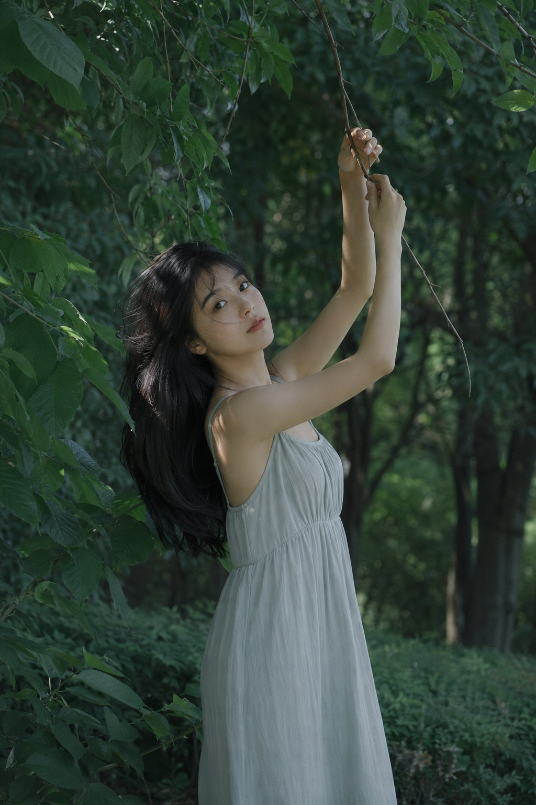
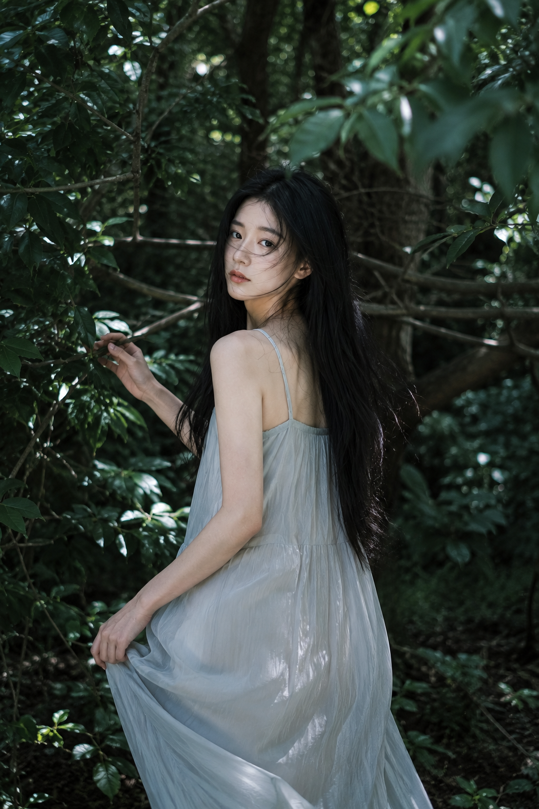
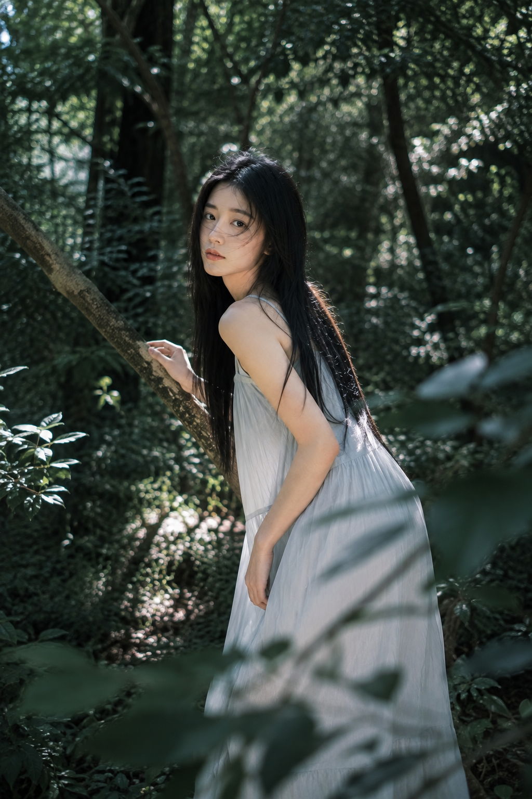

# 同一片森林试了6种动作，冷调女友感真实到像抓拍

**实验目标：** 在同一套深绿、雾蓝和灰白色系里，只调整动作、机位和前景，看 6 个林间瞬间能否同时保住真实感与画面张力。

**核心变量：** 用枝叶形成前景，用碎光提亮面部，再用宽松垂坠的长裙稳住人物轮廓。

---

**#01 ｜ 枝叶下轻扶回望**

这是全组的基准写法：人物清晰，环境不被虚化成一块绿布，手势也有明确的枝条作为支点。

竖版 2:3，真实写实森系人像摄影，盛夏林间，一位 22-26 岁成年东亚女生站在浓密树荫下，气质清冷安静，面容自然清秀，黑色长直发及腰，发丝被微风轻轻吹起。她穿一条奶灰白色细肩带宽松长裙，面料轻薄柔软，带自然垂坠褶皱，内衬完整不过分暴露。人物身体微微侧向画面左侧，抬起一只手轻扶头顶垂下的树枝，另一只手自然垂落，头部回望镜头，眼神平静温柔，嘴唇自然裸粉。场景为枝叶繁盛的绿色树林，前景有大片虚实交错的深绿色叶片，背景是层叠树枝、树干与幽深林影。光线为中午偏下午的自然散射光，树叶缝隙间洒下斑驳光斑，局部照亮额头、肩膀、手臂和发丝边缘，形成柔和轮廓光。整体色调以墨绿、冷绿、灰蓝白、自然肤色为主，低饱和、低对比、偏冷色温，画面干净通透，带轻微胶片颗粒与数码直出质感，50mm 人像镜头，中近景，人物清晰锐利，背景适度柔化。避免 AI 美女脸、过度磨皮、网红妆、塑料皮肤、夸张美颜、手部畸形、头发成块、过度梦幻特效、过度虚化、文字、水印、logo。

---

**#02 ｜ 藤径转身**

背向镜头再回眸，比正面站姿更像偶然抓拍。85mm 压缩枝叶层次，脸部补光要单独说清，否则五官容易沉进林影。

---

**#03 ｜ 老树作视觉支点**

粗糙树皮与柔软裙料形成材质反差，35mm-50mm 留下更多环境。这张不追求大虚化，而是让老树成为画面的稳定骨架。

---

**#04 ｜ 双手举枝**

手臂向上延展能打破静态，叶片则像天然相框。跟 AI 沟通时要同时指定双手位置与手指完整，不要只写「扶树枝」。

---

**#05 ｜ 枝丛间缓慢前行**

一手拨叶、一手轻提裙边，同时给画面行进方向。平视 85mm 保留杂志感，也避免低机位让动作变得刻意。

---

**#06 ｜ 斜枝前的微俯身**

前倾动作缩短了镜头与人物的心理距离，前景遮挡则增加空间深度。冷白天光只做局部提亮，暗部仍要保留绿色细节。

---

**实验结论：** 真实感不来自「超真实」这一个词，而是人物动作有支点、光线有方向、环境有前中后景。收藏这套逻辑，关注后续案例；你最想看哪种林间动作，可以留言告诉我。

#GPTImage2 #千问 #豆包 #生图提示词 #Prompt #女友感自拍 #盛夏森林写真
