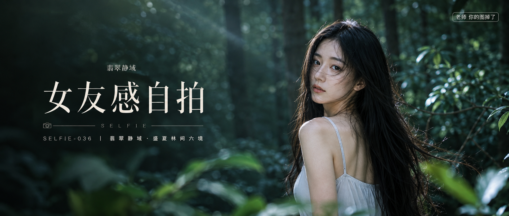

# SELFIE-036-翡翠静域·盛夏林间六境 封面

## 封面提示词

视觉概念「翡翠静域」，盛夏深林中的冷调写实人像商业封面，一位 24 岁成年东亚女生穿内衬完整的奶灰白宽松长裙，黑色长直发被微风吹起，人物位于画面右侧中近景，3/4 侧脸回望镜头，脸部占画面高度约三分之一，眼神有神灵动，嘴唇自然闭合，五官精致自然，面部立体清晰，皮肤光泽细腻，妆感干净清透，轮廓清晰上镜。一束冷白树叶碎光从左上方斜切画面，侧逆光打亮颧骨与发丝，柔光环绕面部，前景深绿叶片虚化，中景人物清晰，背景层叠树干沉入青黑林影，形成明确前中后景和冷白与翡翠绿的色彩反差。画面有即将穿过树林的单帧故事感，摄影杂志大片，电影感光影，高清锐利，色彩层次丰富，视觉冲击力强，构图黄金比例，色调统一精致，画面有张力，2.35:1 电影横构图。避免 AI 美女脸、网红感、过度精修、塑料皮肤、暗沉肤色、明显痘印、明显皱纹、斑点、面部变形，避免纯背影、远景小人物、眼睛半闭、嘴巴微张、手部畸形、文字遮挡五官。

【文字排版-必须完整保留，不得省略或简化任何一项】画面左侧垂直居中偏下叠加文字排版：超大号衬线字体米白色主文案「女友感自拍」，主文案正下方一条细横线左端带📷横线中央有透明英文水印 SELFIE，横线下方等宽白色字体副文案「SELFIE-036 ｜ 翡翠静域·盛夏林间六境」；右上角浅色半透明圆角底衬配小号文字「老师 你的图掉了」（署名文字，必须出现，不可省略）；无整体蒙层，文字直接压图。在主文案上方以极小号细衬线字体加入次级装饰文字「翡翠静域」，不得挤压主标题或遮挡人物面部。【文字排版结束】

## 封面图片

