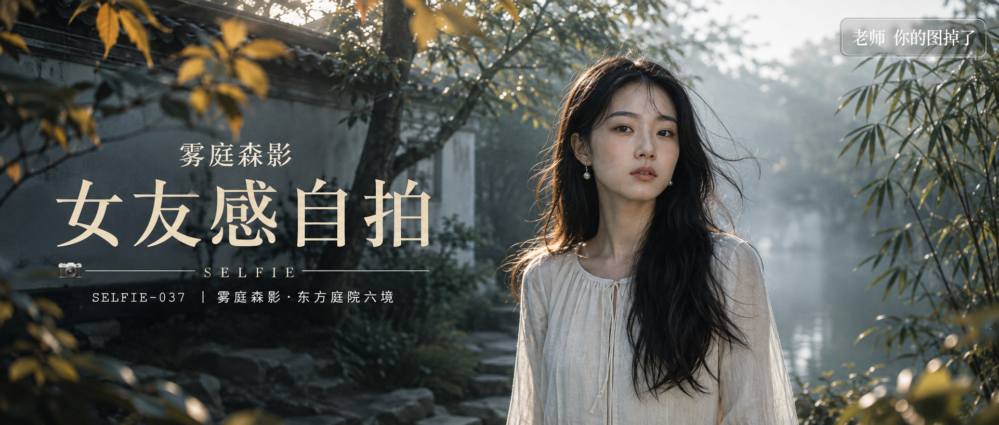

# SELFIE-037-雾庭森影·东方庭院六境 封面

## 封面提示词

雾庭森影视觉概念，东方庭院与森林湖岸在横向画面中自然衔接，一位24岁的成年东亚女性以正脸偏3/4角度位于画面右侧中近景，面部占画面高度三分之一以上，眼神有神灵动，五官精致自然、面部立体清晰、皮肤光泽细腻、妆感干净清透、轮廓清晰上镜；黑色长发被微风轻轻吹起，穿象牙白棉麻长裙，肩颈与服装完整得体。右侧晨雾冷灰绿，左侧透入一束克制的金色侧逆光打亮颧骨，形成冷暖对比；前景虚化竹叶与金色落叶形成双层框景，中景人物清晰，后景灰白院墙、古树与湖面递进，电影感光影、色彩层次丰富、构图黄金比例、视觉冲击力强、高清锐利、色调统一精致、商业海报级完成度，缩略图中人物依然醒目，面部无遮挡，画面有张力，2.35:1电影横构图。避免侧脸比例过大、眼睛半闭、嘴巴微张、文字遮挡五官，避免 AI 美女脸、网红感、过度精修、塑料皮肤、暗沉肤色、明显痘印、明显皱纹、斑点、面部变形。

【文字排版-必须完整保留，不得省略或简化任何一项】画面左侧垂直居中偏下叠加文字排版：超大号衬线字体米白色主文案「女友感自拍」，主文案正下方一条细横线左端带📷横线中央有透明英文水印 SELFIE，横线下方等宽白色字体副文案「SELFIE-037 ｜ 雾庭森影·东方庭院六境」；在主文案上方以较小号典雅衬线字体加入视觉概念名「雾庭森影」，不可挤压固定文字；右上角浅色半透明圆角底衬配小号文字「老师 你的图掉了」（署名文字，必须出现，不可省略）；无整体蒙层，文字直接压图。【文字排版结束】

## 封面图片

