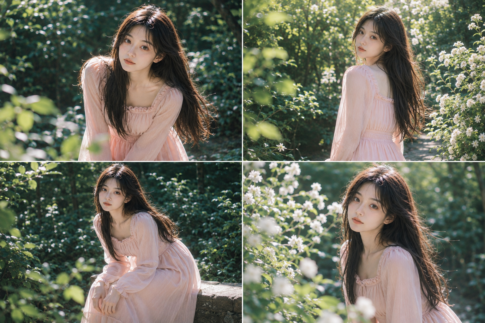
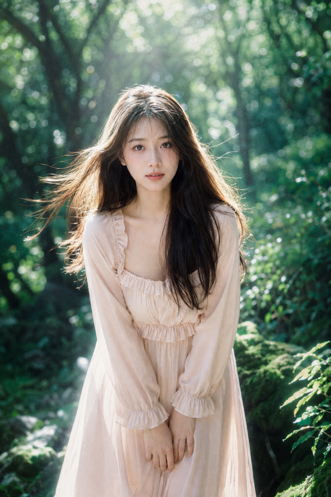
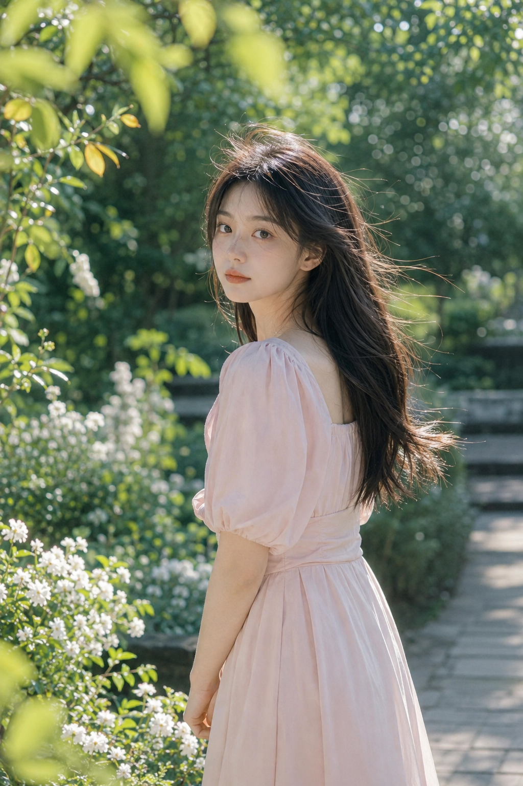
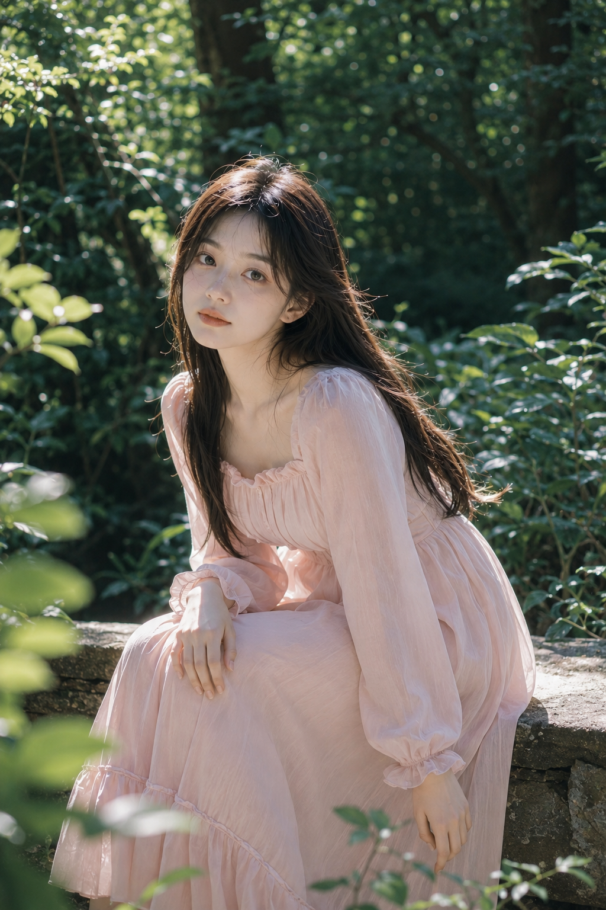
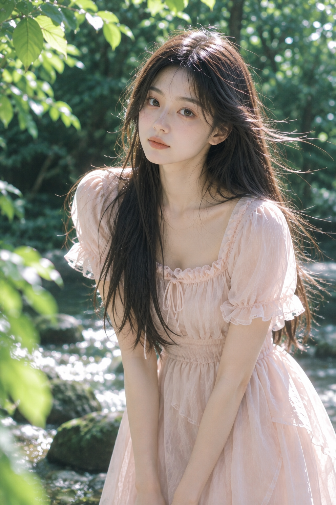
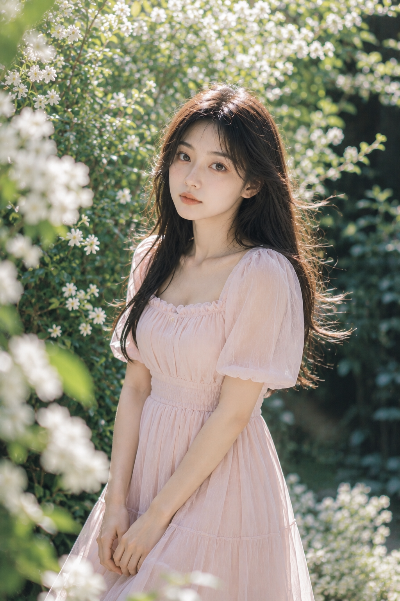
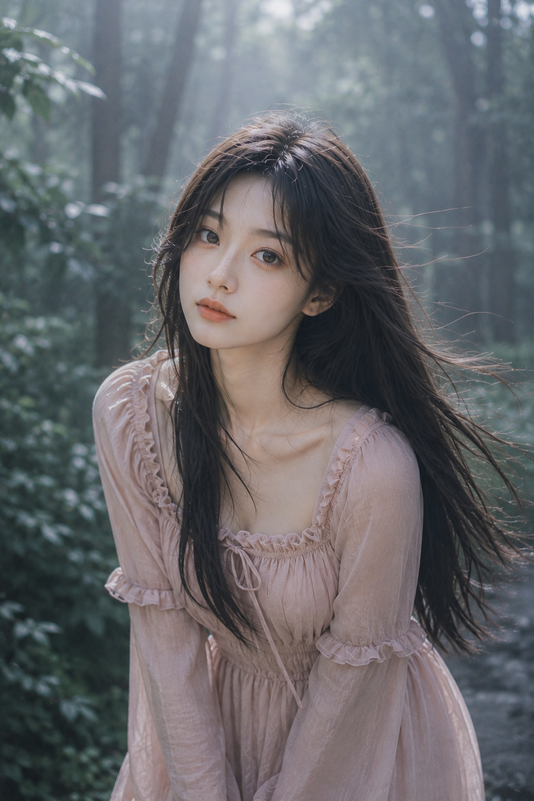

# 这套粉绿森林女友感写法存一下，6种构图都能稳定出片

这组「粉雾森语」把画面拆成三个层级：粉色负责亲近感，深绿负责空间，轮廓光负责分离人物。

---

**Q：第一张为什么要让人物俯身靠近镜头？**

轻微前倾能拉近距离，肩颈必须放松、双手自然下垂。50mm—85mm 精准对焦眼睛，既亲近又不易变形。

竖版 2:3，清新梦幻的夏日森林人像写真，真实写实摄影风格。一位 24 岁成年东亚女生置身于幽深茂密的树林中，微微俯身靠近镜头，双手自然垂放在身前，肩颈舒展，眼神安静清澈地直视镜头，神情温柔克制、空灵纯净。她拥有五官自然清秀、面部干净的东亚面孔，柔和鹅蛋脸，健康自然的冷白肤色，保留真实细腻皮肤纹理与自然光泽，淡妆，裸粉色唇妆。黑棕色长发浓密柔顺，在微风中向两侧轻轻扬起，发丝在逆光下清晰发亮；与本组其他画面保持同一人物面孔与发型。她穿一条奶油粉色方领荷叶边长袖连衣裙，领口端庄，面料轻柔，裙摆自然垂落，甜美但不俗气。背景是深绿树叶、暗调枝干与柔和散景，阳光穿过树叶形成斑驳光影与银白轮廓光，人物面部有柔和补光，画面明亮通透，以奶油粉与翡翠绿形成鲜明而精致的色彩层次。浅景深，眼睛精准对焦，50mm—85mm 人像镜头，f/1.8—f/2.8，大面积背景虚化，轻微胶片颗粒与空气感辉光，高级日系写真人像，无文字，无水印，无 logo。避免 AI 美女脸、网红感、过度精修、塑料皮肤、暗沉肤色、明显痘印、明显皱纹、斑点、面部变形。

---

**Q：站姿回眸怎样避免“影楼摆拍感”？**

同时交代身体朝向、发尾受风和前景叶片。身体先侧过去，脸再转回，动态才成立。侧逆光能让人物从深绿背景中跳出来。

---

**Q：坐姿怎么兼顾松弛感与手部稳定？**

一手放膝、另一手垂落，比“优雅坐姿”更容易生成完整手指。35mm 带入石台和植物，也更像偶然记录。

---

**Q：溪边的清冷感为什么不会显得灰暗？**

溪水亮点、银白边缘光和面部补光要同时存在，再用奶杏粉做暖色锚点。氧气感来自亮部干净，不是整体发白。

---

**Q：白花很多，怎样避免背景杂乱？**

前景花朵虚化，中景保留人物，后景化成散景；三层虚实比增加花量更高级。双手交叠时，要明确“五指清楚自然”。

---

**Q：薄雾电影感最容易失败在哪里？**

雾太厚会吞掉五官。只保留“轻微薄雾”，并要求天光照亮面部；85mm 近景压缩背景，情绪交给眼神。

---

**跟 AI 沟通时，分三次收紧：**先锁定脸与发型，再补亮面部，最后检查手指、裙装和穿模。一次只修一个变量，比整段重写更稳。

喜欢哪一种森林光线，可以在评论里留下编号；也可以说说下一期想看的场景。

#GPTImage2 #千问 #豆包 #生图提示词 #Prompt #女友感自拍 #森林写真
