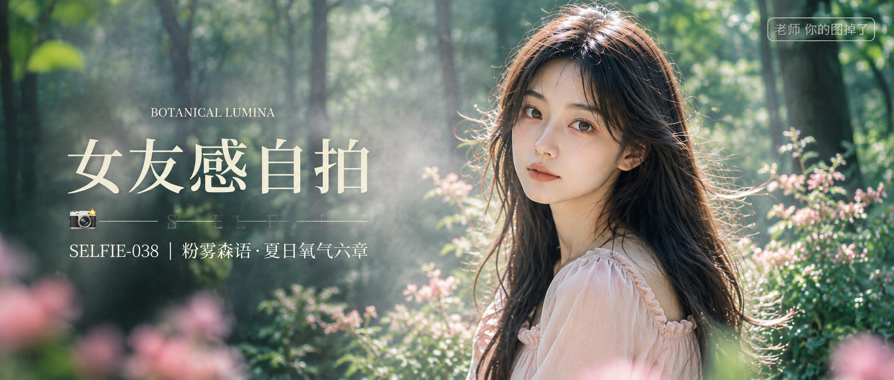

# SELFIE-038-粉雾森语·夏日氧气六章 封面

## 封面提示词

视觉概念「粉雾森语」，夏日森林电影海报，一位 24 岁成年东亚女生置身明亮翡翠绿叶与奶油粉花影之间，右侧 3/4 侧脸近景正面看向镜头，面部占画面高度三分之一以上，眼神有神灵动，五官精致自然，面部立体清晰，皮肤光泽细腻，妆感干净清透，黑棕长发被侧逆光勾出银白边缘，浅雾粉方领长袖连衣裙端庄优雅；左侧保留由虚化树叶、粉色光斑与薄雾形成的干净文字区，前景粉色花瓣虚化、中景人物清晰、后景深绿森林散景，形成明确前中后景，粉绿互补色明亮醒目，侧逆光打亮颧骨，柔光环绕面部，电影感光影，高清锐利，色彩层次丰富，视觉冲击力强，构图黄金比例，画面有张力，商业海报级完成度，真实写实摄影，2.35:1 电影横构图。无整体蒙层，避免眼睛半闭、嘴巴微张、纯侧脸、远景小人、五官模糊、文字遮挡面部、AI 美女脸、网红感、过度精修、塑料皮肤、暗沉肤色、明显痘印、明显皱纹、斑点、面部变形、手指畸形、文字乱码、文字裁切、漏字。【文字排版-必须完整保留，不得省略或简化任何一项】画面左侧垂直居中偏下叠加文字排版：超大号衬线字体米白色主文案「女友感自拍」，主文案正下方一条细横线左端带📷横线中央有透明英文水印 SELFIE，横线下方等宽白色字体副文案「SELFIE-038 ｜ 粉雾森语·夏日氧气六章」；主标题上方可用极小号米白字点缀视觉概念「BOTANICAL LUMINA」，不可替代或挤压固定文字；右上角浅色半透明圆角底衬配小号文字「老师 你的图掉了」（署名文字，必须出现，不可省略）；无整体蒙层，文字直接压图。【文字排版结束】

## 封面图片

