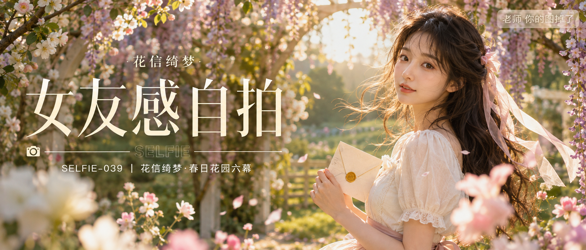

# SELFIE-039-花信绮梦·春日花园六幕 封面

## 封面提示词

视觉概念「花信绮梦」：盛放苹果花与淡紫藤花交织成明亮花园拱门，一位 24 岁成年东亚女生以正面偏 3/4 角度置于画面右侧近景，面部占画面高度三分之一以上，清晰看向镜头，眼神有神灵动，嘴角自然浅笑；深栗棕色长卷发被春风轻轻吹起，象牙白方领连衣裙配奶油粉丝带，手持一封带黄铜火漆印章的春日书信。前景粉白花瓣虚化，中景人物清晰，背景嫩叶绿草坡与暖金夕阳形成粉绿金三层纵深，侧逆光打亮颧骨与发丝，柔光环绕面部，肤色明亮健康，五官精致自然、面部立体清晰、皮肤光泽细腻、妆感干净清透、轮廓清晰上镜。轻复古日系杂志与法式花园大片融合，亮色系，高明度但不惨白，奶油粉、嫩叶绿、象牙白、暖金色形成鲜明记忆点，电影感光影、高清锐利、色彩层次丰富、视觉冲击力强、构图黄金比例、前景虚化背景、色调统一精致、画面有张力，商业海报级完成度，2.35:1 电影横构图。无整体蒙层，避免纯侧脸、闭眼、嘴巴微张、人物过小、文字遮挡五官、手部畸形、背景杂乱，避免 AI 美女脸、网红感、过度精修、塑料皮肤、暗沉肤色、明显痘印、明显皱纹、斑点、面部变形。

【文字排版-必须完整保留，不得省略或简化任何一项】画面左侧垂直居中偏下叠加文字排版：超大号衬线字体米白色主文案「女友感自拍」，主文案正下方一条细横线左端带📷图标，横线中央有透明英文水印 SELFIE，横线下方等宽白色字体副文案「SELFIE-039 ｜ 花信绮梦·春日花园六幕」；在主文案上方以小号细体字加入次级视觉概念名「花信绮梦」，不得挤压主标题或人物面部；右上角浅色半透明圆角底衬配小号文字「老师 你的图掉了」（署名文字，必须出现，不可省略）；无整体蒙层，文字直接压图。【文字排版结束】

## 封面图片

