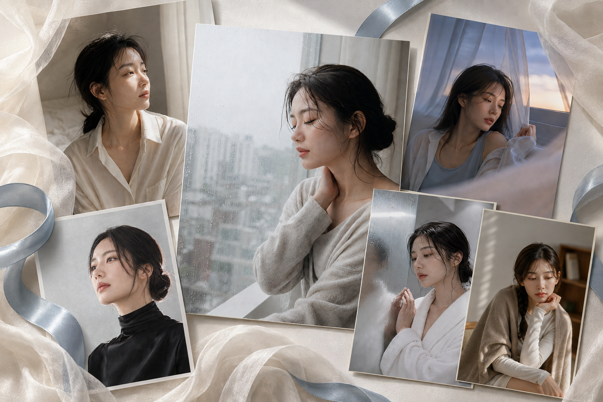
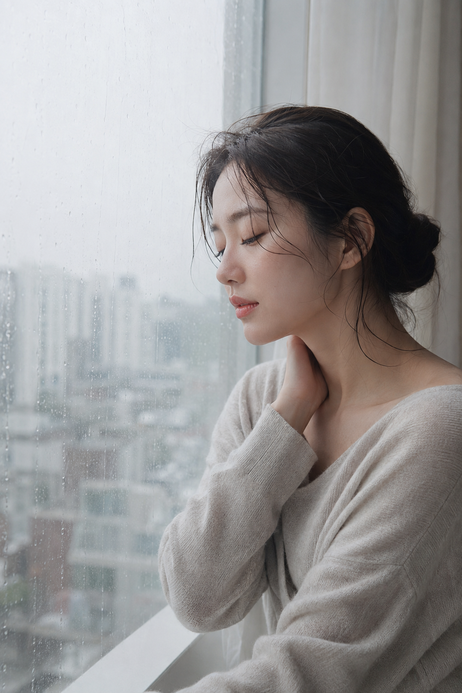
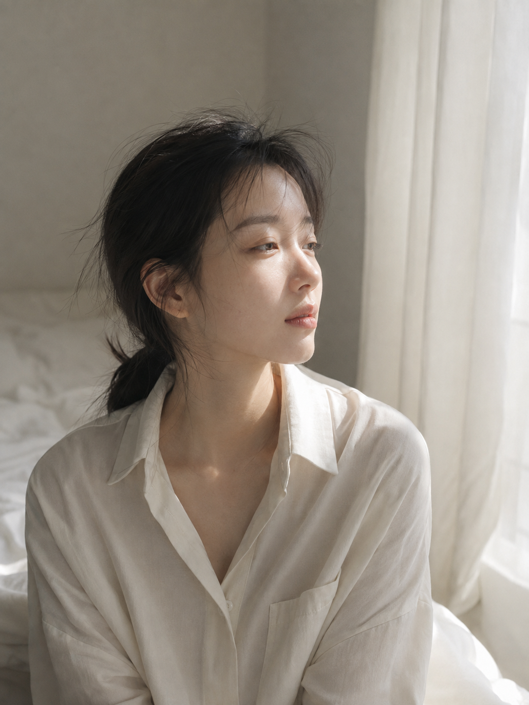
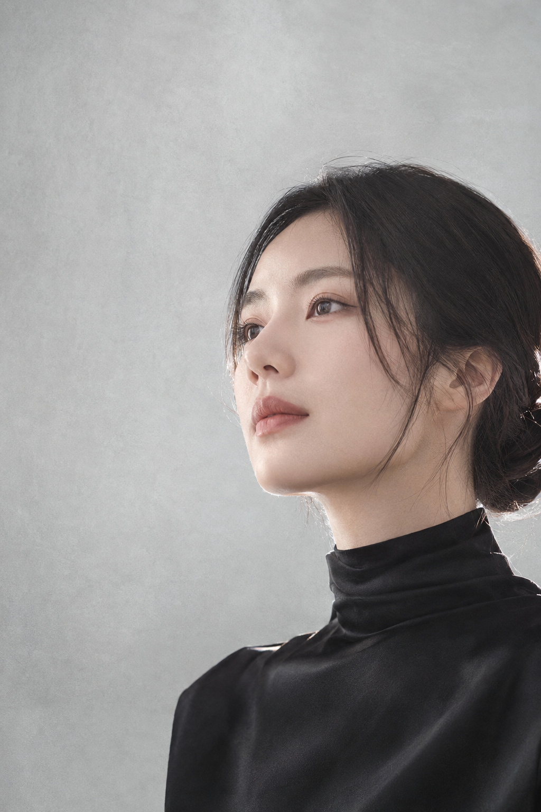
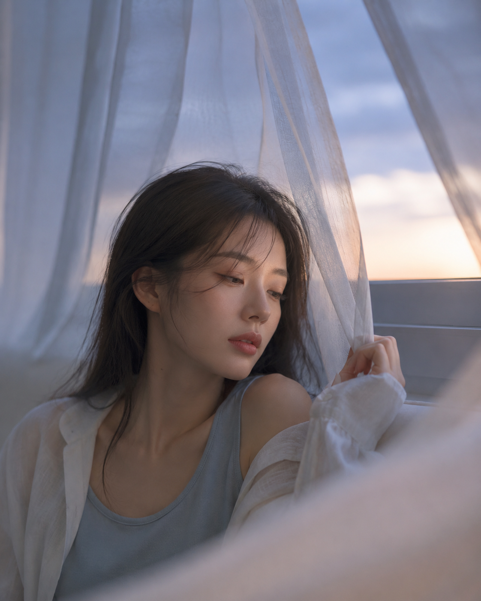
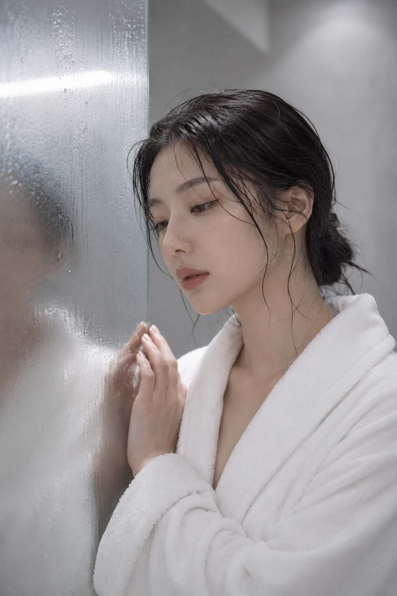
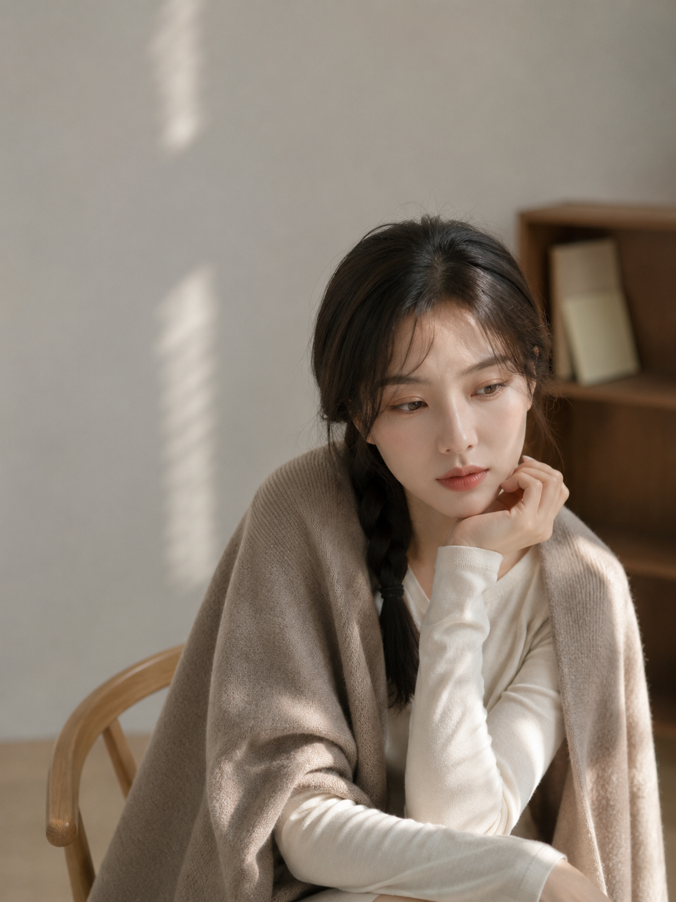

# 高级感不靠灰滤镜，六种留白构图把女友照拍得像真的

这组「雾光私语」没有用浓妆和重滤镜抢注意力，而是把雨痕、纱帘、镜面与墙面变成构图的一部分。真正的高级感来自留白中的呼吸，而不是把画面整体压灰。

雨后窗边先用最经典的偏心构图：人物落在右侧，左侧雨痕承担情绪，也给视线留下出口。85mm 把环境压成柔软色块，睫毛与针织纹理仍然清楚。

这是正文唯一一份原版提示词：

竖版2:3，韩系极简高级人像摄影，一位22-26岁的成年东亚女性坐在雨后公寓的落地窗边，真实自然的亚洲面孔，柔和鹅蛋脸，五官清秀克制，冷白但健康的自然肤色，保留细腻皮肤纹理和轻微绒毛感，不磨皮、不塑料。深棕色长发松散挽成低盘发，耳侧垂落几缕自然碎发，发丝略显潮湿蓬松。她穿一件宽松的浅燕麦灰细针织上衣，宽领自然滑向一侧肩头，露出纤细肩颈与锁骨，但穿着完整、优雅克制。人物侧身靠近窗户，头部微微向下倾斜，双眼轻闭，一只手轻放在颈侧，表情安静、疏离、略带沉思。阴天窗光从画面左侧柔和照入，玻璃表面有朦胧雨痕，背景是虚化的灰白城市轮廓与浅色窗帘。整体为雾灰、燕麦白、冷棕和柔和豆沙色调，低饱和、低对比、轻微灰雾感，阴影柔软，高光克制。85mm人像镜头，胸像近景，浅景深，人物位于画面右侧，左侧保留大片窗景留白，焦点落在侧脸、睫毛、嘴唇和锁骨，柔和电影感、轻微胶片颗粒、高级美妆杂志质感。无文字、无水印、无首饰、无杂乱家具。避免网红脸、AI美女脸、夸张妆容、过度锐化、塑料皮肤、硬阴影、浓烈滤镜、色情姿态、身体结构错误。

清晨床侧换成反向留白：人物偏左，纱帘在右侧提亮。白衬衫的真实褶皱比“完美服装”更像生活瞬间；50mm 也更接近人眼。

黑色丝缎这一幕用材质反差托住画面。浅灰墙给黑衣留出轮廓，细窄侧逆光只勾发丝，不把人拍成生硬棚照。黑色不是压暗画面，而是让肤色与灰玫瑰唇色更亮。

黄昏纱帘属于柔性框景：人物放在左下，飘起的纱从上方和右侧包围。冷蓝窗光与暖灰反射光同时写清，AI 才不会只套一层蓝滤镜。

浴室镜面最容易翻车的不是水汽，而是第二张脸。与 AI 沟通时，直接说明“只保留模糊反射，不能出现清晰第二张脸”，比笼统写“镜面自然”有效。

书房用左上大留白平衡右下人物，披肩、木椅与书架只负责提供材质层次。手靠近下巴时要补一句“不遮挡面部”，让动作自然，也减少手指穿模。

六幕看似不同，底层逻辑只有三个：先确定留白方向，再指定柔光路径，最后限制材质与反射。 跟 AI 沟通也尽量说位置和关系，例如“人物右移、左侧保留窗景”，不要只说“更有高级感”。

---

你更喜欢雨后窗边、雾蓝纱帘，还是黑色丝缎这一幕？欢迎留言，也可以收藏这套构图方法继续换场景。

---

## 往期回顾

- 提示词怎么拼出不规则宫格杂志感大片？ 复制到 GPT 豆包试试！
- 小猫、花园、长椅、女友、写真，8 种提示词组合，绝对出片
- 低机位围圈构图，换六种生活场景都像手机真实抓拍

#GPTImage2 #千问 #豆包 #生图提示词 #Prompt #女友感自拍 #雾光肖像
