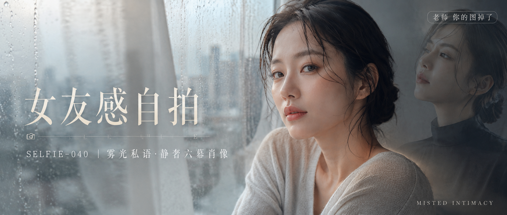

# SELFIE-040-雾光私语·静奢六幕肖像 封面

## 封面提示词

视觉概念「雾光私语」：明亮雨后公寓窗边，一位24岁成年东亚女性以清晰正脸偏四分之三角度靠近镜头，面部占画面高度约45%，深棕湿润低盘发与自然碎发，浅燕麦灰针织上衣完整端庄；五官精致自然、面部立体清晰、皮肤光泽细腻、眼神有神灵动、妆感干净清透、轮廓清晰上镜。左侧雨痕玻璃与奶油白纱帘形成前景虚化，右侧一束雾蓝与暖米白交叠的柔光环绕面部并打亮颧骨，背景隐约叠放一张黑色丝缎肖像的半透明杂志页，形成明暗材质反差、前中后景与冷暖层次；雾蓝、珍珠白、燕麦金为主色，少量炭黑点睛，整体明亮高级、色彩层次丰富、视觉冲击力强、电影感光影、构图黄金比例、画面有张力、商业杂志封面级完成度，2.35:1电影横构图。无杂乱家具，服装不透明、不暴露，避免 AI 美女脸、网红感、过度精修、塑料皮肤、暗沉肤色、明显痘印、明显皱纹、斑点、面部变形、眼睛半闭、嘴巴微张、手部畸形、文字遮挡五官。【文字排版-必须完整保留，不得省略或简化任何一项】画面左侧垂直居中偏下叠加文字排版：超大号衬线字体米白色主文案「女友感自拍」，主文案正下方一条细横线左端带📷横线中央有透明英文水印 SELFIE，横线下方等宽白色字体副文案「SELFIE-040 ｜ 雾光私语·静奢六幕肖像」；右上角浅色半透明圆角底衬配小号文字「老师 你的图掉了」（署名文字，必须出现，不可省略）；画面右下可用极小号装饰文字「MISTED INTIMACY」增强层次，但不能挤压固定文字或人物面部；无整体蒙层，文字直接压图。【文字排版结束】

## 封面图片

