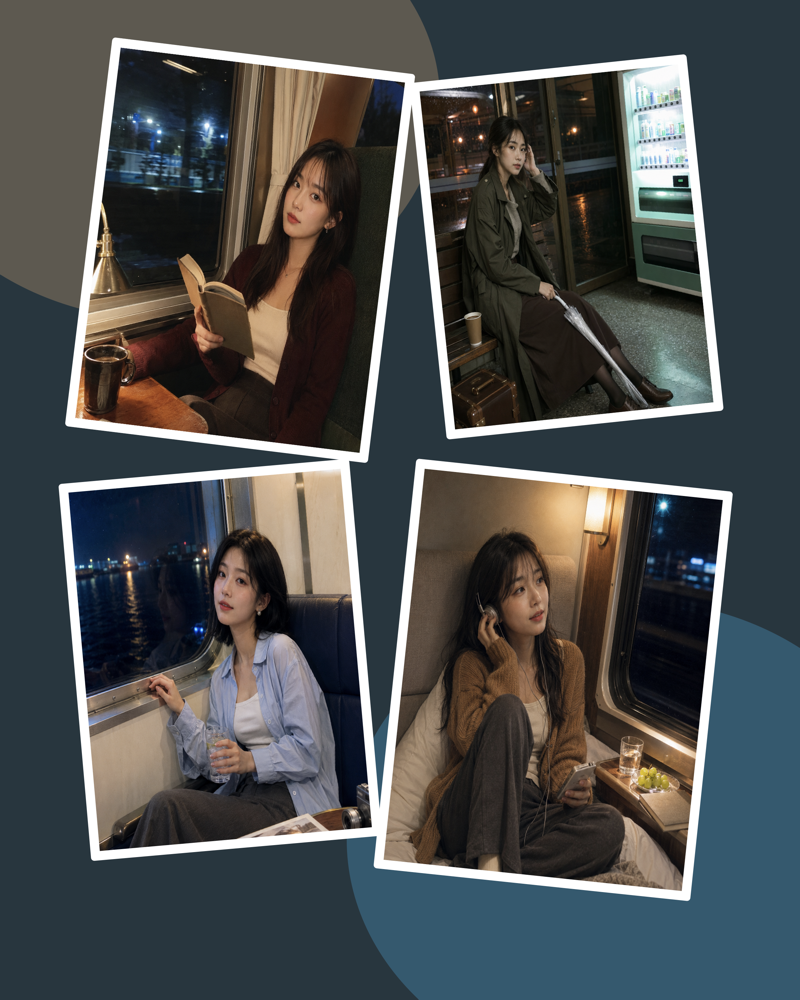
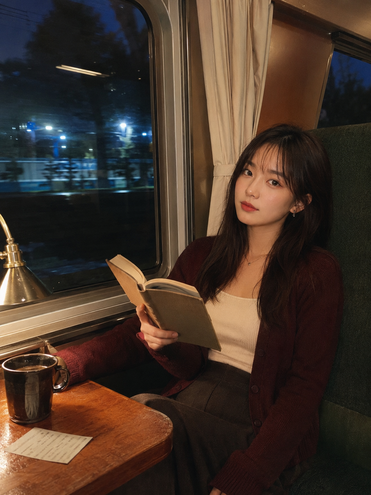
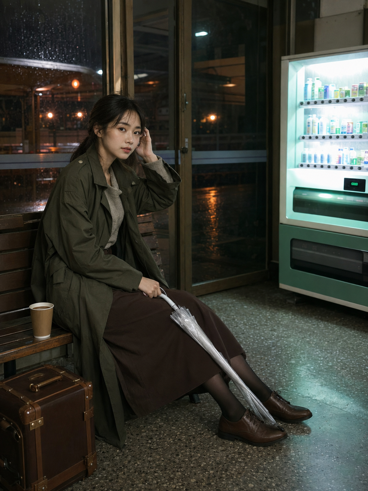
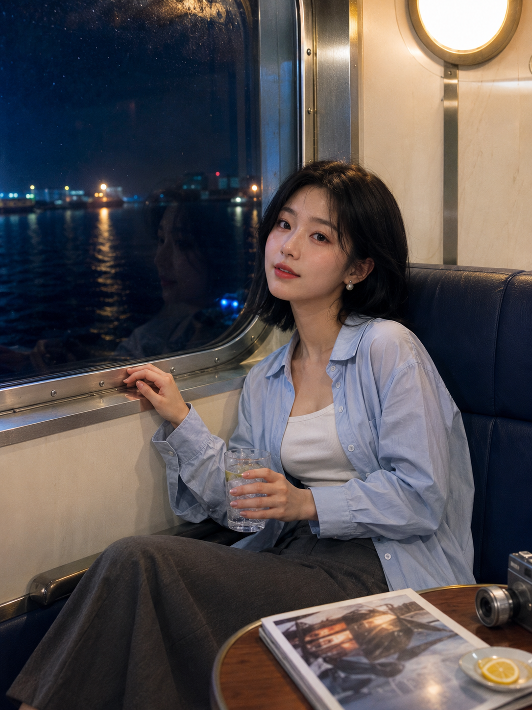
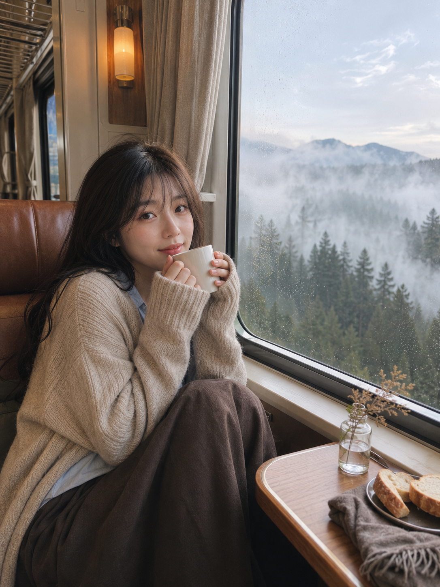
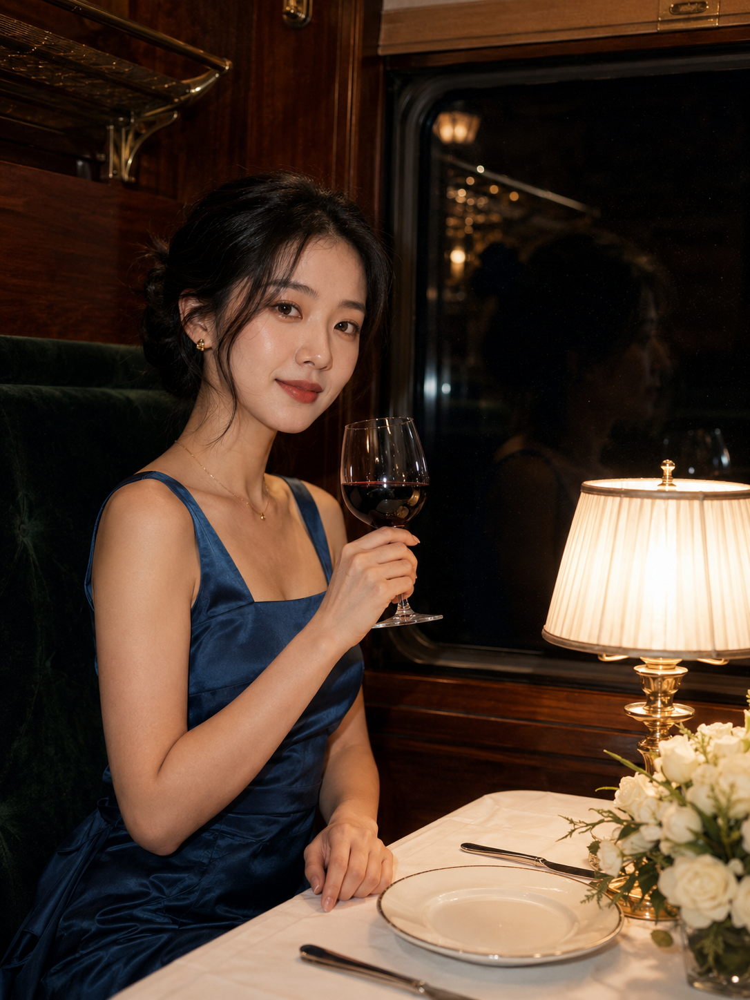
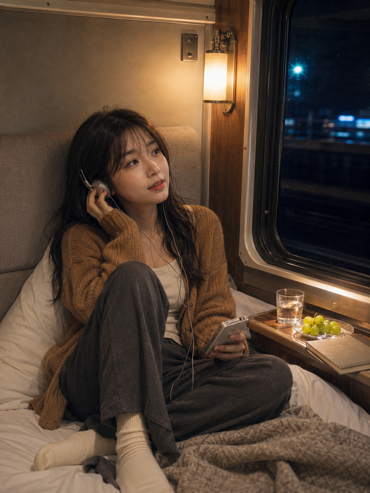

# 这组夜行交通女友照被问在哪拍的，6个场景都像真实旅途

夜行交通最适合做女友感：人物不是站着“被拍”，而是在路上有一件正在做的事。窗外冷色和车内暖光一起出现，画面才有真实的停留感。

---

**#01 ｜ 夜行列车阅读**

人物放右侧，左侧留出夜窗；书和阅读灯让手部有自然落点。

竖版3:4，真实写实的夜间旅行人像摄影，安静私密、略带复古数码相机质感。一位24岁成年东亚女生，真实自然鹅蛋脸，五官清秀，健康自然肤色与细腻皮肤纹理，清透淡妆、暖棕眼影、低饱和豆沙红唇，深棕色中长直发、轻薄碎刘海、小巧金色耳钉。她坐在夜行列车靠窗座位，穿低饱和酒红色修身针织开衫、奶油白方领上衣、深棕色长裙与细金项链，身体微侧向车窗，一臂自然搭在木质小桌，另一手拿一本翻开的无文字旧书，刚从书页抬眼看向镜头，神情安静柔和、不露齿。腰部以上中近景，人物在右侧，左侧是带室内倒影、模糊树影和掠过站台灯光的深色车窗；背景有深墨绿软包座椅、米白厚窗帘、银灰窗框、暖木桌面，桌上克制放置黄铜阅读灯、深色陶瓷咖啡杯、折叠车票。酒红、奶油白、深墨绿、暖木棕、黄铜金与冷蓝黑配色；顶部暖黄灯为主光，阅读灯在侧脸形成琥珀补光，窗外冷蓝夜景形成冷暖对比。35至50mm镜头、平视、中等景深，面部清晰、背景轻虚化，轻微数码柔焦和细腻颗粒，像旅途中被朋友随手记录的高质量照片。无文字、无水印、无品牌标识、无手机截图界面。避免AI美女脸、网红感、过度精修、塑料皮肤、暗沉肤色、明显痘印、明显皱纹、斑点、面部变形、夸张大眼、手指畸形、书本乱码、窗框错位、强烈闪光、过曝肤色、背景杂乱

---

**#02 ｜ 雨夜候车室**

售货机只做右后方冷色侧光，人物和雨伞的轻动作会比正对镜头更像抓拍。

---

**#03 ｜ 夜航渡轮**

让圆角舷窗占画面左侧，玻璃杯与金属窗框提供两处克制高光。

---

**#04 ｜ 山间清晨**

杯口热气、雾林和偏左人物组成三层景深；窗外不必过亮，保住雾的层次更重要。

---

**#05 ｜ 复古餐车**

黄铜台灯放进近景，深蓝缎面留给暖光，才能既优雅又不显摆拍。

---

**#06 ｜ 深夜卧铺**

耳机线和音乐播放器是“正在旅途”的证据。和 AI 沟通时，先交代真实卧铺结构，再写动作与光线。

---

**测试结论：** 夜景不靠重滤镜，靠“一个自然动作 + 一处暖光 + 一块冷色窗景”。这三点同时写清，六种交通场景都会保留生活感。

---

## 往期回顾

- 粉雾森语：夏日森林六章！女友感天花板提示词分享
- 提示词怎么拼出不规则宫格杂志感大片？ 复制到 GPT 豆包试试！
- 小猫、花园、长椅、女友、写真，8 种提示词组合，绝对出片

#GPTImage2 #千问 #豆包 #生图提示词 #Prompt #女友感自拍 #夜行交通
