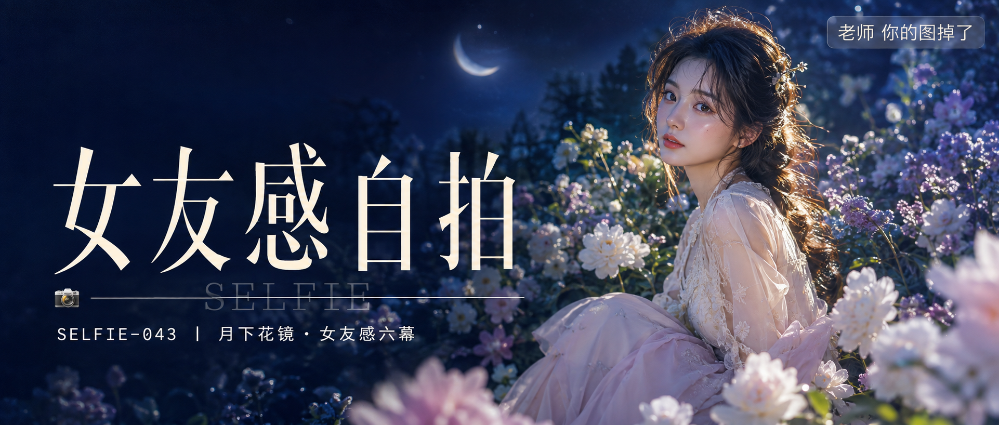

# SELFIE-043-月下花镜·女友感六幕 封面

## 封面提示词

月白花镜：电影横幅里的月夜秘密花园，一位24岁成年东亚女生以清晰的3/4侧脸坐在繁盛白芍与雾紫花丛前，面部占画面右侧三分之一，五官精致自然、面部立体清晰、皮肤光泽细腻、眼神有神灵动、妆感干净清透、轮廓清晰上镜；她穿奶油白与浅雾粉法式长裙，内衬完整，身后是深蓝树林和一弯朦胧月光，前景有晶莹露珠与虚化花瓣，左侧留出干净的深蓝负空间。冷蓝月光与暖金侧逆光打亮颧骨和发丝，玻璃质感月晕、花瓣、人物、林影形成前中后景，明亮奶油白与蓝紫色彩层次丰富，电影感光影，高清锐利，构图黄金比例，色调统一精致，视觉冲击力强，商业海报级完成度。避免AI美女脸、网红感、过度精修、塑料皮肤、暗沉肤色、明显痘印、明显皱纹、斑点、面部变形、文字乱码、文字遮挡五官。

【文字排版-必须完整保留，不得省略或简化任何一项】画面左侧垂直居中偏下叠加文字排版：超大号衬线字体米白色主文案「女友感自拍」，主文案正下方一条细横线左端带📷横线中央有透明英文水印 SELFIE，横线下方等宽白色字体副文案「SELFIE-043 ｜ 月下花镜·女友感六幕」；右上角浅色半透明圆角底衬配小号文字「老师 你的图掉了」（署名文字，必须出现，不可省略）；无整体蒙层，文字直接压图。【文字排版结束】

## 封面图片

