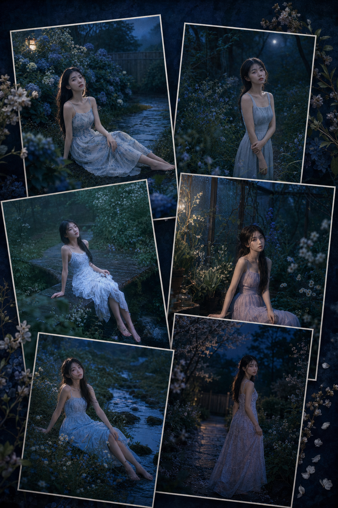
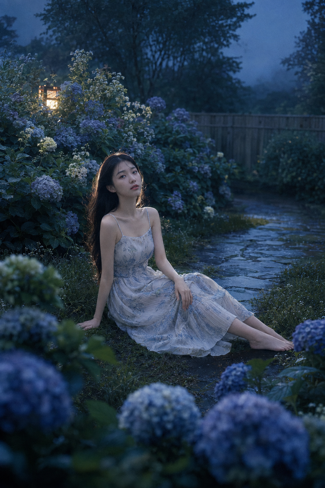
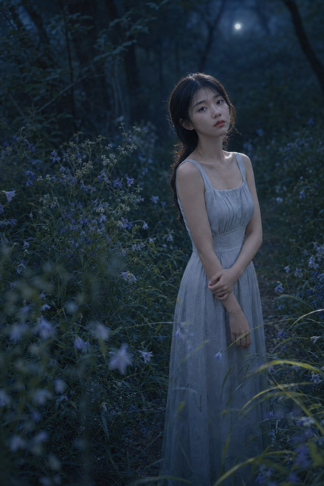
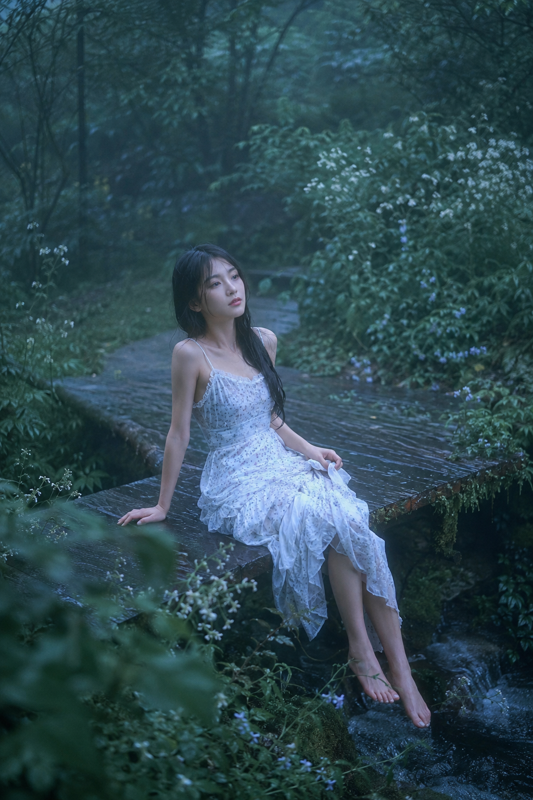
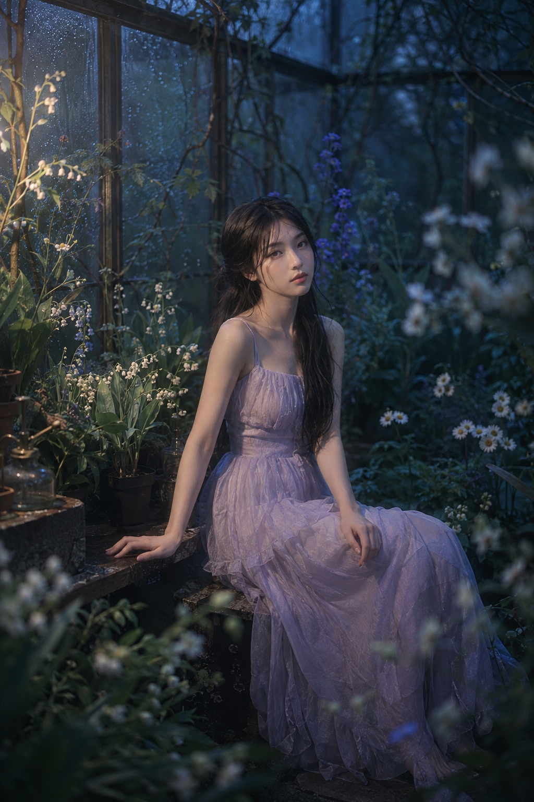
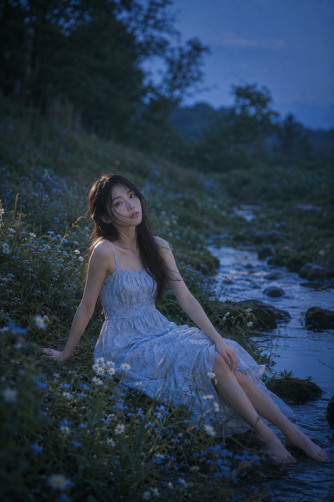
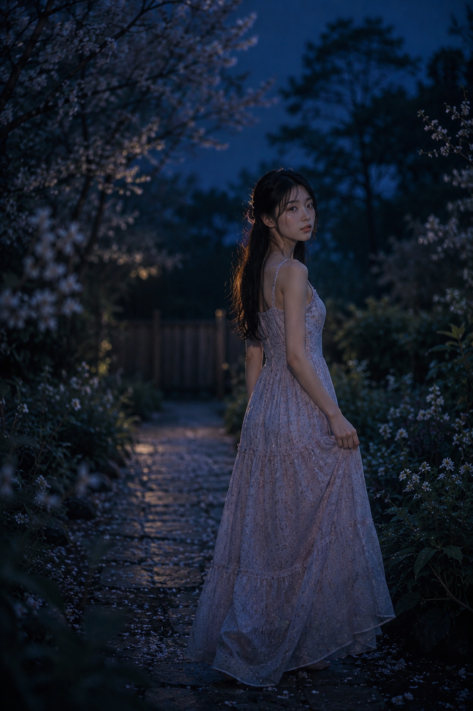

# 这套蓝调花园写法存一下，6个花境都能出真实电影感

蓝雾花径的核心不是把花塞满画面，而是先让夜色留出呼吸。冷蓝定空气，暖白只负责把人从暗处托出来。

## 第一幕｜紫阳花庭院

适合场景：想把人物放进花里，却不想拍成影楼花海。

竖版 2:3，日系蓝调梦境风格人像写真，真实写实摄影，带轻微胶片颗粒与柔雾感，画面安静、清冷、透明、带一点夏夜的忧郁感。傍晚将夜未夜的花园庭院里，一位 22-26 岁成年东亚女生坐在盛开的紫阳花之间，真实自然的东亚面孔，五官清秀耐看，皮肤白皙透亮但保留细腻真实纹理，淡妆，裸粉唇色，眼神安静、微微放空，情绪轻柔。她留黑棕色长直发，自然披散，几缕发丝被晚风轻轻吹起。她穿一条浅雾蓝与奶油白色调的日系碎花细肩带长裙，面料轻薄柔软，带细褶和层叠裙摆，内衬完整，质感轻盈。人物坐在潮湿草地与石板小径交界处，一只手轻撑在身侧，另一只手自然放在膝上，双腿斜向前方舒展，姿态松弛自然。周围盛开大片蓝紫色、灰紫色、奶白色紫阳花，夹杂细碎白花、深绿叶片与带露水的草丛，背景可见木质围栏、模糊树影和被蓝色暮光吞没的庭院角落。构图为环境式全身人像，人物位于画面中央偏下，前景以虚焦花团形成包围感，中景人物清晰，背景层层虚化，画面留有大面积深蓝色空气感负空间。光线以蓝调傍晚自然环境光为主，左后方有一束极柔和的暖白余晖勾亮发丝、面部边缘和肩颈，形成轻微轮廓光，整体不过曝，呈现细腻梦境氛围。色彩以雾蓝、灰蓝、蓝紫、深绿、奶白为主，低饱和、低对比，画面通透安静。摄影语言为日系杂志写真与电影感生活人像结合，全画幅相机，50mm 镜头，轻微俯拍，中等景深，前景柔焦，人物面部清晰，背景柔和化，35mm 胶片颗粒感，轻微高光晕染。无文字，无水印，无 logo。避免网红脸、避免塑料皮肤、避免浓妆、避免高饱和度、避免影楼摆拍感、避免肢体畸形、避免花丛过于对称、避免过强棚拍感。

---

## 第二幕｜风铃草小径

适合场景：人物站着容易僵时，把双手交叠、视线与小径一起写清楚。前景花枝的虚焦比多加滤镜更有窥视感。

---

## 第三幕｜雨后木桥

适合场景：青苔、溪流和白花都很抢眼，就让木桥延伸承担纵深；人物只需坐在桥缘，画面会自然安静。

---

## 第四幕｜铃兰温室

适合场景：和 AI 沟通温室时，重点交代玻璃水汽、冷光底色、弱暖光扫脸，才能避免变成明亮的影棚。

---

## 第五幕｜薄暮溪边

适合场景：草坡上坐姿别追求对称，手撑地、扶脚踝与斜伸双腿能留下被偶然拍到的松弛。人物亮，背景略压暗，蓝调才会干净。

---

## 第六幕｜夜樱回望

适合场景：回身比正面站定更像电影静帧。把大量深蓝负空间留给树影，花瓣只做前景和情绪，不抢脸。

---

## 一句结论

六个场景都在重复同一件事：先搭出前、中、后景，再让暖白轮廓光只碰到脸、发丝和肩部，真实感就会留下来。

---

## 往期回顾

- GPT image2: 在木屋窗光里生成一组清透夏日女友感写真
- 粉雾森语：夏日森林六章！女友感天花板提示词分享
- 提示词怎么拼出不规则宫格杂志感大片？ 复制到 GPT 豆包试试！

#GPTImage2 #千问 #豆包 #生图提示词 #Prompt #女友感自拍 #蓝雾花径
