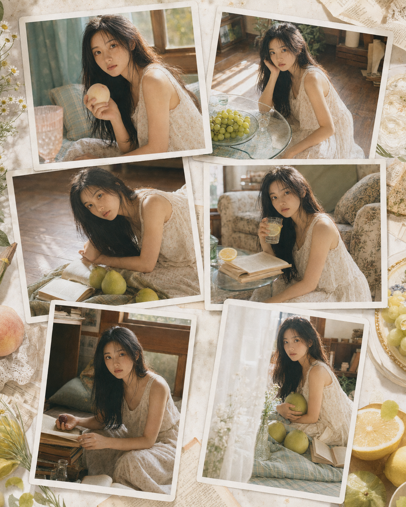
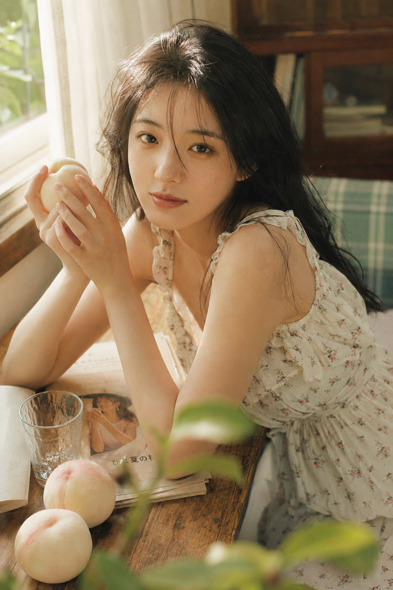
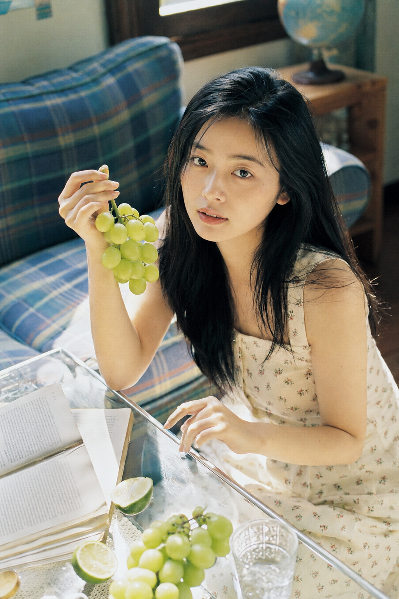
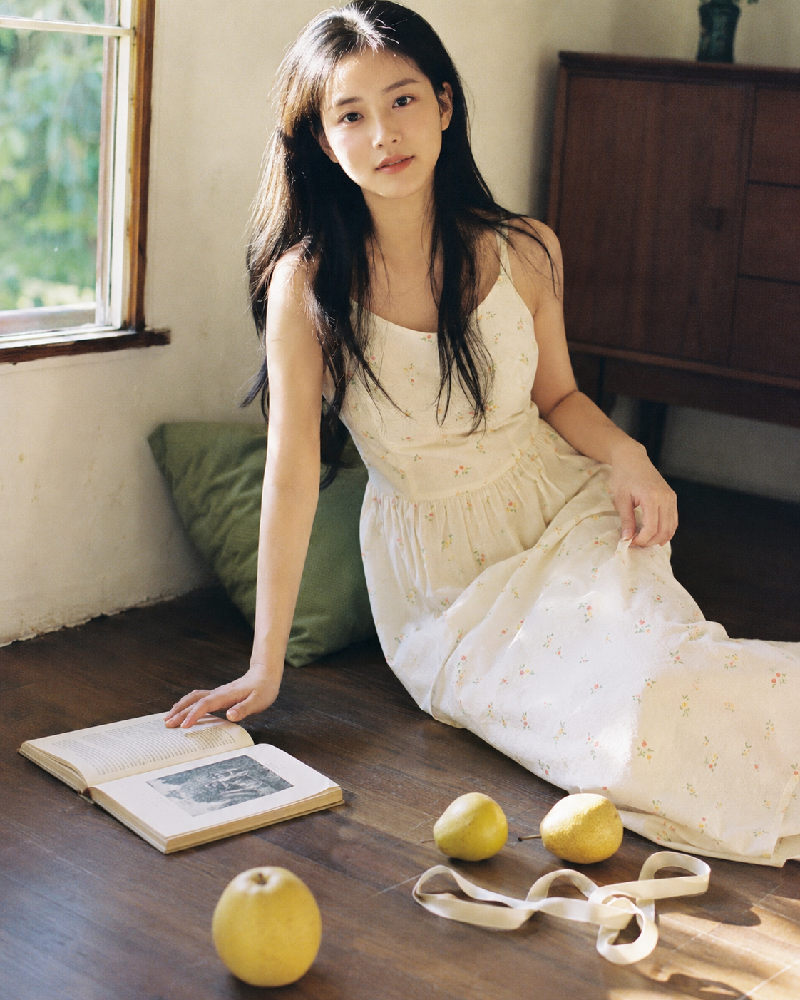
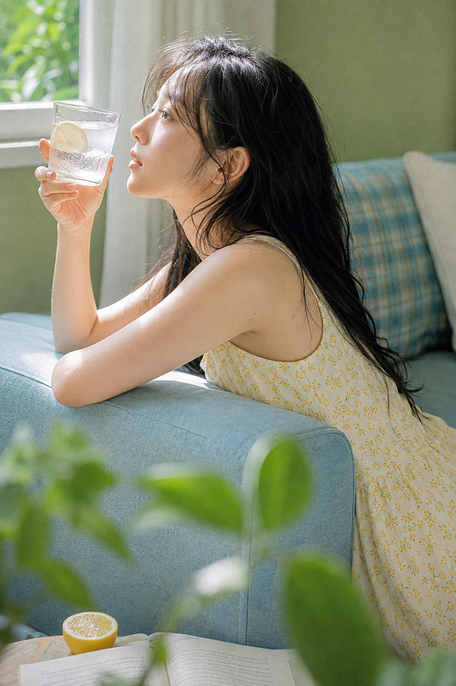
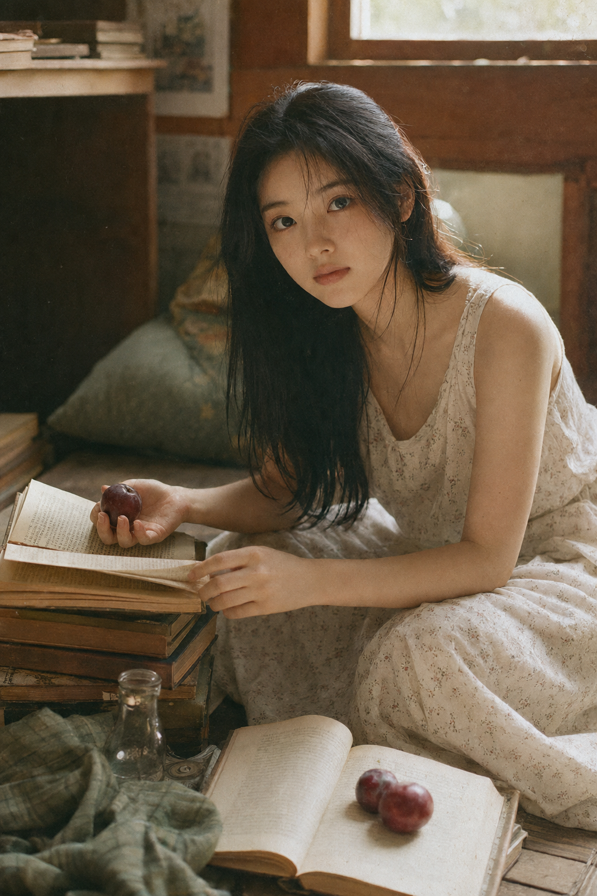
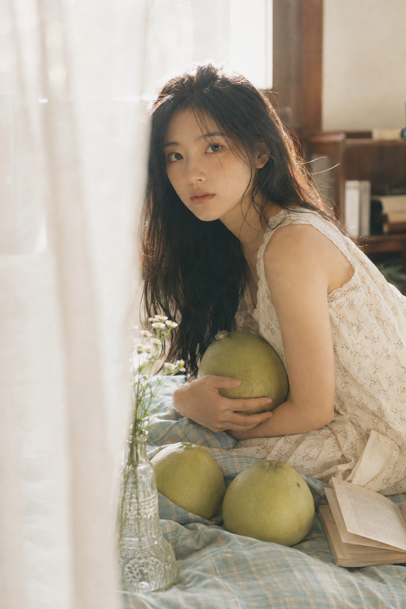

# 为什么女友感写真总像摆拍？这6个窗边细节让画面自然下来

女友感不是把表情做得更甜，而是让画面里有一点正在发生的生活：水果被握住、书页被翻开、光线恰好擦过脸。先把“精致写真”换成“生活化抓拍”，人物就不容易僵。

窗边白桃这一张把镜头推近，给脸、手和水果三条明确焦点；人物不必直视镜头，动作有任务感才自然。

竖版 2:3，日系复古少女写真，夏日午后卧室，自然窗光洒入房间，真实写实摄影风格。画面主体是一位 20-24 岁成年东亚女生，黑色长发自然披散，发丝略凌乱，部分碎发贴在额头和脸颊，五官清秀干净，皮肤白皙通透但保留真实纹理，淡妆，神情安静温柔，略带慵懒感。她穿一件奶油白色细碎小花无袖连衣裙，棉麻质感，轻微荷叶边细节。女生侧趴在窗边木桌旁，手里捧着一颗带绒感的白桃，桌上摊开一本旧杂志和几张泛黄纸页，旁边散落两三颗白桃与透明玻璃杯。背景有浅蓝绿色格纹靠垫、奶油白纱帘和木质家具，前景可有轻微虚化的绿叶。构图为近距离半身特写，人物脸部占画面较大比例，略微倾斜构图，镜头贴近人物，焦点落在眼睛和手中的水果上。光线温暖柔和，高光略微过曝，在头发、手臂和脸颊形成金色光斑。整体色调以奶油白、桃粉、浅绿色、木色为主，带轻微胶片颗粒、柔焦、高光晕染和早期日系杂志质感，35mm / 50mm 定焦镜头效果，生活化抓拍氛围。避免商业棚拍感，避免过度摆拍。负面词：AI美女脸，网红感，塑料皮肤，浓妆，欧美脸，夸张磨皮，手部畸形，五官变形，低俗暴露，背景杂乱，HDR，冷白棚拍光

玻璃桌的反射会自动带出第二层叙事。跟 AI 说清俯拍、人物落在右下、焦点落在眼睛与玻璃反光，桌面才不会变成普通静物背景。

木地板与香梨用对角线把视线送回脸部。前景只留一颗虚焦水果，能让“随手拍”的不完整感比满画幅布置更可信。

柠檬汽水适合侧脸：让杯壁冷凝水接住窗光，再把人物视线留给窗外，画面会有轻松的停顿，而不是在摆姿势。

旧书堆这一幕的关键是只给一只手具体任务。一手翻书、一手拿李子，比双手同时面对镜头更稳定，也更容易保住手部结构。

纱帘逆光不靠大幅虚化，而靠“窗纱占据画面一侧”的遮挡。与 AI 沟通时，把逆光、侧光、轮廓光分开写，人物脸部会仍然明亮、有层次。

这六幕共用的是任务感动作 + 一主一辅光源 + 可被触摸的材质。换水果、书页或靠垫都可以，先别换掉这三个骨架。

#GPTImage2 #千问 #豆包 #生图提示词 #Prompt #女友感自拍 #窗边写真
