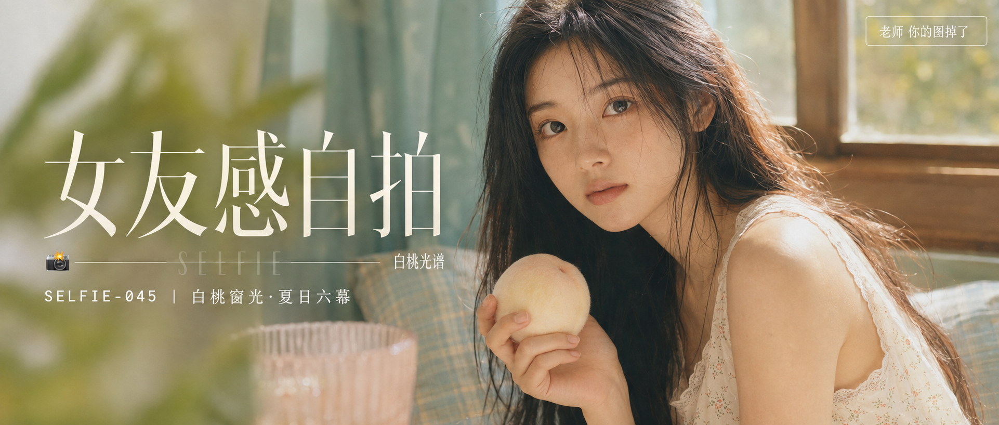

# SELFIE-045-白桃窗光·夏日六幕 封面

## 封面提示词

白桃光谱：明亮夏日窗边的高质感日系人物封面，一位 24 岁成年东亚女生正脸或清晰 3/4 侧脸，五官精致自然、面部立体清晰、皮肤光泽细腻、眼神有神灵动、妆感干净清透、轮廓清晰上镜。她穿奶油白碎花连衣裙，手持一颗绒感白桃，人物面部占画面三分之一以上；前景是半透明的桃粉玻璃和散焦绿叶，中景为人物与白桃，背景为薄荷绿窗帘、浅蓝格纹靠垫和金色窗光。电影感光影，侧逆光打亮颧骨，前景虚化背景，色彩层次丰富，构图黄金比例，视觉冲击力强，高清锐利，奶油白、白桃粉、薄荷绿的亮色层次，2.35:1 电影横构图。避免 AI 美女脸、网红感、过度精修、塑料皮肤、暗沉肤色、明显痘印、明显皱纹、斑点、面部变形、文字乱码、文字裁切、遮挡五官。【文字排版-必须完整保留，不得省略或简化任何一项】画面左侧垂直居中偏下叠加文字排版：超大号衬线字体米白色主文案「女友感自拍」，主文案正下方一条细横线左端带📷横线中央有透明英文水印 SELFIE，横线下方等宽白色字体副文案「SELFIE-045 ｜ 白桃窗光·夏日六幕」；主文案右下方以极小装饰字呈现视觉概念「白桃光谱」；右上角浅色半透明圆角底衬配小号文字「老师 你的图掉了」（署名文字，必须出现，不可省略）；无整体蒙层，文字直接压图。【文字排版结束】

## 封面图片

