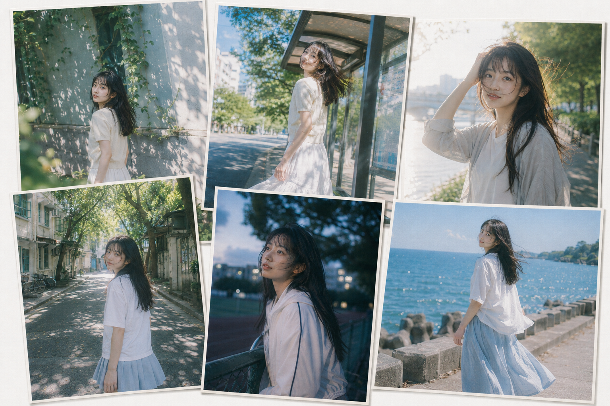
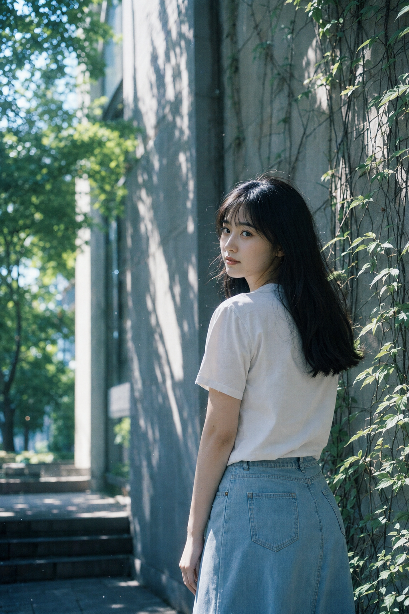
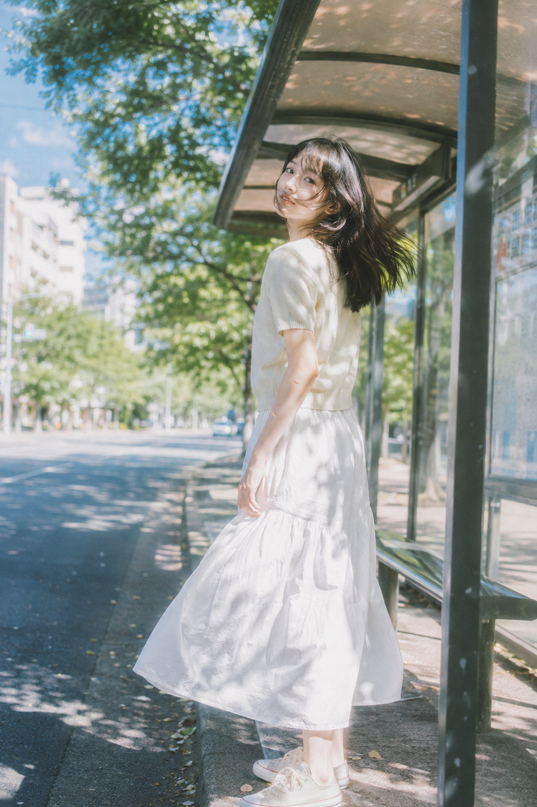
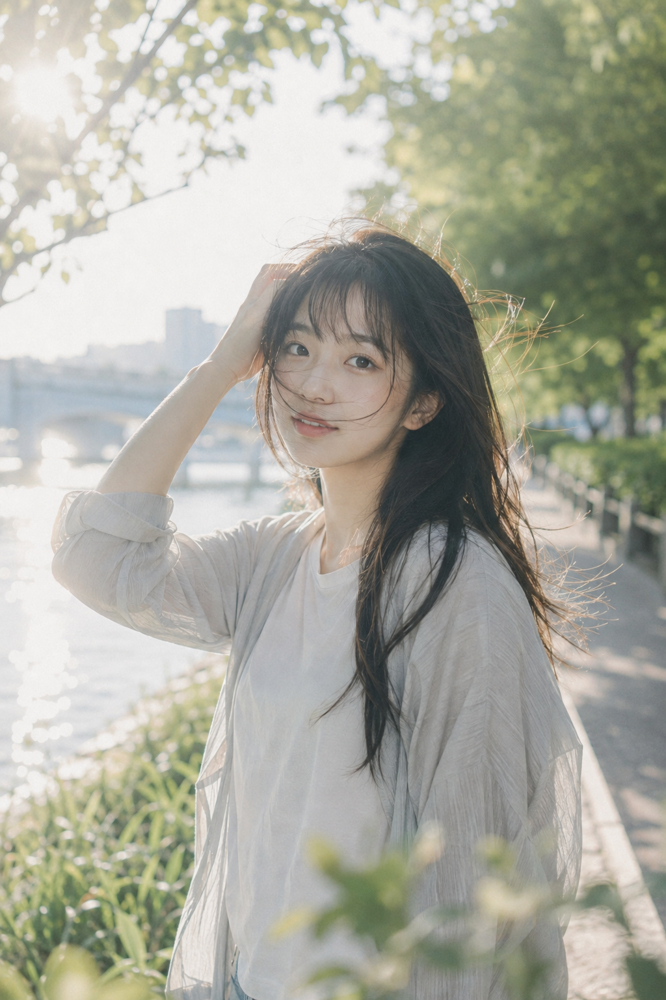
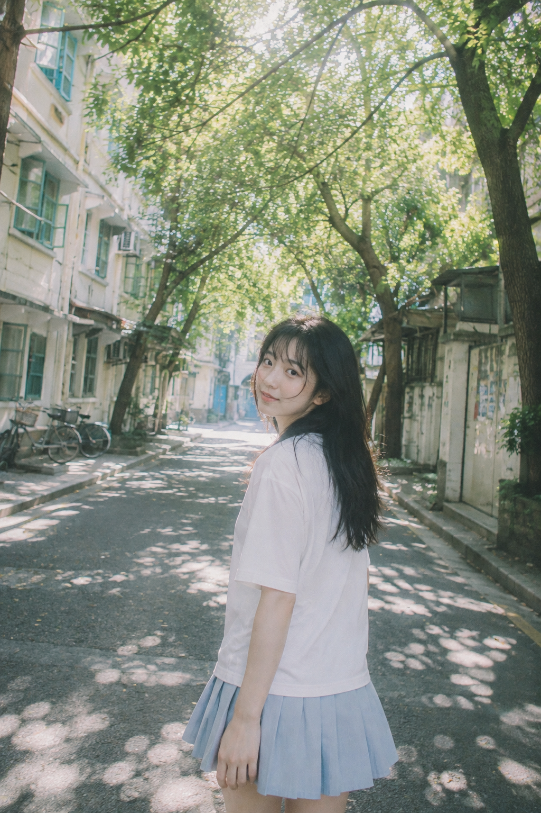
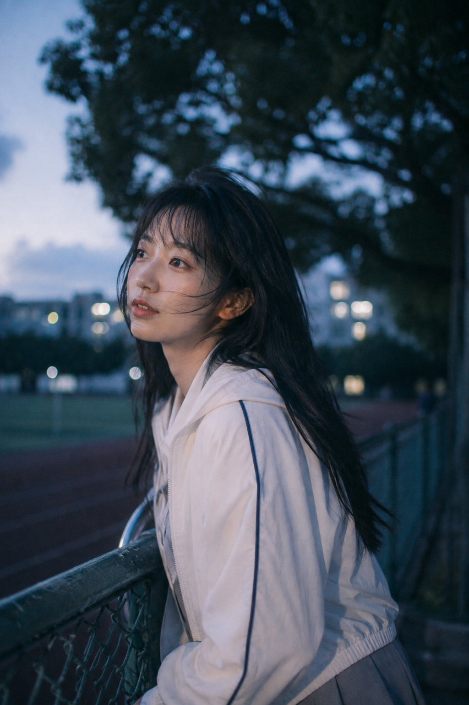
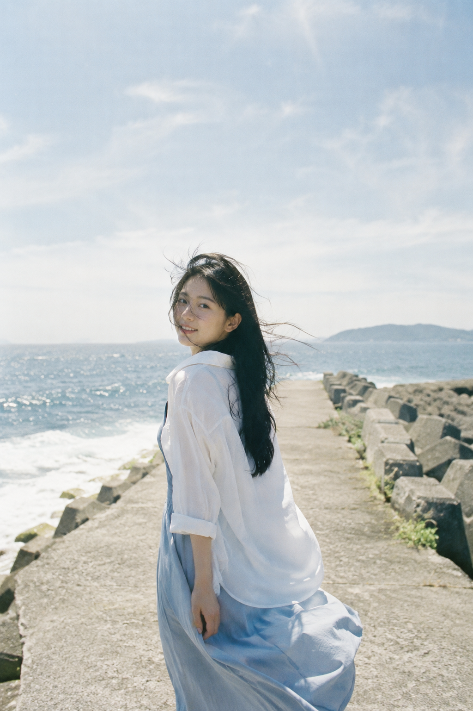

# 试了6个夏日场景后，我找到让女友照像真实抓拍的写法

日常感不靠摆拍姿势，而是让人物、光线和环境各留一点不完美。真实空间 + 轻微动作，比堆砌氛围词更有效。

---

### 图书馆外墙｜把树影留给画面呼吸

竖版2:3，日系夏日青春纪实人像，35mm胶片颗粒，清透安静。一位24岁成年东亚女生，五官自然清秀，面部干净，健康自然肤色，皮肤保留真实纹理，眼神真实；黑色披肩长发、轻薄空气刘海，碎发被微风吹起。白色棉质短袖衬衫配浅蓝牛仔半裙，站在夏日校园图书馆浅灰外墙旁，爬藤、绿枝和墙面叶影作背景；人物偏右、身体微侧，平视镜头自然回头，左侧保留树影与建筑留白。树叶缝隙的斑驳阳光、柔和炫光、空气光尘、圆形散景；青绿、天空蓝、米白色，冷调阴影与乳白高光，日本青春电影静帧，无文字，无logo，无水印。避免 AI 美女脸、网红感、过度精修、塑料皮肤、暗沉肤色、明显痘印、明显皱纹、斑点、面部变形

人物偏右，树影和留白一起完成情绪。偏右人物比居中站好更像偶遇。

---

### 公交站｜让风替代刻意动作

固定“侧前方平视、肩膀放松”，把发丝和裙摆交给夏风，动作就不会僵。

---

### 河边堤岸｜用侧后晨光做透明感

河面反光是第二光源，晨光只勾亮发丝。动作越小，越像正在发生。

---

### 老居民区｜用广角保留生活线索

保留老建筑、绿窗框和自行车，28mm 的轻微透视会把小巷拉出纵深。

---

### 操场边｜蓝调时刻别把夜景写得太重

要灰蓝晚风，不要霓虹夜景；远处散景与脸部环境光就够了。

---

### 海边防波堤｜留白比海更重要

明确“大量天空和海面留白”，再安排自然回望。别让海浪、礁石和人物同时抢镜。

---

同一套判断即可复用：真实空间、一个自然动作、光线与留白。

#GPTImage2 #千问 #豆包 #生图提示词 #Prompt #女友感自拍 #夏日女友感
