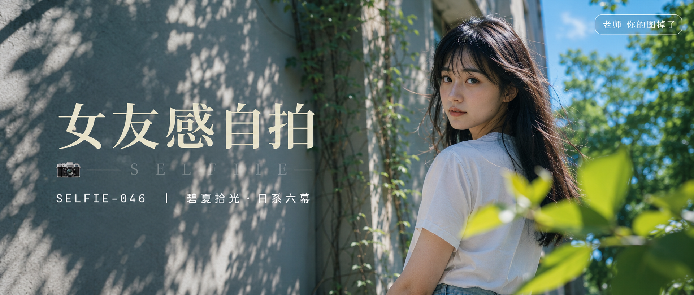

# SELFIE-046-碧夏拾光·日系六幕 封面

## 封面提示词

超宽2.35:1电影横构图，视觉概念「碧夏拾光」：夏日图书馆浅灰外墙前，一位24岁成年东亚女生以清晰的3/4正脸看向镜头，面部占画面右侧三分之一以上，五官自然清秀、面部干净、健康自然肤色、皮肤光泽细腻、眼神有神灵动、轮廓清晰上镜；白色棉质短袖衬衫与浅蓝色牛仔半裙，背景由爬藤绿意、明亮天空蓝和大面积树影构成，前景有一束虚化叶片，侧逆光打亮颧骨和发丝，电影感光影、高清锐利、色彩层次丰富、视觉冲击力强、构图黄金比例、前景虚化背景、画面有张力；人物右侧，左侧为干净留白和精致树影层次，无整体蒙层，无logo，无水印。

【文字排版-必须完整保留，不得省略或简化任何一项】画面左侧垂直居中偏下叠加文字排版：超大号衬线字体米白色主文案「女友感自拍」，主文案正下方一条细横线左端带📷横线中央有透明英文水印 SELFIE，横线下方等宽白色字体副文案「SELFIE-046 ｜ 碧夏拾光·日系六幕」；右上角浅色半透明圆角底衬配小号文字「老师 你的图掉了」（署名文字，必须出现，不可省略）；无整体蒙层，文字直接压图。【文字排版结束】

## 封面图片

