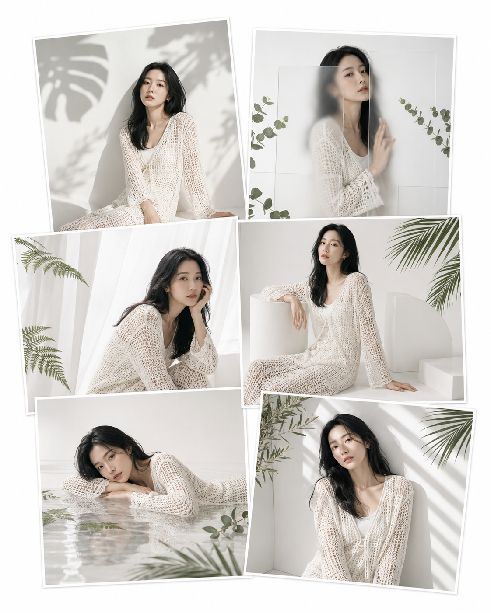
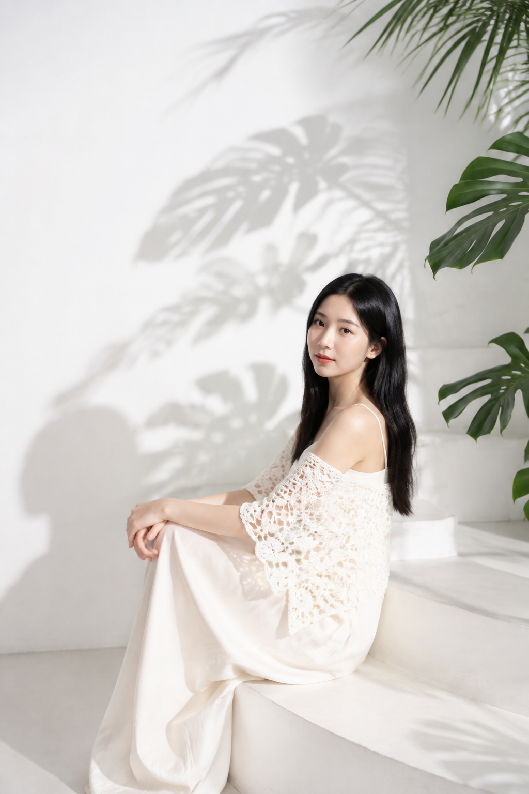
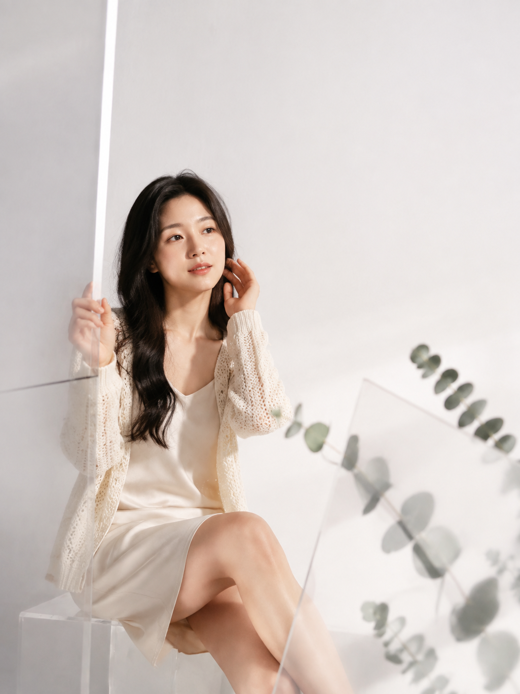
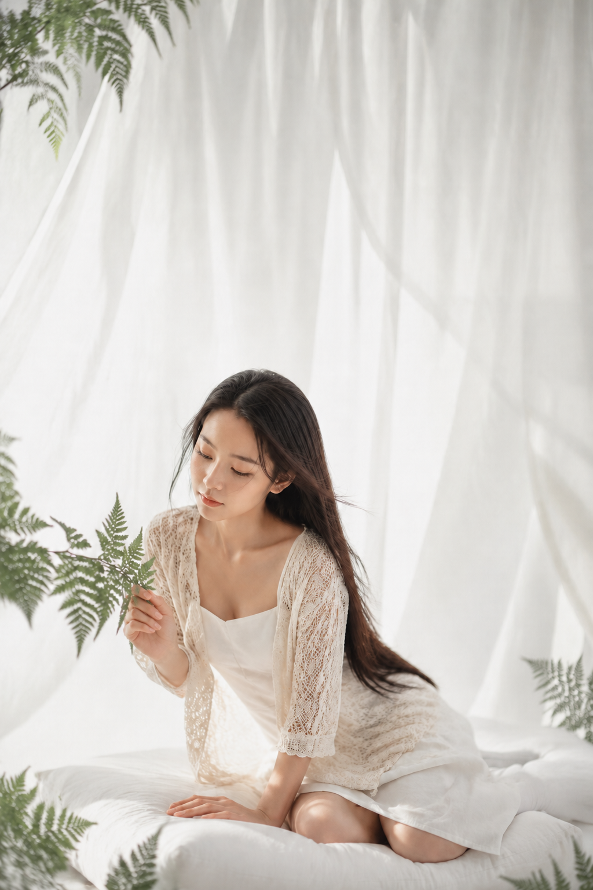
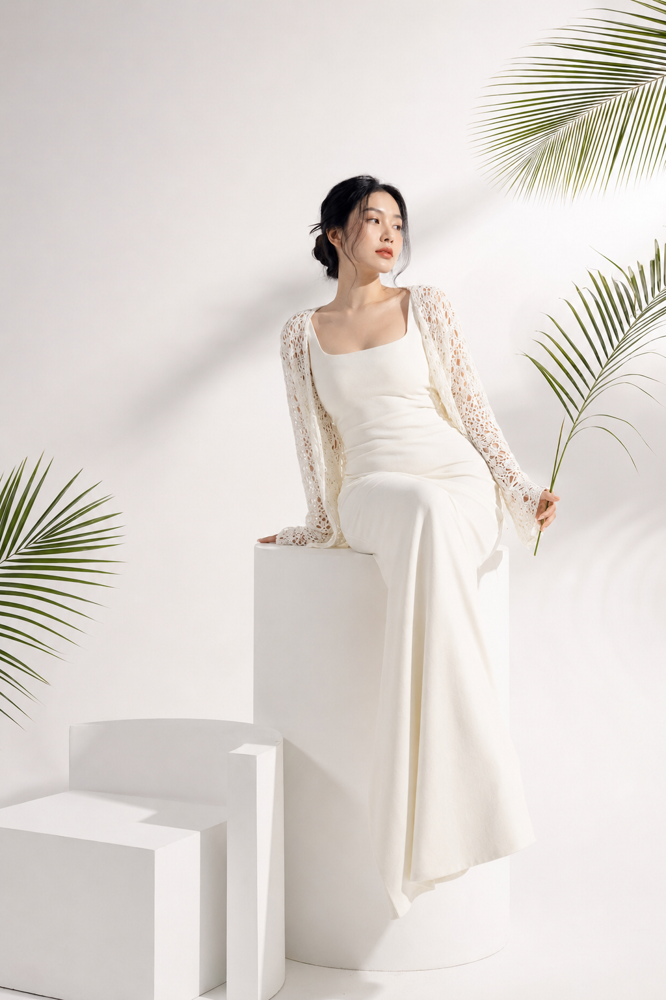
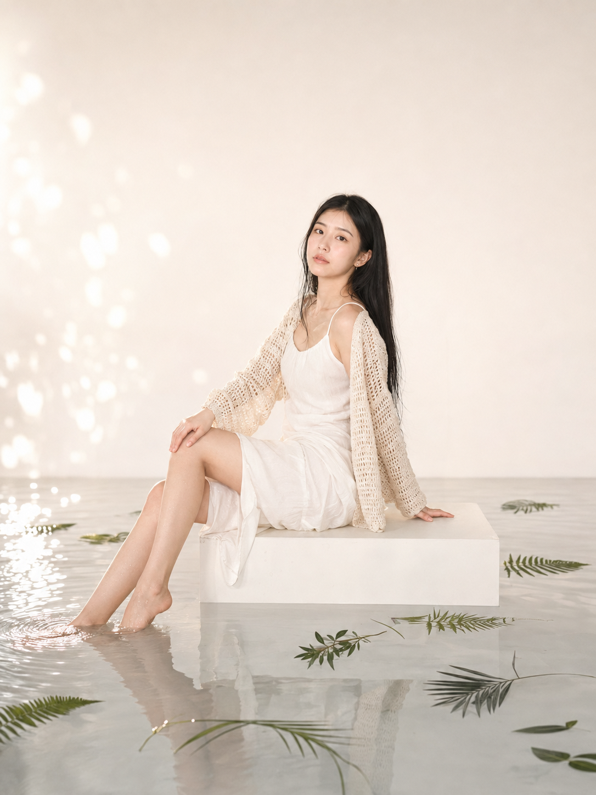
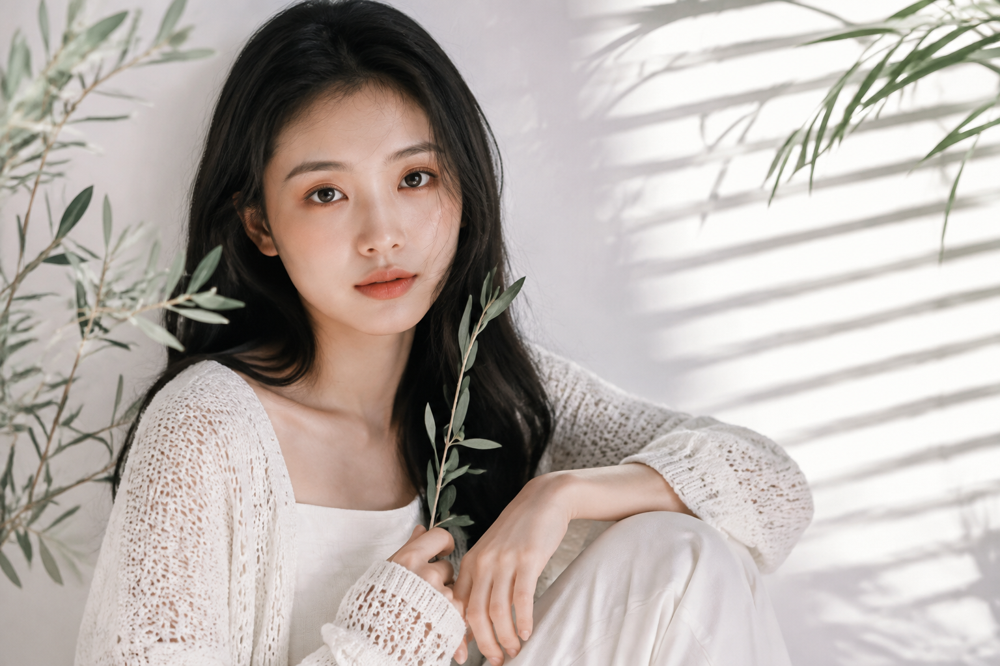

# 6个白色影棚场景，生成的女友照像一组高定杂志内页

白色并不等于空。让画面高级的，是留白、叶影和材质反差共同完成的呼吸感；同一套钩针外搭换一处布景，就有不同的杂志叙事。

**Q：第一张怎样把白墙拍出层次？**

用弧墙承接硬光，把植物只留在边缘。人物不要站正中，负空间才会显得有分量。

竖版2:3，极简高调白色摄影棚人像，纯白弧形墙面和白色微水泥地面，少量龟背竹与细长棕榈叶从画面边缘进入，硬光把抽象墨绿与浅灰叶影投在白墙上。一位24岁成年东亚女生坐在低矮白色弧形台阶，真实自然的东亚面孔，五官自然清秀，面部干净，健康自然肤色，干净自然肤质，自然皮肤纹理，眼神真实，清透淡妆、浅珊瑚色嘴唇，黑色长直发中分披至腰部。她穿象牙白细肩带长裙，外搭白色手工钩针短罩衫，花朵与几何镂空纹理清晰，服装内衬完整不透明。人物侧身坐在台阶边缘，一腿自然屈起，双手轻搭膝盖，身体微微后仰，转头看向镜头，表情松弛克制。人物位于右下三分之一，左侧与上方留出干净白色负空间。正面柔光叠加侧上方模拟阳光，面部明亮，植物投影清晰柔和；50mm镜头，平视略高机位，f/3.5，真实商业人像，轻微数码直闪质感，高清无文字无标识。避免过度暴露、透明服装、低俗姿态、AI美女脸、网红感、过度精修、塑料皮肤、暗沉肤色、明显痘印、明显皱纹、斑点、面部变形、肢体错位、多余手指、文字、水印、logo。

**Q：亚克力怎么用才不显廉价？**

只要磨砂板制造柔边，不让反射穿过五官。清晰的人脸与朦胧的边缘，就是这张的材质对比。

**Q：想让画面有空气感，先改什么？**

纱幕只负责透光，蕨叶只压住边角；让发丝和布料轻微飘动，比加滤镜更能保留真实感。

**Q：白色台座怎样不拍成样板间？**

把圆柱、方台和弧形模块排成高低动线，再让一束斜向叶片打破几何秩序。台座是构图工具，不是布景主角。

**Q：浅水镜面最该控制什么？**

水只要薄到能留住涟漪和不完整倒影。暖白背景配少量绿叶，反射自然就不会变成泳池场景。

**Q：近景如何既有光影又看清眼睛？**

百叶窗硬光留在肩颈和墙上，镜头正前方补一层柔光。和 AI 沟通时要明确：条纹可以落在背景，但不要遮住双眼。

---

#GPTImage2 #千问 #豆包 #生图提示词 #Prompt #女友感自拍系列 #纯白影棚
