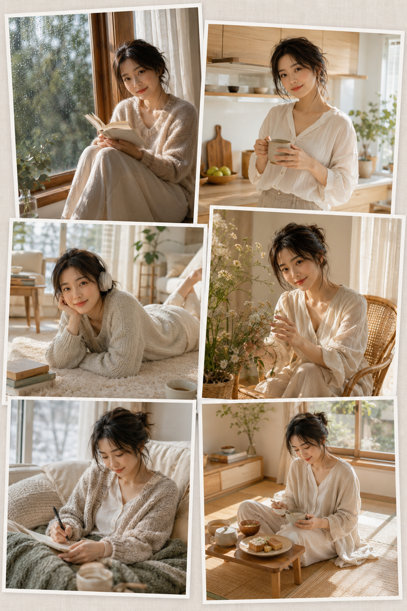
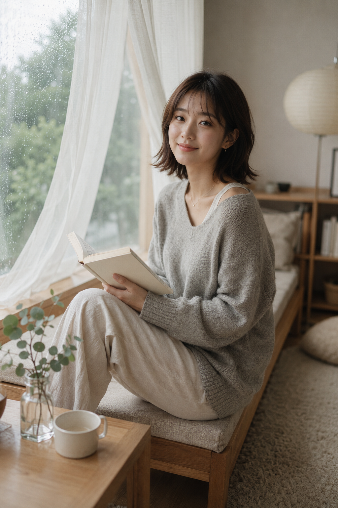
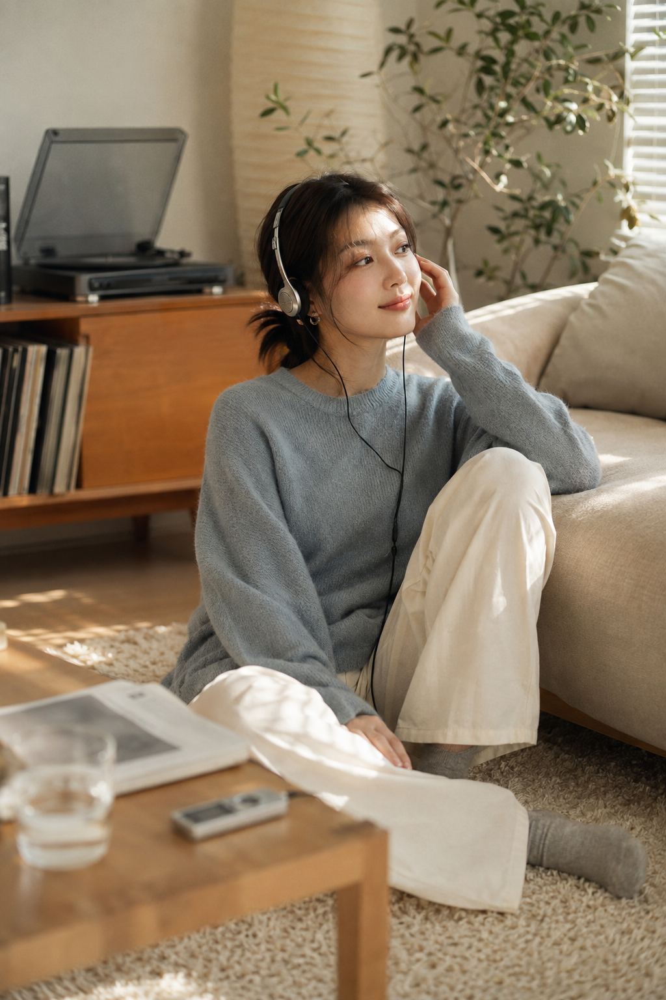
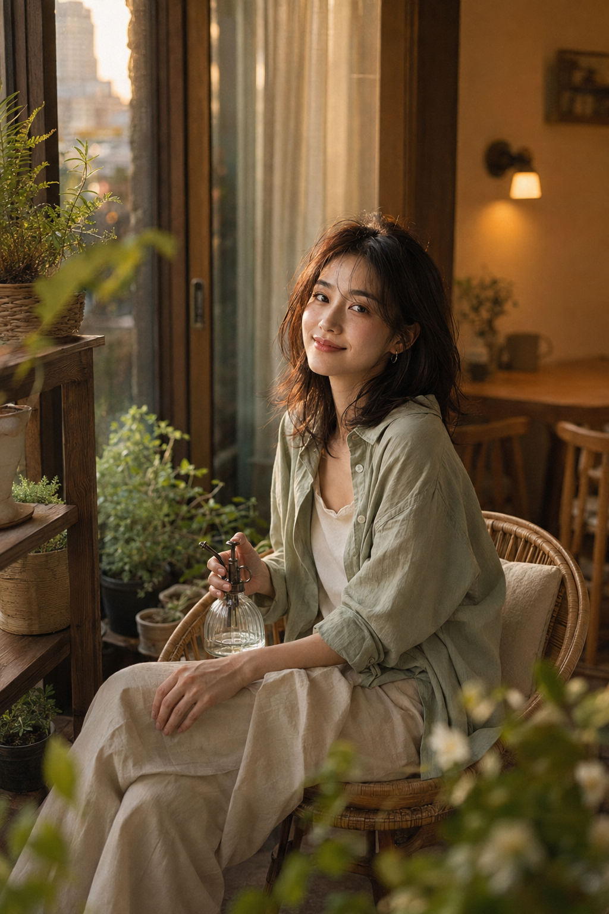
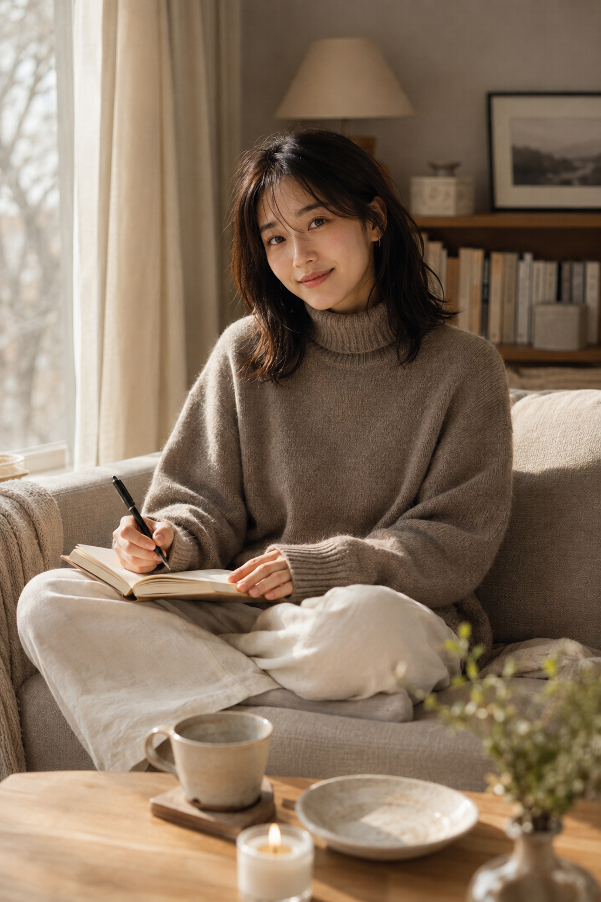
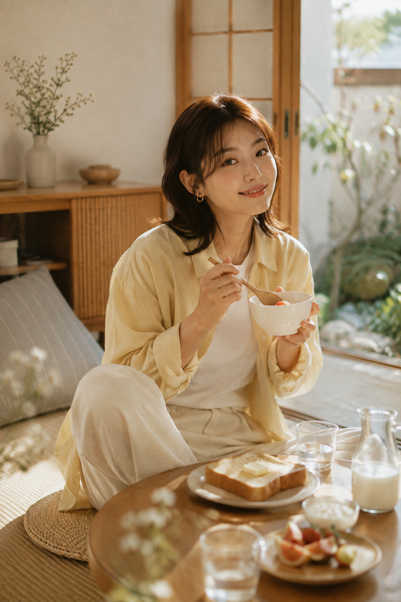

# 6段居家自然光，让女友感生活照拍出杂志内页般的质感

**本期实验：** 用六段自然光，拆开“松弛而不摆拍”的居家感。先决定光线的方向，再安排动作和道具。

---

**#01 ｜雨后漫反射**

雨天的窗光没有硬边，书本和抬眼动作会把画面收得很安静。关键不是“日系”，而是左侧漫反射、真实皮肤与不刻意的停顿。

竖版 2:3，真实写实的日系居家生活方式人像摄影，安静、温柔、松弛，带轻微高端生活杂志质感。一位 24—28 岁成年东亚女性坐在宽大的木框飘窗上，真实自然的东亚面孔，柔和鹅蛋脸，五官清秀耐看，眼神明亮平静，嘴角带轻微自然笑意，健康白皙肤色，保留细腻真实的皮肤纹理与自然光泽，不过度磨皮。深棕色齐肩层次短发，发尾轻微外翻，空气感侧分刘海自然垂落。她穿燕麦灰色宽松圆领针织衫，内搭象牙白棉质背心，下身为浅米色宽松棉麻长裤，佩戴极细金色项链与小巧耳钉。人物侧身坐在飘窗软垫上，一条腿自然屈起，另一条腿放松垂下，双手捧着一本无文字的浅色书籍，阅读片刻后轻轻抬眼看向镜头，姿态自然，不刻意摆拍。场景为雨后的温暖公寓，窗外可见被雨水柔化的灰绿色树影，玻璃上残留少量细小水珠，米白色薄纱帘被微风轻轻吹起。飘窗旁放置浅木色边桌，桌上有白色陶瓷茶杯、小玻璃花瓶和几枝淡绿色尤加利。背景设置低矮原木书柜、亚麻坐垫、米灰色地毯与一盏奶油白纸质落地灯，空间干净克制，生活感真实。阴天自然光从左侧大窗柔和进入，整体光线均匀通透，人物脸部具有柔软明暗层次，头发边缘带轻微银灰色轮廓光。整体配色为燕麦灰、奶油白、浅橡木色、雾绿色和少量暖棕色，低饱和、低对比，亮部柔和，阴影不死黑。全画幅相机，50mm 定焦镜头，f/2.0，人物半身至膝部构图，焦点落在双眼，前后景自然虚化，轻微 Kodak Portra 胶片色彩，细腻颗粒，真实摄影质感。避免 AI 美女脸、网红脸、过度尖下巴、夸张大眼、浓妆、塑料皮肤、过度磨皮、身体结构错误、手指畸形、姿态僵硬、背景杂乱、强烈 HDR、冷蓝色调、过度橙黄、商业棚拍感、动漫感、插画感、3D 渲染感、文字、水印、Logo；避免 AI 美女脸、网红感、过度精修、塑料皮肤、暗沉肤色、明显痘印、明显皱纹、斑点、面部变形

---

**#02 ｜清晨斜光**

厨房不必堆满道具；右前方斜光落到杯沿和发丝，就能让醒来后的松弛感成立。

---

**#03 ｜百叶午光**

条状光影只留在地毯和裤腿，脸仍用散射光照亮，耳机才像正在听歌而非摆造型。

---

**#04 ｜黄昏轮廓光**

让金光停在肩线、叶片与发尾，脸部再用窗面反光补亮，画面会有层次而不显脏。

---

**#05 ｜冬日柔侧光**

厚窗帘过滤后的侧光能保住针织和纸张的细节；留一点生活痕迹，比满屋装饰更可信。

---

**#06 ｜周末高调晨光**

早餐画面把人物放在桌面引导线旁，亮部要通透但不过曝，食物才不会抢走视线。

---

**和 AI 怎么说：** 第一轮先固定“成年人、真实面孔、自然皮肤、生活姿态”；若画面太像广告，第二轮只补“保留居住痕迹、阴影不过黑、避免商业棚拍”，别同时推翻场景。

自然光不是滤镜名，而是人物、动作与空间之间的关系。

---

你最想先把哪段自然光写进自己的居家照片？

#GPTImage2 #千问 #豆包 #生图提示词 #Prompt #女友感自拍系列 #居家自然光
