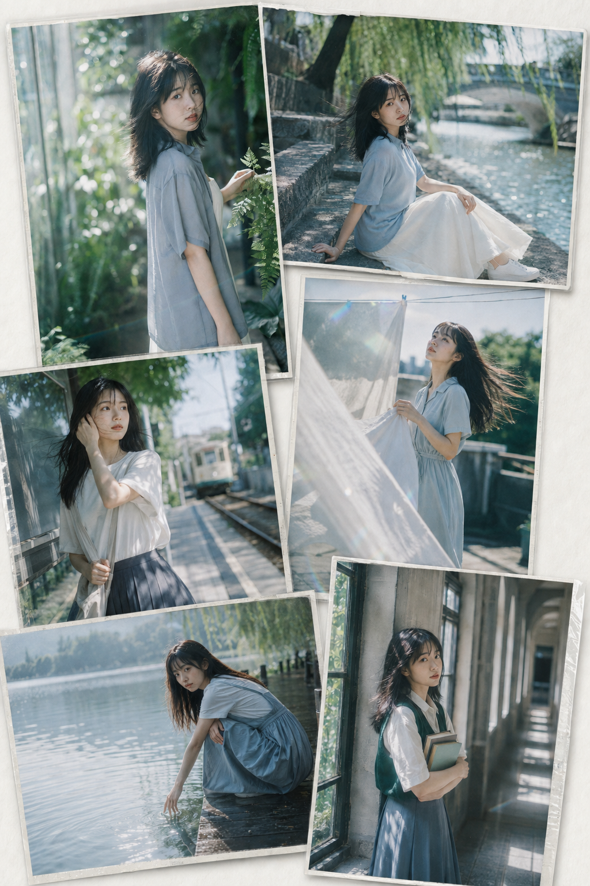
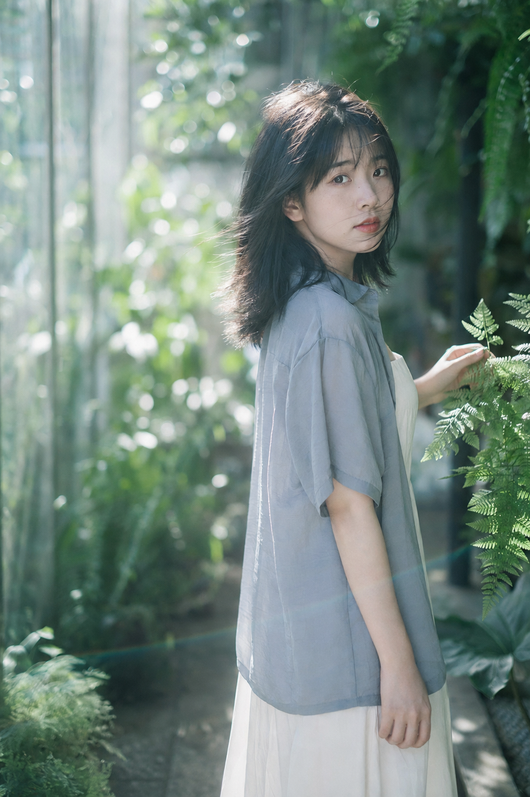
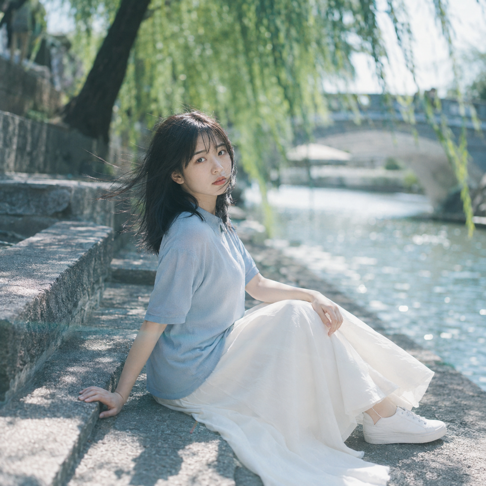
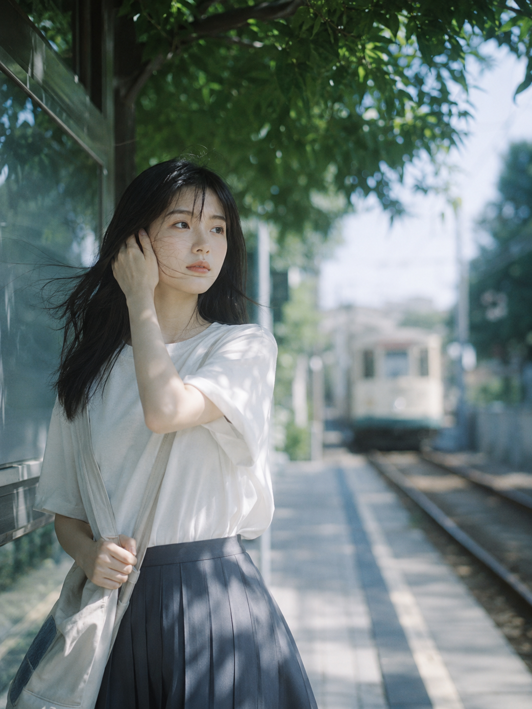
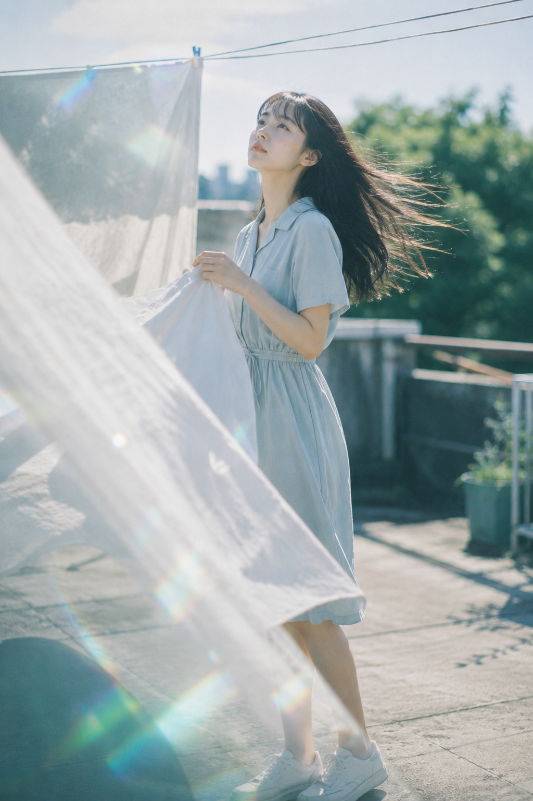
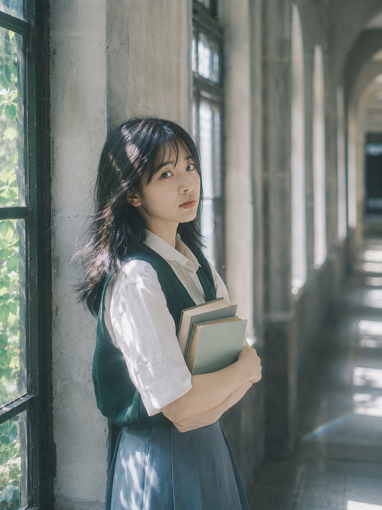

# 澄夏漫游：6个场景怎样写出真实的盛夏电影女友感

六个场景共用冷白、灰蓝与青绿；真正决定真实感的是<strong>风、光和留白</strong>。

---

### 01｜玻璃花房：回望比直视更有叙事

人物靠右、左侧留白，85mm 把焦点收回到眼睛。重点是像刚被叫住的一瞬间。

竖版2:3，盛夏玻璃花房中的清冷日系胶片人像，一位23—26岁的成年东亚女生，真实自然的东亚面孔，脸型柔和，五官清秀，黑色明亮眼睛，健康白皙肤色，保留细微自然皮肤纹理，淡粉色腮红，水润浅珊瑚色嘴唇，清透裸妆。她留蓬松的黑色齐肩长发和轻薄碎刘海，花房通风窗吹入微风，发尾与鬓角碎发轻轻扬起。女生穿浅灰蓝色短袖衬衫和象牙白细肩带长裙，服装简洁克制，内衬完整，无品牌标识。她站在玻璃花房的狭窄植物通道中，身体朝向前方，脸从肩侧自然回望镜头，一只手轻扶身旁的银绿色蕨叶，另一只手自然垂落，神情安静、略带疏离感。半身构图，人物位于画面右侧三分之一，左侧保留大片虚化绿植与玻璃反光。使用85mm人像镜头，f/1.8浅景深，焦点落在双眼，背景中的藤蔓、玻璃框架和叶片形成柔和圆形散景。午后阳光透过磨砂玻璃与叶片落在人物脸侧和肩膀，形成细碎斑驳光影，头发边缘出现银白色轮廓光。整体采用低饱和青绿、灰蓝、冷白色调，肤色保持柔和奶白，带轻微青色镜头耀斑、高光晕染、细腻胶片颗粒和空气雾感，真实摄影，安静盛夏电影氛围。无文字，无水印，无Logo，无边框。避免网红脸、AI美女脸、浓妆、过度磨皮、塑料皮肤、手部畸形、额外手指、花朵遮挡五官、暖橙滤镜、过度HDR、动漫感、3D渲染感。

---

### 02｜河岸柳荫：让风先替人物说话

侧坐只留一个支撑点，发丝与柳枝同向。保留水面闪光，静态画面就有了风。

---

### 03｜老式电车站：给画面留一个“将要发生”

目光越过镜头，电车只留轮廓。与 AI 沟通时补上“等待即将到站的车”，就有了故事。

---

### 04｜天台晾衣场：用半透明前景软化摆拍感

床单是一层透光前景，压低“摆拍感”；长发和微仰视线负责把夏天拍得松弛。

---

### 05｜湖边木栈道：动作必须有真实落点

触水与扶膝让双手都有落点。脸和触水手同时清晰，湖面交给虚化。

---

### 06｜旧图书馆长廊：让重复结构替你完成构图

拱窗向远处延伸，人物放一侧，书本只做停顿。余光和碎光已经足够。

---

场景可替换，但<strong>人物状态、光线方向和留白</strong>必须同时成立。

#GPTImage2 #千问 #豆包 #生图提示词 #Prompt #女友感自拍 #盛夏电影感
