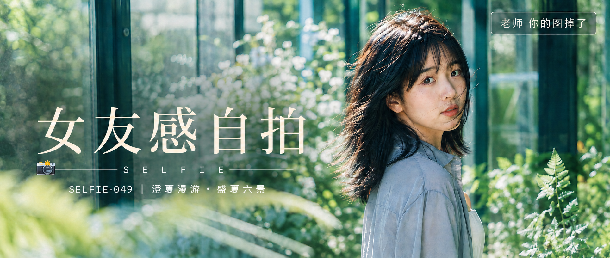

# SELFIE-049-澄夏漫游·盛夏六景 封面

## 封面提示词

明亮通透的盛夏玻璃花房，24岁成年东亚女生以清晰的3/4侧脸回望镜头，五官精致自然、面部立体清晰、皮肤光泽细腻、眼神有神灵动、妆感干净清透、轮廓清晰上镜；浅灰蓝衬衫与象牙白长裙，人物面部占画面约三分之一，前景是一片失焦的银绿色蕨叶，中景为人物，后景为蓝绿色玻璃框架、明亮白花和青柠色光影，侧逆光打亮颧骨与发丝，玻璃反射形成冷青与乳白的双层光带，视觉概念「澄夏漫游」，电影感光影，高清锐利，色彩层次丰富，视觉冲击力强，构图黄金比例，前景虚化背景，色调统一精致，画面有张力，真实高端日系胶片摄影，无水印无Logo，避免 AI 美女脸、网红感、过度精修、塑料皮肤、暗沉肤色、明显痘印、明显皱纹、斑点、面部变形，2.35:1 电影横构图。

【文字排版-必须完整保留，不得省略或简化任何一项】画面左侧垂直居中偏下叠加文字排版：超大号衬线字体米白色主文案「女友感自拍」，主文案正下方一条细横线左端带📷横线中央有透明英文水印 SELFIE，横线下方等宽白色字体副文案「SELFIE-049 ｜ 澄夏漫游·盛夏六景」；右上角浅色半透明圆角底衬配小号文字「老师 你的图掉了」（署名文字，必须出现，不可省略）；无整体蒙层，文字直接压图。【文字排版结束】

## 封面图片

