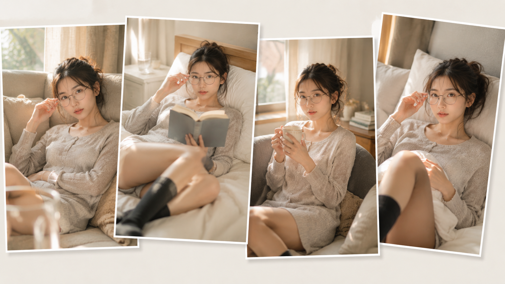
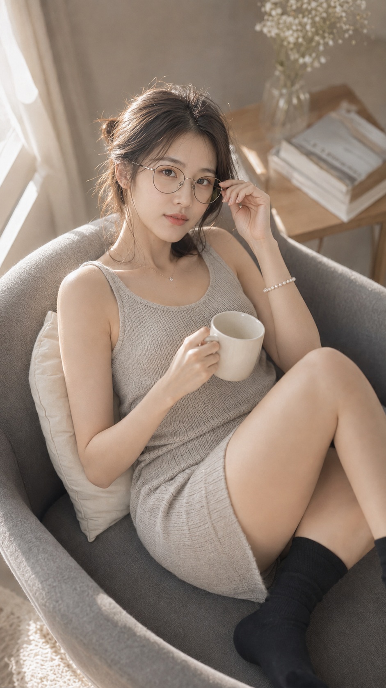
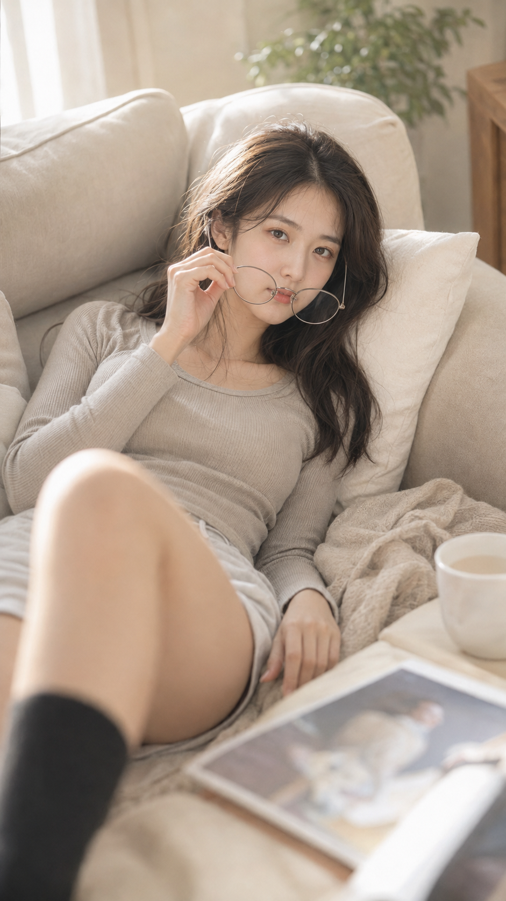

# 6个窗边瞬间，为什么前景虚化让居家女友照更像抓拍？

前景虚化不是把画面拍糊，而是给镜头留下一点正在发生的日常。窗光负责把人物从背景里轻轻托出来，六个场景只换动作、机位和焦段，人物保持同一套暖灰色居家造型。

---

### 01｜沙发侧卧：把焦点留给眼神

原版提示词：

竖版9:16，日系清透居家人像写真，温暖安静的午后客厅，一位25岁成年东亚女性侧卧在浅米色布艺沙发上，背后是奶油白靠枕与柔软针织毛毯，黑棕色长发随意低扎，碎发自然垂落，戴细金属圆框眼镜，五官自然清秀，面部干净，干净自然肤质与真实皮肤纹理，淡妆，穿浅灰色宽松针织家居连衣裙与深灰色中筒袜，佩戴珍珠手链和小巧银色项链；一只手轻扶眼镜框，另一只手松弛放在毯子上，双腿自然弯曲，靠近镜头的腿部只作柔和前景虚化，目光平静直视镜头，表情松弛温柔。左上方窗户照入柔和金色自然光，在头发、肩膀与手臂形成细腻轮廓光，面部受靠枕漫反射补光，整体高调通透、奶油暖灰色调、低饱和低对比，背景简洁干净。全画幅摄影，50mm镜头，f/1.8，大光圈浅景深，焦点落在双眼和眼镜，前后景自然虚化，真实生活记录感，轻杂志写真风格，无文字，无水印，无logo。避免 AI 美女脸、网红感、过度精修、塑料皮肤、暗沉肤色、明显痘印、明显皱纹、斑点、面部变形、手部畸形、腿部比例错误、眼镜反光遮眼、背景杂乱、高饱和、强滤镜

眼镜和眼神必须同时清楚。这里的前景只占边角，才像无意间靠近镜头的瞬间。

---

### 02｜床畔阅读：让光先进入房间

书本和床头柜不必抢戏。告诉 AI 保留窗帘缝隙里的暖金光斑，再把焦点锁到眼睛，画面自然会有空气感；过曝的白床单反而会让人像失去质感。

---

### 03｜窗边马克杯：用俯拍缩短距离

略俯拍 + 50mm比广角更适合小客厅。马克杯是稳定的生活道具，前景虚化只需轻轻带过膝盖，避免占据太多画面。

---

### 04｜阅读抬眸：保留被打断的节奏

和 AI 沟通时，动作不要写成摆拍，而是描述为“从书页上移开眼镜后抬头”。动作前后的因果会让神态更自然，黑柔光只负责收住高光。

---

### 05｜沙发床读页：让黄昏有方向

左后方斜射的窗光把脸颊、手臂和书页连成同一条光线。人物沿对角线躺开，画面会比正对镜头更松弛，也不会显得刻意。

---

### 06｜床头凝望：把留白留给呼吸感

人物放在右上，模糊书页留在前景，白色被角和灰色床头统一材质。主体清晰、周围柔化是这类居家图最稳的层次：先控制光，再控制焦点，最后才加道具。

---

这组写法适合窗边、沙发和床畔等小空间。把光源方向、焦点位置和前景比例说具体，AI 才能把“居家”做成真实发生过的画面。

#GPTImage2 #千问 #豆包 #生图提示词 #Prompt #女友感自拍 #窗边自然光
