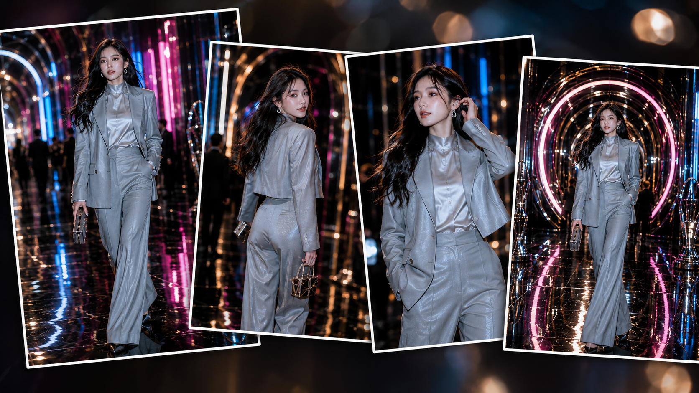
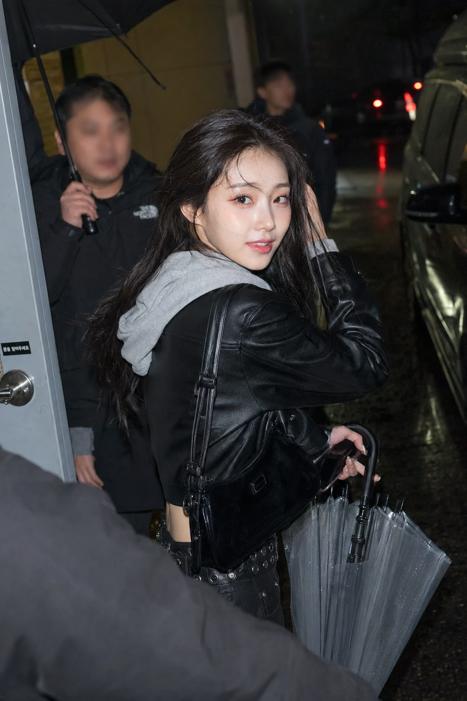
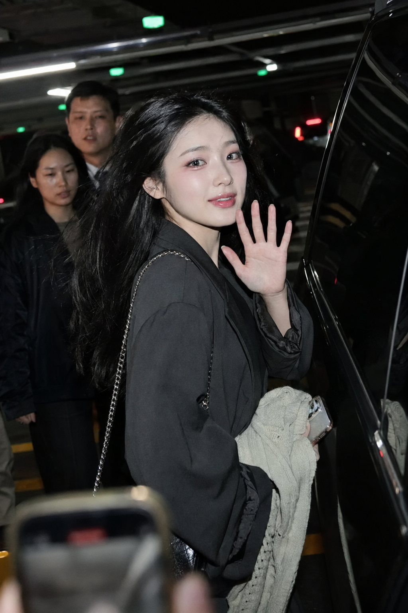
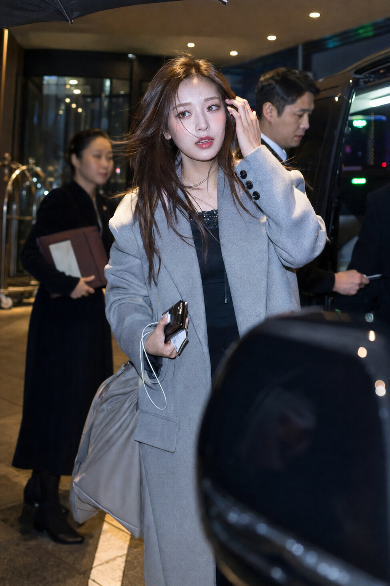
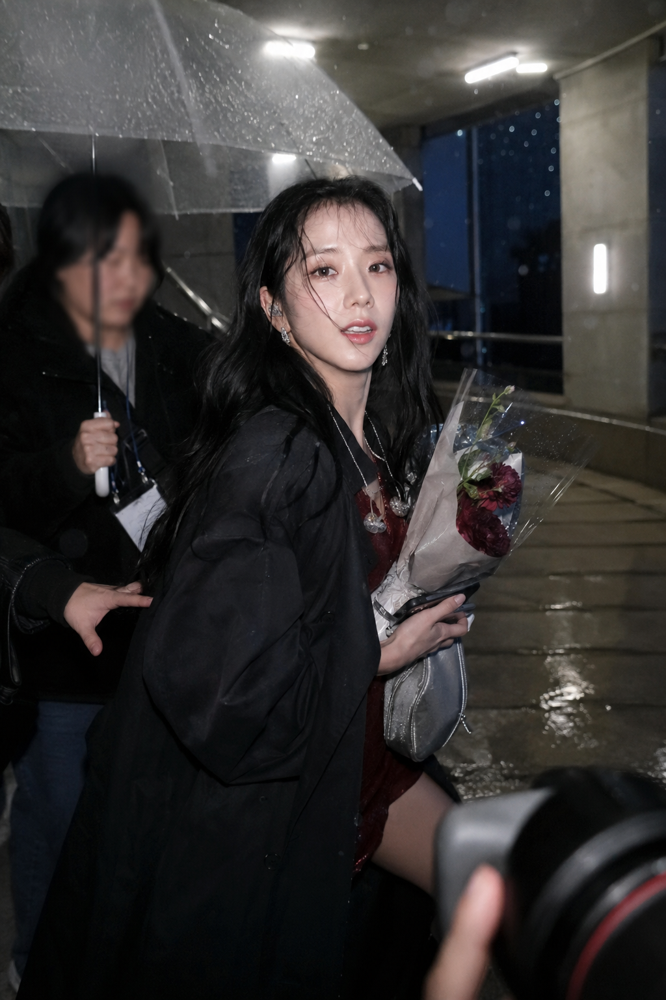

# 6个雨夜偶遇场景，这套韩娱下班路透写法可直接用

这组图想要的不是精修街拍，而是闪光灯亮起前后那一秒：人还在走、环境不完整、画面有遮挡，才像真正被偶遇到的瞬间。

第一张把“收伞、回头、湿地反光”放在同一帧里。动作必须仍在进行，人物才不会像站好等拍。

竖版2:3，韩国 K-pop 女 idol 夜间线下路透抓拍摄影，镜头主要拍摄人物上半身到腰部，像粉丝站在电视台侧门外用长焦相机偶然捕捉到的真实瞬间。一位24岁左右成年东亚女 idol 刚结束打歌舞台，从电视台灰色金属侧门走出来，外面刚下过雨，湿润地面反射白色顶灯和远处车辆尾灯，背景整体压暗。她穿黑色短款皮夹克，内搭浅灰色连帽卫衣，肩背小号黑色包，一只手拿手机和透明雨伞收拢后的伞柄，另一只手把被雨水和风吹乱的头发别到耳后。身体处于行走状态，微微侧身，听到有人喊名字后回头看镜头，嘴角带很轻的笑意，像正在回应粉丝。脸上保留橘粉色舞台眼妆、细闪卧蚕、高光鼻尖和微亮唇釉，五官自然清秀、面部干净、健康自然肤色、自然皮肤纹理、眼神真实。棕黑长发被湿润夜风吹起几缕碎发。相机直闪打亮人物，脸颊、额头和夹克边缘轻微过曝，背景沉入黑色；身后两位虚焦工作人员，一人撑黑伞；左下角被路人黑色外套遮挡，右边缘有虚焦雨伞和保姆车反光车窗。70-200mm 长焦、浅景深、高 ISO、轻微运动模糊、不完全水平的临场构图、细小数字噪点和锐利闪光感，不要棚拍感。避免 AI 美女脸、网红感、过度精修、塑料皮肤、暗沉肤色、明显痘印、明显皱纹、斑点、面部变形

停车场这一帧只换成挥手，不换“移动中”的状态。车门、手机虚影和被切掉的边缘比漂亮背景更能建立现场感。

后门装卸区保留设备箱、摄影机和人群遮挡。和 AI 沟通时，别要求“干净构图”，要明确说“拥挤、偶然裁切、连拍残影”。

凌晨酒店用暖灯撞冷夜色，让浅灰外套成为人物与背景之间的亮面。侧前方直闪只做局部溢亮，避免把整张图打成棚拍。

便利店案例靠冷白室内灯和黑夜反差出效果；冰饮、零食、半挥手都是非表演型道具与动作，比刻意摆姿势更可信。

最后把雨后台阶做成连拍中的抬眼。透明伞边缘、雨滴高光和镜头前的相机虚影要同时保留，画面才有“摄影师站得很近”的距离感。

真正决定真实感的不是把画面做脏，而是让人物足够好看、环境足够不完美：直闪、遮挡、轻微失衡构图，三项至少保留两项。

#GPTImage2 #千问 #豆包 #生图提示词 #Prompt #女友感自拍 #夜间路透
