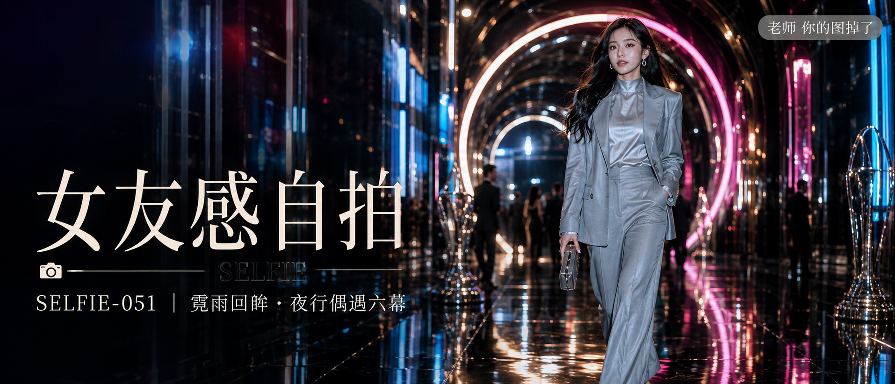

# SELFIE-051-霓雨回眸·夜行偶遇六幕 封面

## 封面提示词

视觉概念「曜夜回廊」：国际颁奖礼后的现代艺术回廊，黑色镜面地面、镜面拱廊、巨大环形灯带与层叠几何光幕构成前中后景，亮粉、钴蓝、暖金三色在空间中交错反射，画面明亮、华丽且有高级电影海报的视觉冲击。一位25岁成年东亚女 idol 以清晰正脸偏3/4侧脸自然走向镜头，人物全身占画面右侧约三分之二，头肩与双腿完整可见；五官精致自然、面部立体清晰、皮肤光泽细腻、眼神有神灵动、妆感干净清透、轮廓清晰上镜。她穿银灰色高定短西装外套、内搭银色高领缎面衬衫和同色高腰阔腿长裤，衬衫衣领完整覆盖锁骨以下区域，搭配金属耳饰与小号手包；身材比例优越、腿部修长、姿态自然松弛、服装版型挺括，正处于有力量感的自然迈步，衣料与灯光形成利落线条。侧逆光打亮颧骨与发丝，地面反射延长腿部线条，远处虚化的典礼嘉宾与玻璃雕塑制造尺度与层次，高清锐利、色彩层次丰富、构图黄金比例、前景虚化背景、画面有张力，2.35:1 电影横构图。避免 AI 美女脸、网红感、过度精修、塑料皮肤、暗沉肤色、明显痘印、明显皱纹、斑点、面部变形、文字乱码、遮挡五官、低领口、暴露服装、低角度窥视镜头。【文字排版-必须完整保留，不得省略或简化任何一项】画面左侧垂直居中偏下叠加文字排版：超大号衬线字体米白色主文案「女友感自拍」，主文案正下方一条细横线左端带📷横线中央有透明英文水印 SELFIE，横线下方等宽白色字体副文案「SELFIE-051 ｜ 霓雨回眸·夜行偶遇六幕」；右上角浅色半透明圆角底衬配小号文字「老师 你的图掉了」（署名文字，必须出现，不可省略）；无整体蒙层，文字直接压图。【文字排版结束】

## 封面图片

