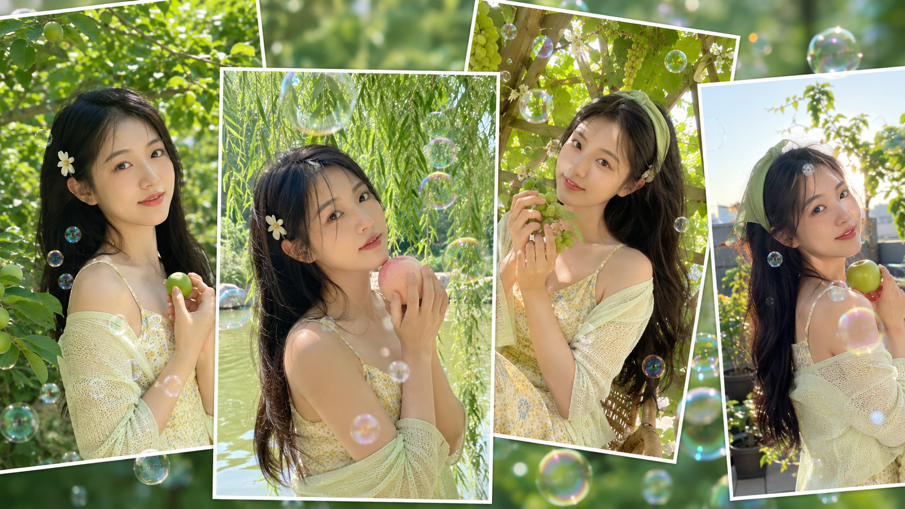
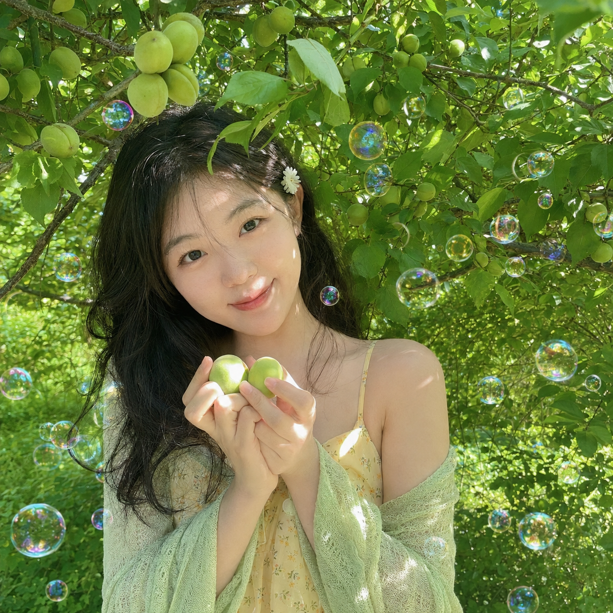
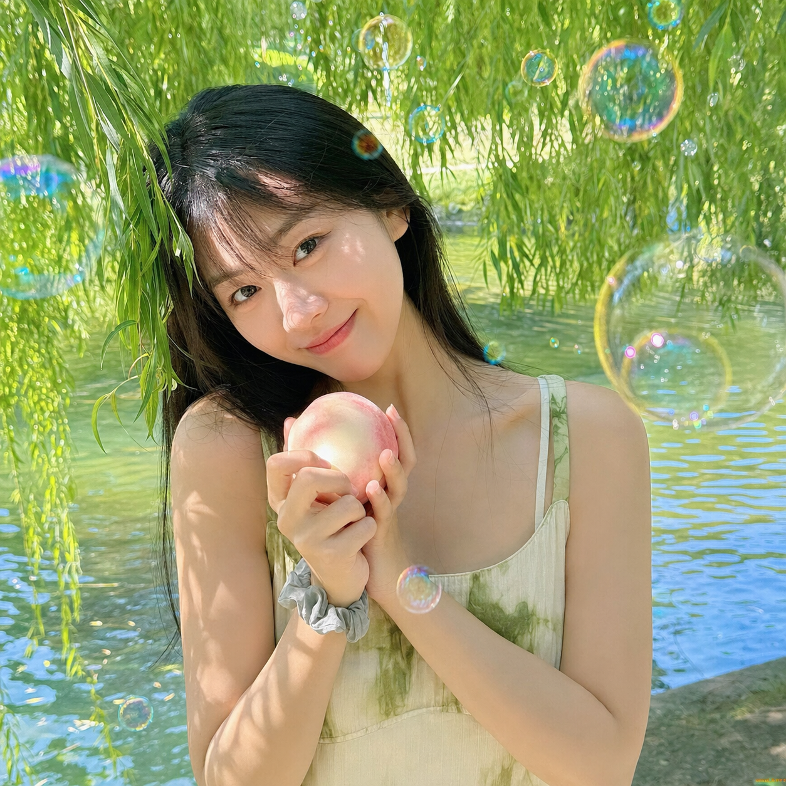
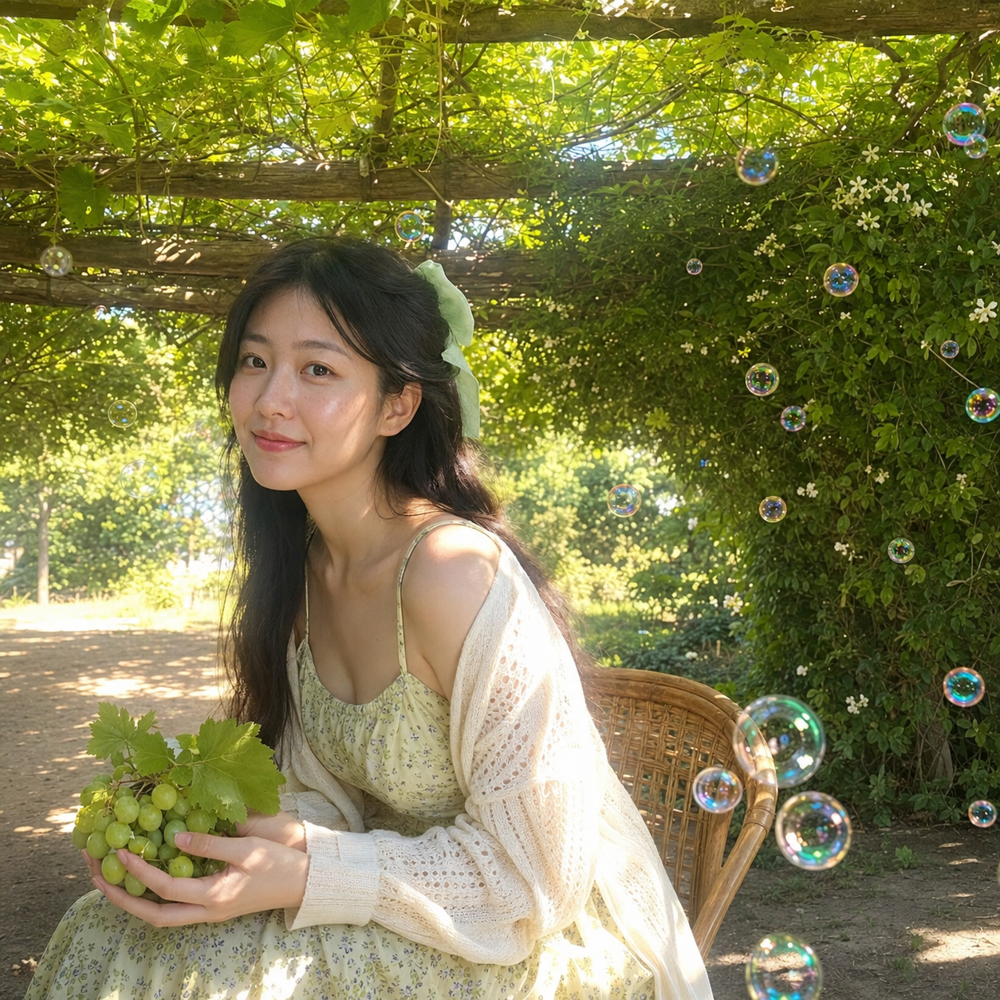
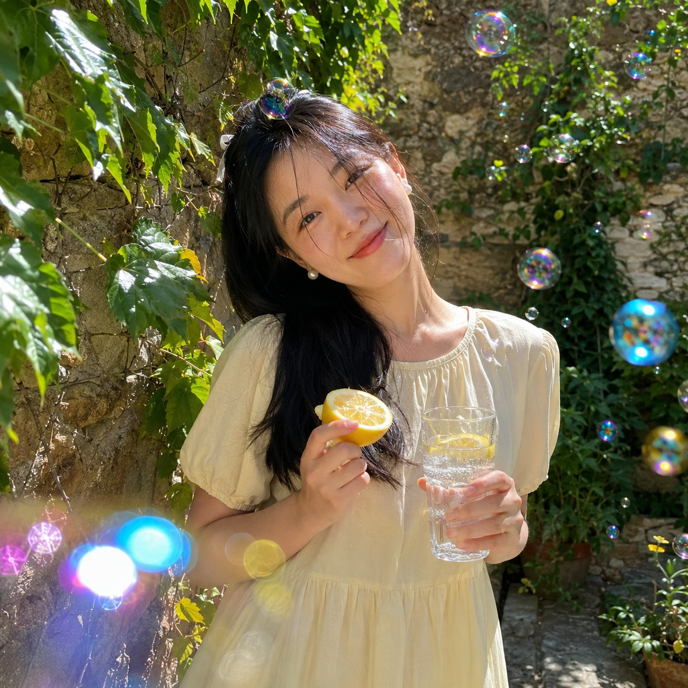
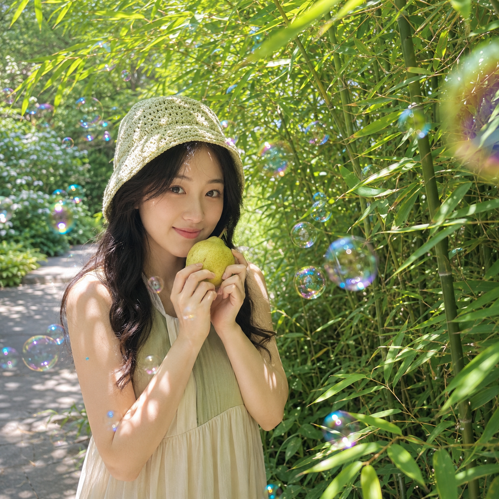
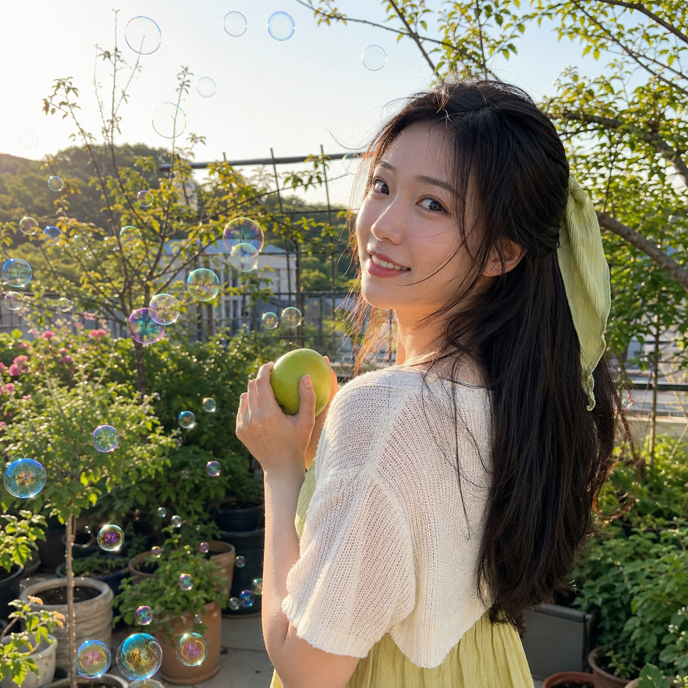

# 翡翠浮光：盛夏绿荫泡泡人像的六种通透光线写法

**本次实验：** 用六个盛夏绿荫场景，观察泡泡人像在不同自然光里的通透感。核心不是把画面修得很满，而是让光从叶隙里落到脸上，再用远近泡泡补出空气感。

**原版写法 ｜ 果园青杏的斑驳顶光**

生成一张盛夏午后果园树荫下的清新人像写真，正方形1:1构图，真实手机随手拍质感，明亮通透，轻微梦幻但仍是自然生活摄影。一位24至28岁成年东亚女生，真实自然的东亚面孔，黑色长发自然披散，耳边别一枚小白花发夹，穿浅杏黄色细肩带碎花连衣裙和薄浅米绿色针织披肩，五官自然清秀，面部干净，健康自然肤色，自然皮肤纹理，表情松弛，眼神真实。她站在结满青杏的小果树下，身体微微侧向镜头，双手在胸前轻捧两颗青杏。大量大小不一的透明肥皂泡自然分布在前景中景背景，边缘有蓝紫粉绿金色虹彩反光。阳光从枝叶缝隙洒落，在发丝、脸颊、肩膀和手背形成斑驳高光，局部轻微夏日白色泛光。背景为浓密鲜亮的果树叶与柔焦树影，无城市建筑。高明度鲜绿、黄绿、杏黄色和自然肤色，近距离半身构图，人物偏左，右上留出绿叶与泡泡空间，26至35mm手机镜头视角，主体清晰背景自然虚化，不要文字、不要水印、避免 AI 美女脸、网红感、过度精修、塑料皮肤、暗沉肤色、明显痘印、明显皱纹、斑点、面部变形

> 核心变量：树影不能只写成背景，要明确它会落在脸颊、肩膀和手背，人物才会像被现场光线包住。

---

**#02 ｜ 柳荫白桃：把阴影改成柔散射光**

> 需要温柔感时，和 AI 说清“柳叶筛下的柔和散射光”。不要同时堆强逆光和强阴影，脸部会更干净，白桃也更显轻。

---

**#03 ｜ 藤架青提：用漏光建立前中后景**

> 泡泡跨过发丝和肩膀，才不是贴上去的特效。和 AI 沟通时可强调部分泡泡经过人物前方，再让顶部叶片轻微发亮，画面自然有纵深。

---

**#04 ｜ 石墙柠檬：保留正午跳光的真实感**

> 老石墙本身有颗粒和颜色，不必抹成干净棚景。把跳跃光斑写在发顶、肩膀和墙面，柠檬黄就会成为亮色画面里的清醒锚点。

---

**#05 ｜ 竹影香梨：让叶隙高光服务眼神**

> 竹叶密时，重点不是增加更多绿，而是保留眼睛和面部轮廓的亮处。先固定清晰五官，再描述叶影，人物不会被背景吞掉。

---

**#06 ｜ 天台青苹果：用侧逆光收住盛夏尾声**

> 最后一张把光放到人物侧后方，让发丝、鼻尖和手臂出现细亮轮廓。天台只留浅色栏杆和绿植，既有风感，也不让城市元素抢走表情。

---

**实验结论：** 六种光线都能共用“真实皮肤、自然表情、前中后景泡泡”这套骨架；变化场景时，优先替换光线落点，再替换水果和植物，成片会更统一。

---

## 往期回顾

- 梦幻森林、日系、白花女友写真、生图提示词拆解
- GPT：初夏写真+花园瞬间+人物锚点
- 鲜花 法式 少女 俏皮 松弛

#GPTImage2 #千问 #豆包 #生图提示词 #Prompt #女友感自拍 #绿荫泡泡
