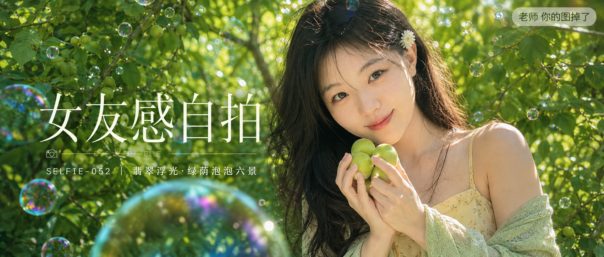

# SELFIE-052-翡翠浮光·绿荫泡泡六景 封面

## 封面提示词

翡翠浮光视觉概念，一位24至28岁成年东亚女生在盛夏果园的浓密绿荫与透明彩虹泡泡之间回眸，正脸偏三分之四侧脸，面部占画面三分之一以上，黑色长发与小白花发夹，浅杏黄碎花连衣裙搭薄浅米绿针织披肩，双手轻托青杏，五官精致自然、面部立体清晰、皮肤光泽细腻、眼神有神灵动、妆感干净清透、轮廓清晰上镜，侧逆光打亮颧骨，前景一枚巨大虹彩泡泡虚化、后景鲜亮果树叶形成纵深，电影感光影，高清锐利，色彩层次丰富，视觉冲击力强，构图黄金比例，画面有张力，2.35:1电影横构图，避免 AI 美女脸、网红感、过度精修、塑料皮肤、暗沉肤色、明显痘印、明显皱纹、斑点、面部变形、文字乱码、裁切五官。

【文字排版-必须完整保留，不得省略或简化任何一项】画面左侧垂直居中偏下叠加文字排版：超大号衬线字体米白色主文案「女友感自拍」，主文案正下方一条细横线左端带📷横线中央有透明英文水印 SELFIE，横线下方等宽白色字体副文案「SELFIE-052 ｜ 翡翠浮光·绿荫泡泡六景」；右上角浅色半透明圆角底衬配小号文字「老师 你的图掉了」（署名文字，必须出现，不可省略）；无整体蒙层，文字直接压图。【文字排版结束】

## 封面图片

