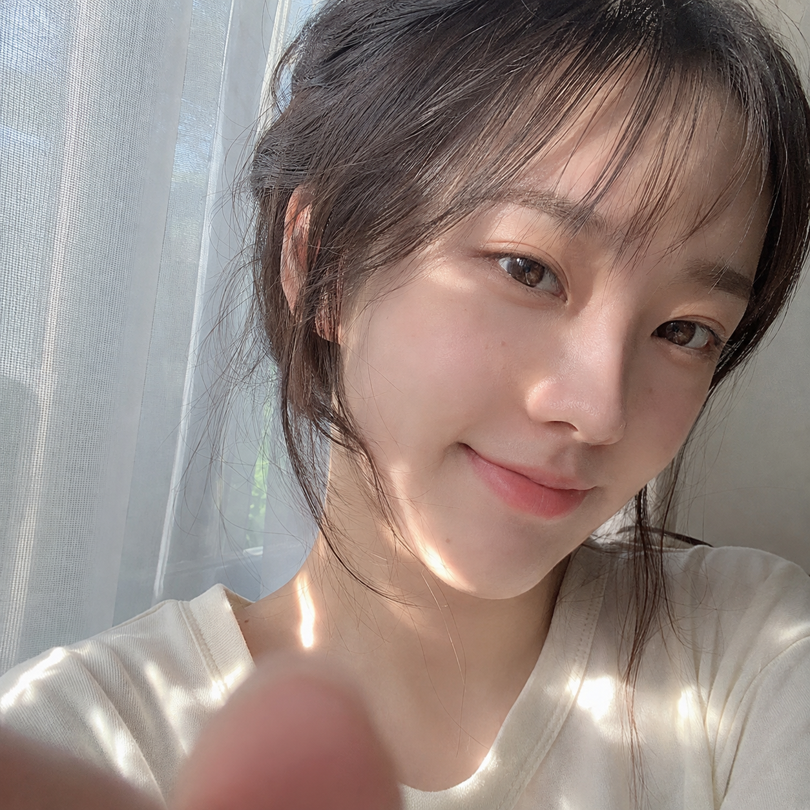
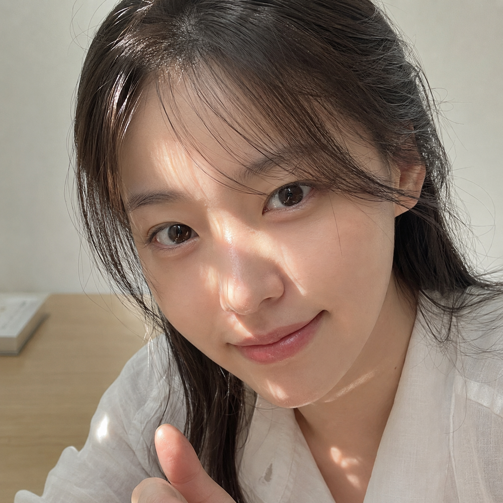
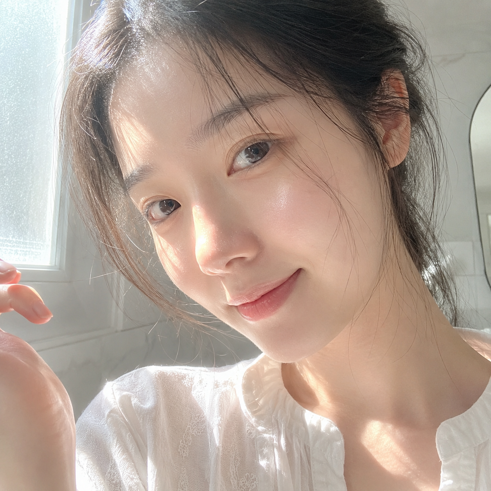

# 晨雾绒光：六个窗光瞬间，让自然自拍像刚刚发生

## 为什么同样是近脸自拍，有的像原相机，有的像模板脸？

问题通常不在脸，而在画面没有交代镜头距离、碎光和无意识动作。这组六个场景都把脸放近、把背景退后，让光像刚好落进来，而不是摆好再拍。

## 01｜白纱窗边：把“刚按下快门”留在前景里

这张的关键是前景手指。它不需要抢镜，只要从下方轻轻入画，就能让画面有一个未完成的动作。碎光要落在鼻尖和衣领，不要整张脸均匀打亮。

生成一张清晨窗边自然自拍感人像，方形 1:1 构图，超近距离手机前置镜头拍摄，真实生活记录感。一位 22—27 岁成年东亚女生坐在白纱窗帘旁，脸部占据画面大部分，镜头距离很近，只拍到头部、肩颈和少量手部。她是自然清秀的东亚面孔，黑棕色长发松松扎起，额前有轻薄碎刘海，两侧垂落细软发丝，穿象牙白棉质上衣。女生微微歪头，嘴角带克制浅笑，眼神柔和地看向镜头侧前方，一根手指自然从前景下方入镜，像刚按下自拍键的瞬间。上午阳光从左侧斜照进来，在脸颊、鼻尖、下巴和衣领上形成几块不规则碎光，局部轻微过曝，另一侧保留柔和阴影。整体色调以奶油白、浅灰绿、自然肤粉、嫩桃粉和黑棕色为主，明亮通透，低对比，轻微柔焦，皮肤保留真实细腻纹理，不要网红感，不要浓妆，不要文字，不要水印，不要复杂背景。

---

## 02｜阳台门边：让反射光代替硬补光

阳台不是背景主角，只留一笔植物虚影。跟 AI 交代“门外反射进来的零散高光”，脸颊就会有暖白而不发灰的层次。

---

## 03｜床头晨醒：把抓拍感放在发丝里

松散头发、抬起的手和轻微发白的亮部，三个细节一起出现才像醒来后的随手一拍。避免写“精致妆容”，保留真实皮肤与轻微阴影。

---

## 04｜书桌逆光：用过滤光代替直射光

百叶窗或植物叶影能把光切成细碎层次，近距离仍有空间感。与 AI 沟通时，重点是“照亮眼下、脸颊与肩颈”，别泛写“阳光人像”。

---

## 05｜走廊窗光：给发丝一圈透亮边缘

走廊背景越少越好，侧前方的窗光和耳边碎发会把目光自然收回脸上。留一点窗框影子，比堆砌道具更像生活记录。

---

## 06｜磨砂窗前：用雾感放松镜头

磨砂玻璃会把高光变软，适合洗漱后干净、明亮的状态。控制住浅雾灰和象牙白，局部轻微过曝比强滤镜更有呼吸感。

---

## 往期回顾

- 梦幻森林、日系、白花女友写真、生图提示词拆解
- GPT：初夏写真+花园瞬间+人物锚点
- 鲜花 法式 少女 俏皮 松弛

#GPTImage2 #千问 #豆包 #生图提示词 #Prompt #女友感自拍 #窗光自拍
