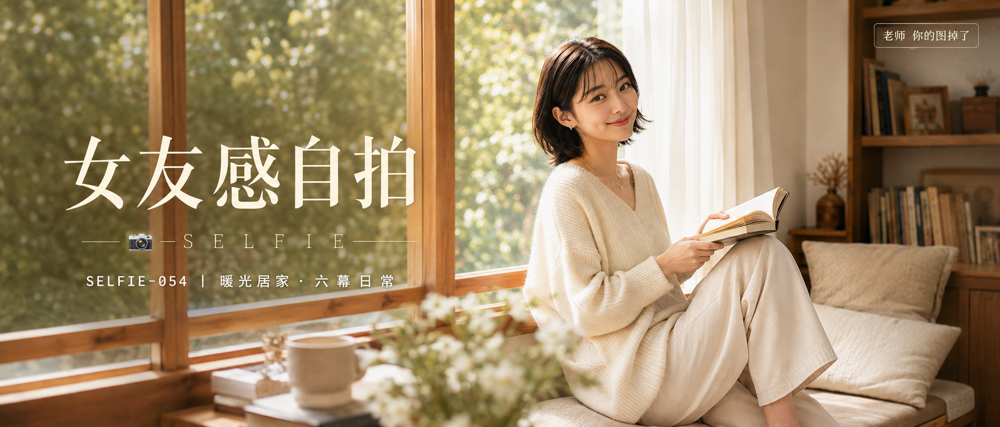

# SELFIE-054-暖光居家·六幕日常 封面

## 封面提示词

暖光栖居视觉概念，一位24至28岁成年东亚女生置身明亮的暖米白居家阅读角，3/4侧脸清晰看向镜头，黑棕色锁骨短发与空气刘海，五官精致自然、面部立体清晰、皮肤光泽细腻、眼神有神灵动、妆感干净清透、轮廓清晰上镜；她穿奶油白宽松针织毛衣与浅米白长裤，坐在木框飘窗软垫上抱着翻开的书，前景虚化白花与玻璃花瓶，侧逆光打亮颧骨，窗外绿色树影和半透明纱帘形成前中后景层次。明亮奶油白、浅木色、柔杏色与鲜嫩橄榄绿的冷暖轻对比，构图黄金比例，电影感光影，高清锐利，色彩层次丰富，视觉冲击力强，暖调生活方式杂志封面，真实自然，无文字无水印，避免AI美女脸、网红感、过度精修、塑料皮肤、暗沉肤色、明显痘印、明显皱纹、斑点、面部变形。2.35:1电影横构图。

【文字排版-必须完整保留，不得省略或简化任何一项】画面左侧垂直居中偏下叠加文字排版：超大号衬线字体米白色主文案「女友感自拍」，主文案正下方一条细横线左端带📷横线中央有透明英文水印 SELFIE，横线下方等宽白色字体副文案「SELFIE-054 ｜ 暖光居家·六幕日常」；右上角浅色半透明圆角底衬配小号文字「老师 你的图掉了」（署名文字，必须出现，不可省略）；无整体蒙层，文字直接压图。【文字排版结束】

## 封面图片

