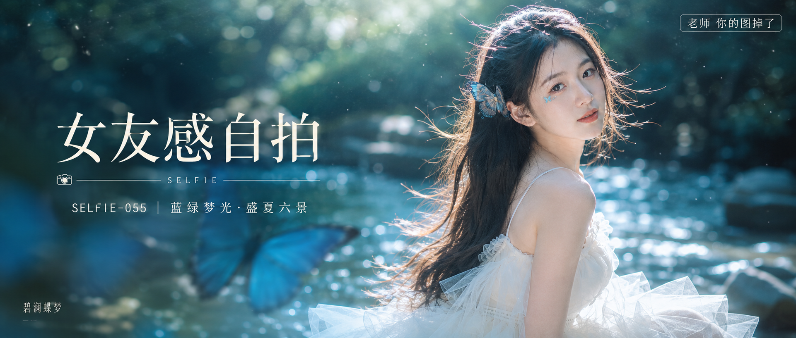

# SELFIE-055-蓝绿梦光·盛夏六景 封面

## 封面提示词

高端视觉概念「碧澜蝶梦」：盛夏森林浅溪边的电影海报人像，一位 24 岁成年东亚女生以清晰正面偏 3/4 侧脸位于画面右侧，面部占画面三分之一以上，五官精致自然、面部立体清晰、皮肤光泽细腻、眼神有神灵动、妆感干净清透、轮廓清晰上镜；黑棕长发被顶侧逆光吹起，发间蓝色半透明蝶饰，象牙白层叠纱裙完整得体，姿态自然优雅、身材比例匀称。前景一只放大的透明湖蓝蝴蝶虚化掠过，人物之后依次是发光的青蓝溪面、墨绿松影与冷白圆形散景，青蓝与象牙白冷暖层次鲜明，柔光环绕面部并打亮颧骨，电影感光影、高清锐利、色彩层次丰富、视觉冲击力强、构图黄金比例、前景虚化背景、画面有张力，2.35:1 电影横构图，无文字以外的水印，无 logo，避免 AI 美女脸、网红感、过度精修、塑料皮肤、暗沉肤色、明显痘印、明显皱纹、斑点、面部变形、错误手部、文字乱码。 【文字排版-必须完整保留，不得省略或简化任何一项】画面左侧垂直居中偏下叠加文字排版：超大号衬线字体米白色主文案「女友感自拍」，主文案正下方一条细横线左端带📷横线中央有透明英文水印 SELFIE，横线下方等宽白色字体副文案「SELFIE-055 ｜ 蓝绿梦光·盛夏六景」；左下角可有极小、克制的装饰文字「碧澜蝶梦」但不得影响主标题；右上角浅色半透明圆角底衬配小号文字「老师 你的图掉了」（署名文字，必须出现，不可省略）；无整体蒙层，文字直接压图。【文字排版结束】

## 封面图片

